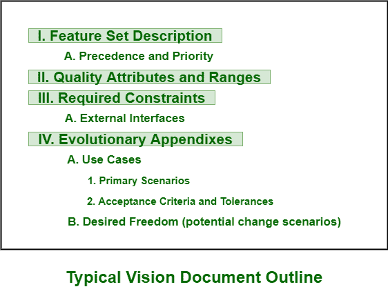
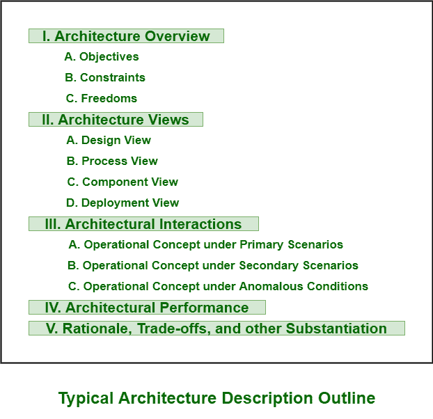

# 工程工件

> 原文:[https://www.geeksforgeeks.org/engineering-artifacts/](https://www.geeksforgeeks.org/engineering-artifacts/)

**工程工件**通常用严格的工程符号表示。这些符号可以是[统一建模语言(UML)](https://www.geeksforgeeks.org/unified-modeling-language-uml-introduction/) 、编程语言或机器的可执行代码。工程工件一般有三种类型。

**工程工件类型:**

1.  **Vision Document –**
    A vision document generally provides complete vision for software system that is under development. It is document that describes and explains compelling idea, project, or another future state simply for specific organization, product, or service. It also supports contract between funding authority and development organization. A vision document is specially written by keeping user’s perspective into consideration and also by focusing on essential features of system. A good vision document should include two appendixes: first one should explain concept of operation using use cases and second one should explain change risks inherent in vision statement.

    

2.  **Architecture Description –**
    An architecture description is collection of artifacts that document an architecture that includes an organized view of software architecture under development. It is generally taken and extracted from design model and also contains views of design, implementation, and deployment sets. In Architecture description, architecture views are generally key artifacts.

    

3.  **软件用户手册–**
    软件用户手册提供了支持交付的软件非常需要的重要文档。该文档通常提供给用户。它应该包括安装程序、使用程序、指南、操作限制以及关于用户界面的说明。测试团队成员应该编写这个用户手册，并且应该在生命周期的早期阶段开发。这是因为用户手册是一个基本的机制，只是用来交流和稳定一个基本的需求子集。