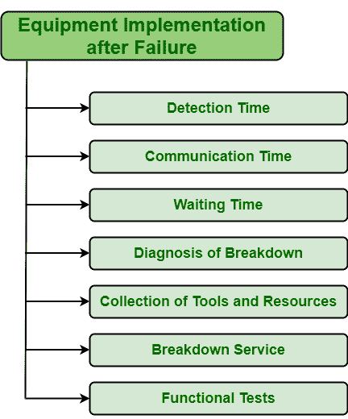

# 故障后的设备实施

> 原文:[https://www . geesforgeks . org/设备-故障后实施/](https://www.geeksforgeeks.org/equipment-implementation-after-failure/)

**[【纠正性维护(CM)](https://www.geeksforgeeks.org/corrective-maintenance-cm/)** ，简单来说，故障修复并不是一件容易的事情。为了成功实施纠正措施，需要有效地管理 CM。操作应该快速进行，并且应该尽量使用最少的资源和工具以及人力来恢复失败的资产。CM 通常用于修复已经发生的损坏。无法预测恢复设备所需的时间。CM 主要用于某些特定设备的低临界性，其故障不影响经济和重大问题。一般来说，它用于其他应用其他技术比应用 CM 成本更高的资产。

**设备实施:**
设备实施是发生故障后需要执行的主要动作。应立即实施，以避免任何类型的损失。故障后实施设备所需的总时间如下:

1.  **检测时间:**
    检测时间简单来说就是检测问题所需的时间。如果一个人想减少修理设备所需的时间，那么他/她应该尽快找出问题。有些故障是隐藏的，但会对系统造成更大的损害。识别问题是一个人在使用任何类型的设备时应该关注的主要事情。如果问题在早期就被确定，它会更快地被纠正。这将减少它们对系统的影响，并降低修复成本。

*   **Communication Time :**

    沟通时间只是指与团队成员就检测到的问题进行沟通所需的时间。这是一项重要且必要的任务，因为管理者必须在短时间内与维护团队进行有效沟通，并以更快的速度尽快解决问题。他/她必须提供正确的信息，然后选择合适的团队成员或技术人员来执行维护任务。执行任务的成员数量越少，执行任务的速度和准确度就越高。

    *   **等待时间:**
    等待时间简单来说就是做文书工作、给合适的技术人员分配任务、会员解决问题所需的时间。等待通常由一些因素决定，如技术人员的可用性、复杂性、需要采取的安全措施等。*   **故障诊断:**
    在进行维护任务之前，需要确定设备上到底发生了什么。人们应该知道两个主要问题的答案，即资产或设备是如何工作的，以及如何修复的。如果技术人员训练有素且技术高超，他/她可以快速准确地发现问题并加以解决。因此，最好将维护任务分配给训练有素且有经验的技术人员或成员。*   **工具和资源的收集:**
    工具和技术零件的收集简单地说就是收集资源、工具、备件所需的时间，这些资源、工具、备件是修复特定设备或资产的问题或故障所需要的。在确定要做什么之后，需要确定执行任务所需的资源和工具。由于工具或资源不可用、订购工具所需的时间、车间距离等原因，此过程非常耗时。*   **Breakdown Service :**

    故障维修是最重要但也是最关键的时刻之一。这是最终修复故障设备以使设备恢复正常工作状态所需的时间。如果技术人员是专家，工具是可用的，团队成员是高度熟练和训练有素的，那么修理时间通常会减少，因为它会更快地完成。

    *   **Functional tests :**

    功能测试是测试修理后的设备在修理后是否正常工作所需的时间。简单来说，就是需要时间来保证设备是否得到了妥善的维修。选择进行的功能测试类型在很大程度上影响测试设备所需的时间。

    看到以上各点后，我们可以说，设备修复所需的实际时间比故障后实施设备所需的总时间要少得多。因此，所有的因素都应该小心谨慎地处理和管理，以减少总时间。