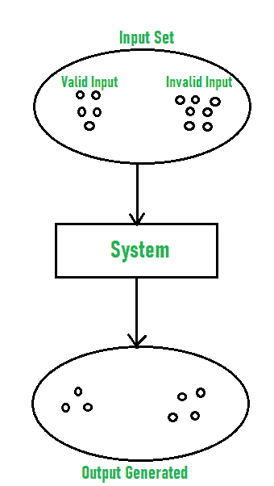
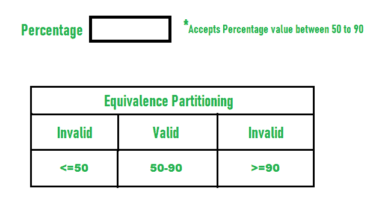
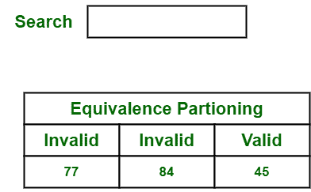
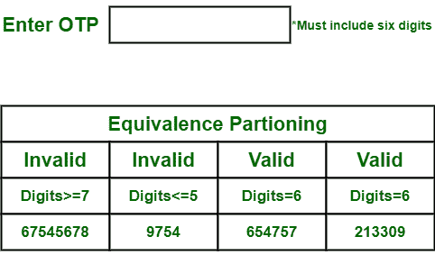

# 等价划分方法

> 原文:[https://www . geesforgeks . org/equality-partitioning-method/](https://www.geeksforgeeks.org/equivalence-partitioning-method/)

**等价划分方法**也称为等价类划分(ECP)。是一种[软件测试](https://www.geeksforgeeks.org/software-testing-basics/)技术或者[黑盒测试](https://www.geeksforgeeks.org/software-engineering-black-box-testing/)将输入域划分为数据类，借助这些数据类，可以导出测试用例。一个理想的测试用例识别错误的类别，这可能需要在观察到一般错误之前执行许多任意的测试用例。

在等价划分中，对给定的输入条件评估等价类。只要给出任何输入，就检查输入条件的类型，然后对于该输入条件，等价类表示或描述一组有效或无效的状态。

**等价划分指南:**

*   如果给定范围条件作为输入，则定义一个有效等价类和两个无效等价类。
*   如果给定一个特定的值作为输入，则定义一个有效的等价类和两个无效的等价类。
*   如果给定集合的一个成员作为输入，则定义一个有效的等价类和一个无效的等价类。
*   如果给定布尔值编号作为输入条件，则定义一个有效等价类和一个无效等价类。

**例-1:**
我们来考虑一个任何大学录取流程的例子。有一所大学根据学生的百分比进行招生。

考虑百分比字段，该字段将只接受 50%到 90 %之间百分比，更多甚至更少不被接受，应用程序会将用户重定向到错误页面。如果用户输入的百分比小于 50%或大于 90 %，则等价划分方法将显示无效的百分比。如果输入的百分比在 50%到 90 %之间，则等价划分方法将显示有效的百分比。

**例 2:**
我们来考虑一个网购网站的例子。在这个网站中，每个产品都有一个特定的产品标识和产品名称。我们可以使用产品名称或产品标识来搜索产品。这里，我们考虑只接受有效产品标识或产品名称的搜索字段。

让我们考虑一组带有产品标识的产品，用户想要搜索手机。下面是一些产品及其产品标识的表格。

<figure class="table">

| 产品 | 产品标识 |
| --- | --- |
| 可动的 | Forty-five |
| 笔记本电脑 | Fifty-four |
| 笔式驱动器 | Sixty-seven |
| 键盘 | Seventy-six |
| 耳机 | Thirty-four |

如果用户输入的产品标识无效，则应用程序会将客户或用户重定向到错误页面。如果用户输入的产品标识是有效的，即移动设备为 45，则等价划分方法将显示有效的产品标识。

**例-3 :**
我们来考虑一个软件应用的例子。软件应用程序的功能是只接受特定数量的数字，甚至不大于或小于该特定数量。

考虑一个仅包含 6 位数字的 OTP 号码，大于甚至小于 6 位数字都不被接受，应用程序会将客户或用户重定向到错误页面。如果用户输入的密码少于或多于六个字符，该等价分区方法将显示无效的动态口令。如果输入的密码正好是六个字符，那么等价划分方法将显示有效的动态口令。

</figure>