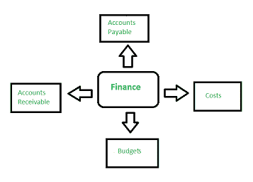
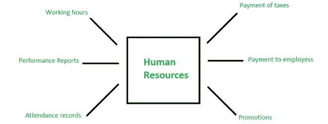
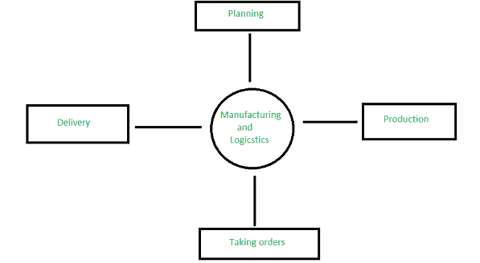
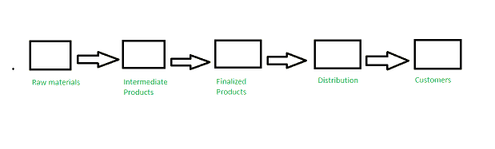
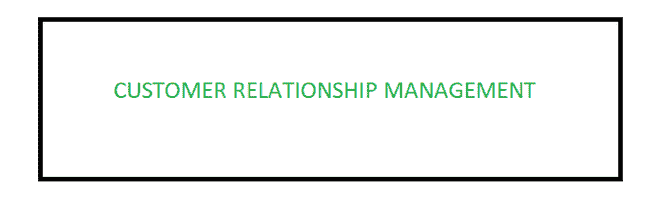

# ERP 组件

> 原文:[https://www.geeksforgeeks.org/erp-components/](https://www.geeksforgeeks.org/erp-components/)

企业是一群人，他们拥有一定的资源来实现自己的目标。它作为一个单一的实体。这个单一的实体不同于传统的方法。它是一个集成软件，集成了许多小模块，成为一个大组织。这些小模块据说是 [ERP](https://www.geeksforgeeks.org/introduction-to-erp/) 的组成部分。它有能力管理许多领域，如金融、制造、客户、项目等。有了企业资源规划系统，我们可以适应变化，提高组织的工作效率。

**ERP 系统的五个主要组成部分如下:**

**1。财务:**

它跟踪您的所有财务数据，包括应收账款、应付账款、总账、成本、预算和预测。它有助于记录现金流，降低成本，增加利润，并确保所有账单按时支付。业务日益复杂，因此需要一个单一的系统来管理所有的财务交易，并对多个业务部门或产品线进行核算。

财务部分

**2。人力资源(HR) :**

它是一个为经理和员工处理所有个人相关任务的软件。员工在任何组织中都扮演着非常重要的角色，没有他们，企业就不会存在。该组件负责自动向员工付款、纳税、生成绩效报告、考勤跟踪、晋升、决定员工的工作时间和假期。

人力资源

**3。制造和物流:**

它是一组申请人，负责计划、生产、接受订单和向客户交付产品。它为您提供了需求和实现水平的视图，这对于检查您是否实现了目标非常重要。它提供对业务有益的所有库存汇总和生产计划。它包括生产计划、订单输入和处理以及仓库管理。

制造和物流

**4。供应链管理(SCM) :**

供应链管理是一个设施网络，负责采购材料，将这些材料转化为中间产品和最终产品，并将这些产品分发给客户。计划、制造、营销、分销和采购组织通过供应链独立运作。这些组织有自己的目标和目的。

供应链管理

**5。客户关系管理(CRM) :**

该组件使用数据分析来研究大量信息，从而与客户进行交互。他们瞄准观众，观察什么对他们有利。该组件从多个渠道收集客户数据。因此，客户关系管理存储关于整体购买历史、个人信息甚至购买行为模式的详细信息。它获得的好处是跟踪客户的购买历史并建议额外的购买。

客户关系管理