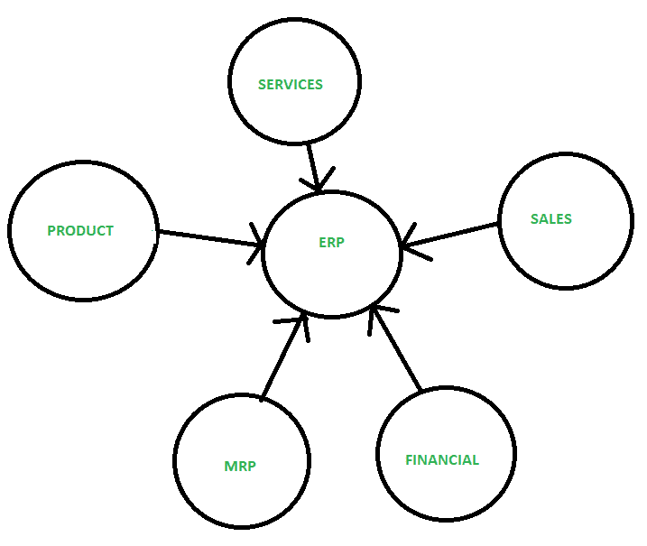

# 企业资源规划实施生命周期

> 原文:[https://www . geesforgeks . org/ERP-实施-生命周期/](https://www.geeksforgeeks.org/erp-implementation-life-cycle/)

[企业资源规划(ERP)](https://www.geeksforgeeks.org/evolution-of-erp-system/) 是用来自动化任何任务的。有了 ERP，在一个单一的数据库下管理每个部门是很容易的。这不会消耗太多时间，而且是一种简单快捷的工作方式。**企业资源计划**开发于 20 世纪 90 年代，是国内和全球运营的基础系统，支持大部分或所有功能领域的日常运营。是商业软件中比较常见的类别之一，尤其是对于大型企业。

它是一种业务策略和一组特定于行业领域的应用程序，通过启用和优化企业和企业间的协作运营和财务流程来构建客户和股东社区价值网络系统。企业资源规划的核心是通过数据管理集中信息和工作流程的有效方式。因为 ERP 将您所有的工作流数据保存在一个地方。

**例:**
任何企业的计划、制造、销售和营销工作都放在一个管理系统下，然后组合成一个单一的数据库系统。

**ERP 实施的不同阶段:**

1.  **预评估筛选:**
    这个阶段从公司决定走 ERP 系统开始。为此，开始搜索包。这是一个耗时的过程，因为在做出任何决定之前，每个包都必须首先进行分析。因为所有的包都不一样，每个包都有自己的优缺点。这个过程应该消除那些不适合公司业务流程的包。
2.  **套餐评估:**
    是执行中最重要的阶段。这一阶段取决于整个项目的成功和失败与软件包的选择。选择任何包时最重要的因素是，不是每个包都可以完全适合项目，但至少它应该非常适合项目。
3.  **[项目规划阶段](https://www.geeksforgeeks.org/software-engineering-project-planning/) :**
    该阶段规划设计实施流程。
4.  **差距分析:**
    这是本次实施最关键的阶段。在这里，分析了公司的实践和企业资源规划软件包支持的实践之间的差距。据估计，即使是最好的企业资源规划包也只能满足公司 80-85%的功能需求。
5.  **[重新设计](https://www.geeksforgeeks.org/software-engineering-re-engineering/) :**
    实现改进是对业务流程的根本反思和彻底重新设计。
6.  **定制:**
    是 ERP 实施的主要功能区。达成的解决方案必须与公司的总体目标相匹配。原型应该允许彻底的测试和尝试解决后勤问题。
7.  **实施团队培训:**
    现在经过以上流程，实施团队知道如何实施系统。这是公司培训员工实施和后期运行系统阶段。
8.  **测试:**
    这是队伍破制的阶段。有时，系统过载或多个用户试图同时登录等。测试用例是专门为发现系统中的薄弱环节而设计的。不同类型的测试有:单元测试、集成测试、验收测试、安全测试、性能和压力测试。
9.  **上线:**
    一旦技术和功能端正常工作，测试完成。接下来是下一阶段，即“上线”。一旦系统‘上线’，旧系统被移除&新系统用于做生意。
10.  **最终用户培训:**
    这是系统用户接受如何使用系统培训的阶段。确定员工及其技能，并根据他们当前的技能对他们进行分组培训。每个员工都接受了将要从事的工作的培训。
11.  **实施后:**
    是最重要、最关键的因素。后期实现基于两个词——系统的运行和维护。这一阶段的持续时间取决于培训效率。必要的增强&升级在此阶段进行。