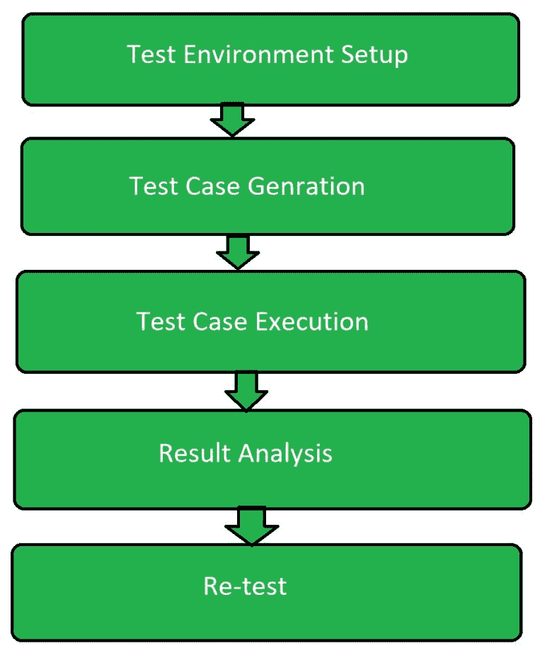

# 错误处理软件测试

> 原文:[https://www . geesforgeks . org/错误处理-软件-测试/](https://www.geeksforgeeks.org/error-handling-software-testing/)

错误处理测试是[软件测试](https://www.geeksforgeeks.org/software-testing-basics/)的一种类型，它是为了检查系统是否能够或能够处理未来可能发生的错误而执行的。这种类型的测试基本上是在开发人员和测试人员的帮助下进行的。错误处理测试不仅关注错误的确定，还关注异常处理。

**错误处理测试的目标:**
错误处理测试的目标是:

*   检查系统处理错误的能力。
*   检查系统最高浸泡点。
*   以确保系统将来可以正确处理错误。
*   使系统也能够处理异常。

**错误处理测试中涉及的步骤:**
以下是错误处理测试中涉及的步骤:

1.  **测试环境设置:**
    根据软件测试技术设置测试环境，使测试过程能够顺利进行。这一步包括测试计划。将被测试的系统确保具有不太重要的数据，因为在测试期间系统中可能存在崩溃问题。
2.  **测试用例生成:**
    在这个软件测试中，测试用例的生成无非是制作不同的测试用例，可能会导致错误。假设软件对分数进行运算，然后将分数的分母设置为零。测试用例的生成与开发团队相关联，因为如果不知道内部代码，就无法设计测试用例。
3.  **测试用例执行:**
    测试用例生成后，真正的测试过程开始。这是测试过程中最重要的部分。它包括在生成的测试用例上运行程序。
4.  **结果与分析:**
    测试用例执行后，分析其结果。它包括检查生成的测试用例的预期输出中的不一致性。程序可能会进入无限循环，这可能会导致软件故障。
5.  **重新测试:**
    如果测试失败，则在再次分析后，执行上述所有步骤来测试系统。它还包括在最近生成的新测试用例下测试系统。

**错误处理测试的优势:**

*   它有助于构建错误处理软件。
*   它使软件为所有情况做好准备。
*   开发了软件中的异常处理技术。
*   这有助于软件的维护。

**错误处理测试的缺点**

*   这是昂贵的，因为开发和测试团队都参与其中。
*   执行测试操作需要很多时间。