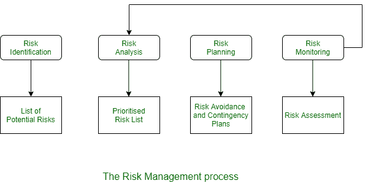

# 风险管理的基本活动

> 原文:[https://www . geesforgeks . org/essential-activities-of-risk-management/](https://www.geeksforgeeks.org/essential-activities-of-risk-management/)

[风险管理](https://www.geeksforgeeks.org/software-engineering-risk-management/)是努力确保将风险对成本、质量和进度的影响
降到最低的领域。

风险管理的主要目的是识别和管理与软件项目相关的风险，并解决问题。评估可能影响项目进度或正在开发的软件质量的风险，并采取措施避免风险是项目经理的重要任务。

识别和准备计划以减少它们对项目的影响被称为风险管理。风险管理的基本动机是避免灾难或重大损失。

风险可分为以下几类。

1.  **项目风险:**
    这些是影响项目进度或资源的风险。
2.  **产品风险:**
    这些是影响正在开发的质量或性能的风险。
3.  **商业风险:**
    这些是影响软件开发或采购组织的风险。

这个分类不是一个特殊的分类。如果一个有经验的程序员离开了一个项目，那么这是一个项目风险，因为系统的交付可能会延迟，产品可能是一个风险，因为替换可能不是一个经验丰富的，因此可能是错误和业务。

由于大多数项目面临固有的不确定性，风险管理对于软件项目非常重要。风险管理的过程如图。

风险管理的过程涉及以下几个阶段-

1.  **风险识别:**
    此阶段识别可能的项目、产品、业务风险。
2.  **风险分析:**
    在这个阶段或过程中，评估这些风险的可能性和后果。
3.  **风险规划:**
    在这个阶段，风险规避要么是有计划地影响计划，要么是减轻计划对项目的影响。
4.  **风险监控:**
    本阶段持续进行风险评估，随着风险信息的增多，风险降低计划也在进行修订。

像所有其他项目规划一样，风险管理过程是一个迭代过程，贯穿整个项目。风险管理流程结果应记录在风险管理计划中。这应该包括讨论项目面临的风险，分析这些风险，并要求制定计划来管理这些风险。它还可能包括风险管理的一些结果。

风险管理必须处理识别可能发生的不良事件、发生的可能性以及不良事件发生时发生的损失。了解了这一点，就可以设计策略来降低降低内容风险或影响的可能性。因此，风险管理围绕着风险评估和风险控制。

以下是管理它们的十大技巧:

| 南否> | 风险项目 | 风险管理技术 |
| --- | --- | --- |
| (1) | 人员短缺 | 配备顶尖人才；工作匹配；团队建设；关键人员协议；培训；预先安排关键人物。 |
| (2) | 不切实际的时间表和预算 | 详细的多源成本和进度估算；按成本设计；增量开发；软件复用；要求擦洗。 |
| (3) | 开发错误的软件功能 | 组织分析；任务分析；OPS 概念的制定；用户调查；原型制作；早期用户手册。 |
| (4) | 开发错误的用户界面 | 原型制作；场景；任务分析；用户特征(功能、风格、工作负载)。 |
| (5) | 镀金 | 要求擦洗；原型制作；成本效益分析；按成本设计。 |
| (6) | 持续的需求变更流 | 高变化阈值；信息隐藏；增量开发(将更改推迟到以后的增量)。 |
| (7) | 外部提供的部件不足 | 基准；检查；证明人检查；兼容性分析。 |
| (8) | 外部执行任务的不足 | 证明人检查；事前审计；Awardfee 合同；竞争性设计或原型团队建设。 |
| (9) | 实时性能不足 | 模拟；基准；建模；原型制作；仪器仪表；调谐。 |
| (10) | 紧张的计算机科学能力 | 技术分析；成本效益分析；原型制作；参考检查。 |

