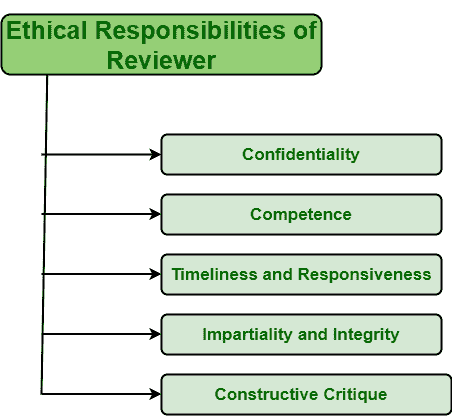

# 审核人的道德责任

> 原文:[https://www . geeksforgeeks . org/伦理-审查者的责任/](https://www.geeksforgeeks.org/ethical-responsibilities-of-reviewer/)

同行评审基本上被定义为对由一个或多个与工作生产者能力相似的人完成的工作的评估。它是简单保证[软件质量](https://www.geeksforgeeks.org/software-engineering-software-quality/)的非常关键的工具。同行**评审员**通常在同行评审过程中发挥核心和非常关键的作用。

同行评审者在进行评审时有以下几项道德责任:

这些解释如下。

1.  **保密:**
    保密的主要原则是维护隐私。它基本上被定义为一种保守秘密的状态。审阅者还主要负责对正在审阅的文档进行保密。保密是指不与评审过程之外的任何人分享或讨论，除非有必要并经编辑批准。
2.  **Competence :**
    Competence is basically described as quality or state of having sufficient knowledge, required skill, qualification, strength. For review process, reviewers should only accept review if he/she has knowledge, expert, and required skill for reviewing particular material.

    如果审查人员不是材料方面的专家，则可能存在实质性缺陷或材料被拒绝。因此，在这种情况下，审查者不应接受审查。

3.  **Timeliness and responsiveness :**
    Timeliness simply means quality of doing something at a favorable or best time whereas responsiveness simply means quality of reacting quickly and positively. Reviewers are also responsible for reviewing material quickly in time requested and submit it in a given period of time.

    评审者需要尽一切努力在要求的时间内以积极的方式完成评审。如果审查者不能在要求的时间内完成审查，那么在这种情况下，他/她不应接受审查。

4.  **公正和诚信:**
    公正简单来说就是决策、反馈的公平。审查者也有责任及时提供公正，即不偏不倚和建设性的反馈。他们还负责确保反馈有足够的，即可接受的细节。他们不应该通过同行评审的交流来利用材料。
5.  **Constructive critique :**
    Constructive is basically a process where individual expresses his/her opinion about a particular thing whether positive or negative aspects are there in a pleasant manner.

    审阅者还负责给出正在审阅的材料的积极方面，如果存在，则建设性地识别或确定消极方面。应该提供这种反馈，以便在需要时进行改进。作者解决并修复工作中的所有弱点。在获得反馈后，需要实施改进策略来解决问题。