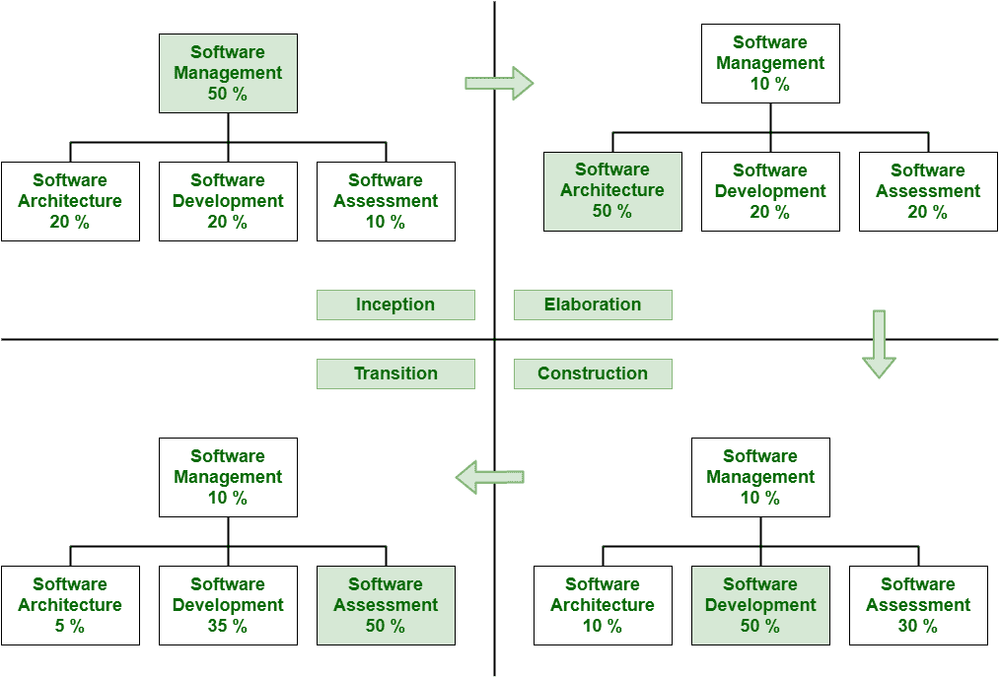

# 组织评价

> 原文:[https://www.geeksforgeeks.org/evaluation-of-organization/](https://www.geeksforgeeks.org/evaluation-of-organization/)

评价通常被认为是改善管理的重要工具。**组织的评价**或组织评价是获取或获得关于组织的绩效和通常影响这一绩效的因素的有效信息的系统过程。它不同于其他类型的评估，只是因为它只集中和关注作为主要分析单位的组织。通过对组织的评估，从行为甚至社会的角度，根据组织的功能、问题和成就来计算和衡量组织的有效性。

[项目组织](https://www.geeksforgeeks.org/project-organizations-and-their-responsibilities/)通常代表和展示团队的架构。项目组织也需要与[工作分解结构](https://www.geeksforgeeks.org/software-engineering-work-breakdown-structure/)中的项目计划保持一致。

**评价的重要性:**

*   需要确保正在建立的目标和目的是否实现。
*   需要确保组织正在适应新的环境、不断变化的技术，甚至其他外部变量的变化，以便有效地利用可用资源。
*   不同的模式需要更好地满足和完成研究所客户的需求。

上图简单解释了团队的重心如何在整个生命周期内转移，即使在每个阶段有 50 %的员工被分配到一组活动中。

**各阶段强调的活动:**

1.  **Inception Team –**
    It is an organization that moves from abstract, broad conversations into more detailed discussions. They capture fine details of what’s going to happen next and work that is needed to be completed to achieve agreed-upon goal. This team simply focuses on planning, with more support from various teams to just confirm and ensure that plans represent general agreement of all perspectives.
2.  **Elaboration Team –**
    This team gains handle on architecture of system. They simply begin setting up environment for Construction by purchasing hardware, software, and tools. It is an organization mainly focused on architecture in which driving forces of project simply reside in software architecture team. They are supported by software development and software assessment team. These teams have necessary and important to achieve stable architecture baseline.
3.  **Construction Team –**
    This team generally turn project or product vision into visual thing. They also work with product manager to simply create user experience that fulfills requirements. It is fairly balanced organization in which several activities resides in software development and even in software assessment teams.
4.  **过渡团队–**
    过渡团队通常专注于审查过渡计划、监控进度、提供所需资源、解决问题和升级管理。过渡团队还评估和评价质量、状态报告，甚至项目变更控制。它实际上是一个关注客户的组织，用户的反馈只是推动部署活动。