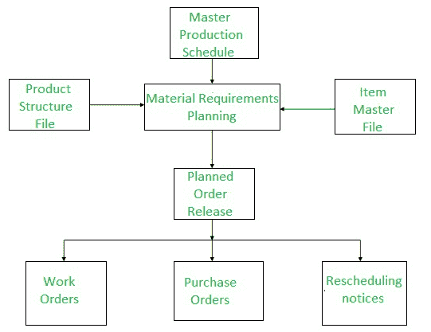
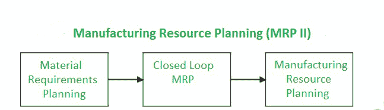
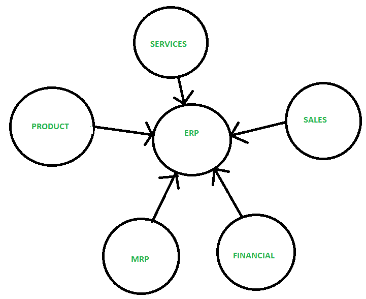
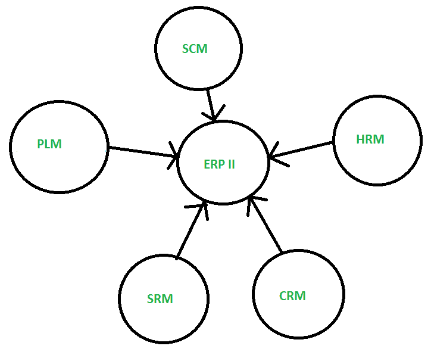

# ERP 系统的演进

> 原文:[https://www.geeksforgeeks.org/evolution-of-erp-system/](https://www.geeksforgeeks.org/evolution-of-erp-system/)

[企业资源规划(ERP)](https://practice.geeksforgeeks.org/problems/what-is-enterprise-resource-planning-erp-and-what-kind-of-a-database-is-used-in-an-erp-application) 是用来自动化任何任务的。有了 ERP，在一个单一的数据库下管理每个部门是很容易的。这不会消耗太多时间，而且是一种简单快捷的工作方式。

**例:**
任何企业的计划、制造、销售和营销工作都放在一个管理系统下，然后组合成一个单一的数据库系统。

**ERP 系统的演进:**

**1。物料需求计划(MRP)–**
物料需求计划发展于 20 世纪 70 年代，是工业生产计划和调度中广泛使用的方法。这是一种嵌入在许多商业软件应用程序中的方法。

物料需求计划的功能是提供物料可用性，即用于按时生产需求数量。这一过程涉及对库存和需求的监控，从而自动创建采购或生产的采购建议。物料需求计划的主要目标是确定需要哪些物料、需要多少数量以及何时需要。

**2。制造资源计划(MRP II)–**
制造资源计划发展于 20 世纪 80 年代，是管理整个制造公司的闭环 MRP 的扩展。该系统提供了对所有职能部门都有用的信息，并鼓励跨职能部门的互动。

它通过提供和订购承诺能力来支持销售和营销。这是一个基础广泛的资源协调系统，涉及公司在规划过程中的其他领域，如营销、财务和人力资源。

**3。企业资源计划(ERP)–**
企业资源计划发展于 20 世纪 90 年代，是国内和全球运营的基础系统，支持日常运营中的大部分或所有功能领域。是商业软件中比较常见的类别之一，尤其是大型企业。

它是一种业务策略和一组特定于行业领域的应用程序，通过启用和优化企业和企业间的协作运营和财务流程，构建客户和股东社区价值网络系统。企业资源规划的核心是通过数据管理集中信息和工作流程的有效方式。因为 ERP 将您所有的工作流数据保存在一个地方。

**4。企业资源计划(ERP II)–**
发展于 2000 年代，ERP II 是现在用来形容 ERP 的名字。基本上是 ERP 的继承者。它是企业内部和外部的一种业务战略和一套协作的运营和财务流程。

这些新的业务模式反映了对内部集成的业务关注的增加。它的领域遍及所有部门和细分市场。此处的数据是内部和外部发布和订阅的。它包括部门模块、客户关系管理、供应链管理和其他利益相关者模块。它强调无形的助攻。

