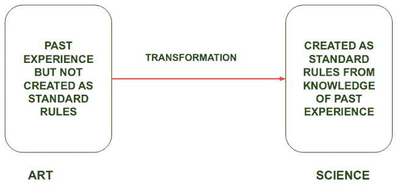
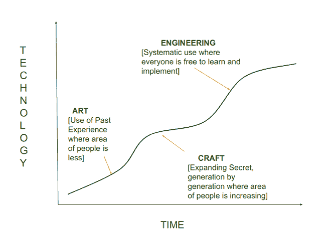

# 软件工程的进化:从艺术到工程学科

> 原文:[https://www . geeksforgeeks . org/软件工程从艺术到工程学科的演变/](https://www.geeksforgeeks.org/evolution-of-software-engineering-from-an-art-to-engineering-discipline/)

[软件工程](https://www.geeksforgeeks.org/software-engineering/)是[软件开发](https://www.geeksforgeeks.org/challenges-of-software-developers/)的系统化、高性价比技术。这是一种开发软件的工程方法。

**比如:**如果有人想从旁遮普去德里旅游。有两种方法可以达到同样的效果:

1.  正常的方法是出去，然后赶上可以乘坐的公共汽车/火车。
2.  构建了一个系统的方法:首先在谷歌地图上查看距离，在线分析火车和公共汽车的时间，然后匹配用户的偏好。假设用户工作到下午 4:00，火车时刻为:下午 1:00，下午 6:00，那么用户将选择下午 6:00 的时间到达德里。

从以上情况可以很容易地分析出，与常规方法相比，创建一个系统化的方法更为优化，并且更节省时间和成本。设计软件时也会出现这种情况。所以在软件工程中，从事工程或系统的方法是更有益的。

**软件工程是科学还是艺术？**

大多数人认为写一个高质量的程序是一门艺术。所以让我们把它作为一门艺术或科学来讨论。像其他工程一样，分支假设是机械工程。它基于科学，在科学中，每个组件、技术和与之相关的工作原理都有特定的规则和名称，在它们被标准化之前，经验被标记为它们的经验法则，在此基础上，规则被各种组织标准化。同样，在软件工程中，大量使用从实践者的经验中收集的知识。因此，各种组织或研究者以理论的形式系统地组织了实践者的经验。在这些被标准化之前，经验充当经验法则。因此，像其他工程学科一样，软件工程是一门从艺术转化而来的科学

**软件工程从一门艺术到工程学科的演变:**
在过去的六十年里，软件工程的原则随着各种研究人员和软件专业人员的贡献而演变。软件工程从开始的时候是一门艺术，后来随着时间的推移，它变成了一门手艺，最后变成了工程学科。
最初，程序员使用一种*特别的*编程风格。*临时*编程是一种以无计划或无组织的方式实现的可接近的解决方案。在这种类型的编程风格中，没有关于如何创建结构和步骤来完成编程任务的计划，但是没有任何系统的方法，问题需要在所需的时间内解决。这种风格现在被称为探索、构建和修复以及编码和修复风格。
就像当今世界各种研究人员和科学家在研究那些甚至不必要的东西一样，但在最初阶段，程序员在研究那些真正需要的东西。但是随着时间的推移，特别编程会导致各种问题，导致效率降低，因此采用了另一种方法，即系统方法。

让我们从软件工程发展的详细的逐步过程开始。讨论了以下步骤:

1.  作为艺术的软件工程
2.  软件工程从艺术到工艺的转变
3.  软件工程从工艺到工程学科的过渡

**1。软件工程作为一门艺术:**
软件工程作为一种艺术手段，这只能由特定的人来学习，其他人的不允许在他们身上工作。

**比如:**古代只有少数人知道金饰制作。那些知道金饰制作的人把它作为一个秘密，并将向他的基因一代透露。所以在这个时候，这被称为艺术，在那段时间，精确度非常低。
同样的在软件开发中，只有很少的人知道软件设计和编码，当时没有一套软件设计的规则或指导。那些能够高效地编写代码并从本质上修复 bug 的人被认为是熟练的，而那些不擅长编程并且不知道这一点的人被留下来思考，他们如何能够每次都毫不费力地编写优雅而正确的代码。
像金饰设计效率不高一样，由于各种问题导致软件效率降低，程序编码效率也不高，但有时效率并不被视为一个重要方面。

**2。软件工程从艺术到工艺的转变:**
当了解软件设计和编码的人的领域增加时，软件工程从艺术转变为工艺。
**例如:**当金饰制作的秘密被一代又一代人发现时，这将增加从事该艺术的人数，并将把艺术转化为准确性提高的手艺。
同样在软件工程中，大学引入了特定学位和 P.H.D，一些特定的人将进一步学习，并且必须满足一定的规则才能获得该学位。因此，这个领域的人数在增加，他们开始研究这个领域，并为编码和软件开发创建必须遵循的标准和风格，这些标准将有助于创建一个更少错误的软件。

像黄金一样，装饰品的形状越来越好看，效率也越来越高。同样，程序编写在代码可重用性和效率方面也变得高效，但有时效率并不被认为是一个重要方面。

**3。软件工程从工艺到工程学科的转变:**
在当今世界，软件工程作为一门工程学科，每个人都可以学习软件设计和编码，不管他们是否在攻读学位。
**例如:**在当今世界，每个人都可以学习黄金饰品的制作，并且在各种机器的帮助下，精度有了更大的提高。此外，它被转换成一个专业的研究，人们将了解如何？为什么呢？背后的科学等等。
在软件工程中也是如此，每个人都可以学习软件开发，无论是否进行任何专业研究，软件开发的准确性在标准和研究人员创建的改进规则的帮助下得到提高。
软件工程原理现已广泛应用于工业领域，新原理仍在以非常快的速度不断涌现。