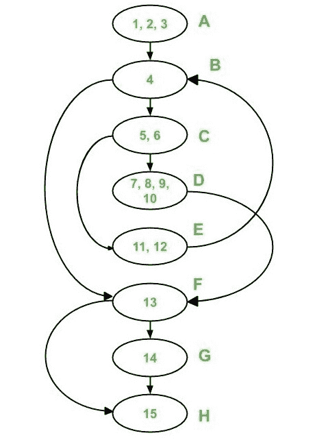
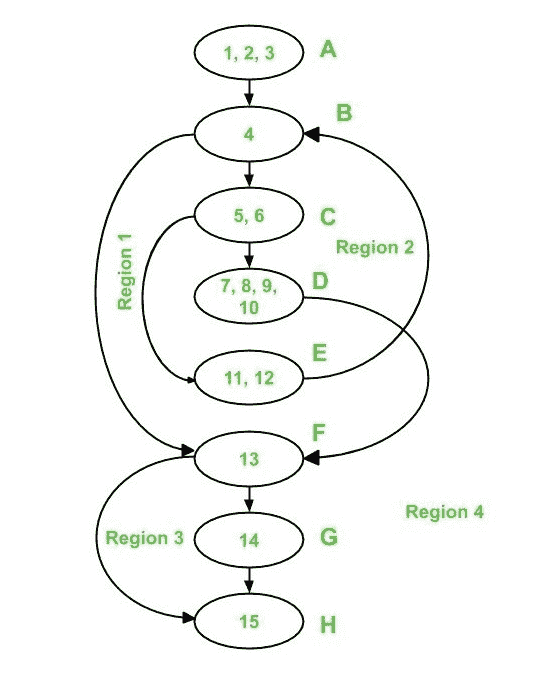
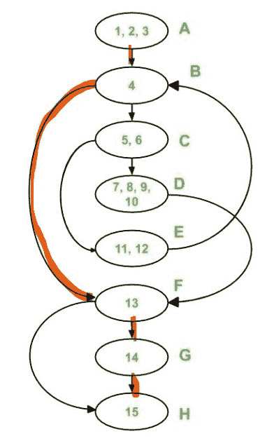
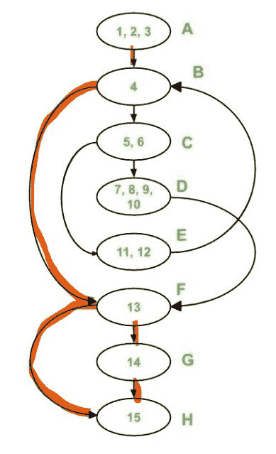
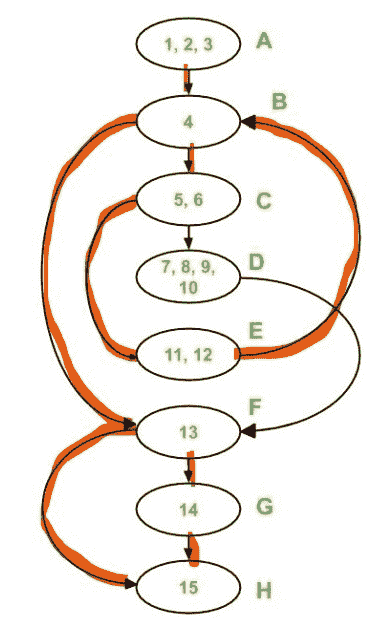
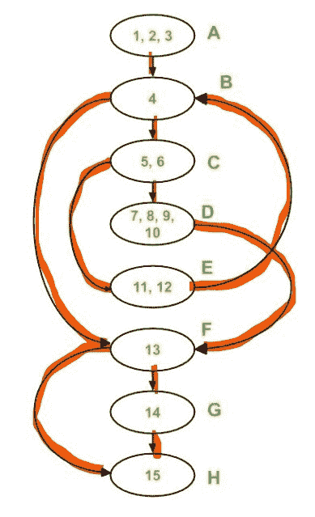

# 基本路径测试中的各种示例

> 原文:[https://www . geesforgeks . org/example-basis-path-testing-white-box-testing/](https://www.geeksforgeeks.org/example-basis-path-testing-white-box-testing/)

先决条件–[基本路径测试](https://www.geeksforgeeks.org/various-path-testing-in-software-engineering/)
我们已经在之前的[文章](https://www.geeksforgeeks.org/various-path-testing-in-software-engineering/)中看到了使用基本路径测试为程序设计测试用例的步骤。现在，让我们按照相同的步骤解决一个例子。

**问题:**考虑给定的检查一个数是否是质数的程序。对于以下程序:

1.  绘制控制流程图
2.  使用所有方法计算圈复杂度
3.  列出所有独立路径
4.  从独立的路径设计测试用例

```
int main()
{
    int n, index;
    cout << "Enter a number: " << endl;
    cin >> n;
    index = 2;
    while (index <= n - 1) {
        if (n % index == 0) {
            cout << "It is not a prime number" << endl;
            break;
        }
        index++;
    }
    if (index == n)
        cout << "It is a prime number" << endl;
} // end main
```

**解:**
**1。绘制控制流程图–**

*   **步骤-1:**
    在声明变量后开始给语句编号(如果该语句中没有初始化变量)。但是，如果一个变量已经被初始化并在同一行中声明，那么编号应该从该行本身开始。

对于给定的程序，编号是这样进行的:

```
int main()
{
    int n, index;
1    cout << "Enter a number: " <> n;
3    index = 2;
4    while (index <= n - 1) 
5    {
6        if (n % index == 0) 
7        {
8            cout << "It is not a prime number" << endl;
9            break;
10        }
11        index++;
12    }
13    if (index == n)
14        cout << "It is a prime number" << endl;
15  } // end main

```

*   **Step-2:**
    Put the sequential statements into one single node. For example, statements 1, 2 and 3 are all sequential statements and hence should be combined into a single node. And for other statements, we will follow the notations as discussed [here](https://www.geeksforgeeks.org/various-path-testing-in-software-engineering/).

    **注意–**
    为简单起见，在节点上使用字母编号。

    获得的图表如下:

    

    **2。计算圈复杂度:**

    *   **Method-1:**

        ```
        V(G) = e - n + 2*p 
        ```

        在上面的控制流程图中，

        ```
        where, e = 10, n = 8 and p = 1

        Therefore, 
        Cyclomatic Complexity V(G) 
        = 10 - 8 + 2 * 1 
        = 4

        ```

    *   **Method-2:**

        ```
        V(G) = d + p 
        ```

        在上面的控制流程图中，

        ```
        where, d = 3 (Node B, C and F) and p = 1

        Therefore, 
        Cyclomatic Complexity V(G) 
        = 3 + 1 
        = 4

        ```

    *   **Method-3:**

        ```
        V(G) = Number of Regions 
        ```

        在上面的控制流程图中，有 4 个区域，如下所示:

        

        ```
        Therefore, there are 4 regions: R1, R2, R3 and R4

        Cyclomatic Complexity V(G) 
        = 1 + 1 + 1 + 1 
        = 4

        ```

需要注意的是，这三种方法给出的圈复杂度都是相同的。

**3。独立路径:**
由于图的圈复杂度为 4，因此有 4 条独立路径。
由路径 1 覆盖(用红色标记)的边是:

```
Path 1 : A - B - F - G - H 

```



路径 1 和路径 2 覆盖的边如下所示:

```
Path 2 : A - B - F - H 

```



路径 1、路径 2 和路径 3 覆盖的边是:

```
Path 3 : A - B - C - E - B - F - G - H 

```



现在只有两条边没有被覆盖，即边 C-D 和边 D-F。因此，路径 4 必须包括这两条边。

```
Path 4 : A - B - C - D - F - H 

```



这些路径中的每一条都引入了至少一条以前没有穿过的新边。

**注–**
独立路径不一定唯一。

**4。测试用例:**
要导出测试用例，我们必须使用之前获得的独立路径。为了设计一个测试用例，向程序提供输入，以便执行每个独立的路径。
对于给定的程序，将获得以下测试用例:

<center>

| 测试用例标识 | 输入号码 | 输出 | 覆盖的独立路径 |
| --- | --- | --- | --- |
| one | one | 无输出 | A-B 空军基地 |
| Two | Two | 这是一个质数 | A-B-F-G-H |
| three | three | 这是一个质数 | A-B |
| four | four | 它不是质数 | A-B-中-德-法-赫 |

</center>