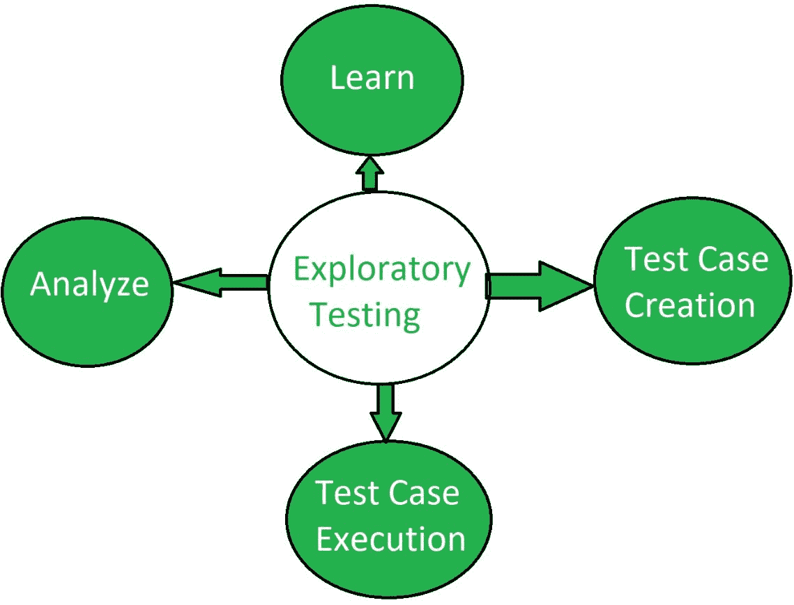

# 探索性软件测试

> 原文:[https://www.geeksforgeeks.org/exploratory-software-testing/](https://www.geeksforgeeks.org/exploratory-software-testing/)

**探索性测试**是一种类型的[软件测试](https://www.geeksforgeeks.org/software-testing-basics/)，其中测试人员可以自由选择任何可能的方法来测试软件。这是一种无脚本的软件测试方法。在探索性测试中，软件开发人员利用自己的个人学习、知识、技能和能力来测试自己开发的软件。

探索性测试检查软件的功能和操作，并识别其中的功能和技术故障。探索性测试的目的是以各种可能的方式优化和改进软件。探索性测试技术结合了测试人员的经验和结构化的测试方法。它通常作为黑盒测试技术来执行。4 探索性测试是一种无脚本的测试技术。

**探索性测试流程:**
探索性测试流程涉及以下 4 个步骤:

*   **学习:**
    这是探索性测试的第一阶段，测试人员学习软件中出现的故障或问题。测试人员利用他/她的知识、技能和经验来观察和发现软件遇到了什么样的问题。这是探索性测试的初始阶段。它还涉及测试人员的不同新学习。
*   **测试用例创建:**
    当故障被识别，即测试人员知道软件正遭受什么样的问题时，测试人员根据缺陷创建测试用例来测试软件。测试用例是通过记住最终用户可能面临的问题来设计的。
*   **测试用例执行:**
    根据最终用户问题创建测试用例后，测试人员执行测试用例。测试用例的执行是任何测试过程的重要阶段。这包括软件执行的计算和操作任务，以获得所需的输出。
*   **分析:**
    测试用例执行后，对结果进行分析，观察软件是否正常工作。如果发现缺陷，则修复缺陷，并再次执行上述三个步骤。因此，整个过程在一个周期内进行，并执行软件测试。

**探索性测试的优势:**

*   它不需要准备，因为它是一种无脚本的测试技术。
*   它能很快发现关键缺陷。
*   在探索性测试中，测试人员使用他们的知识、技能和经验来测试软件。

**探索性测试的缺点:**

*   在探索性测试中，一旦执行了测试，就不会对其进行审查。
*   跟踪执行的测试很困难。
*   不可能重复同样的测试方法。