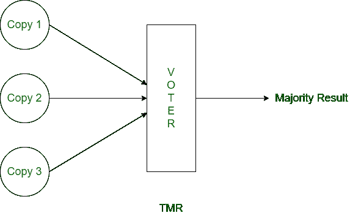
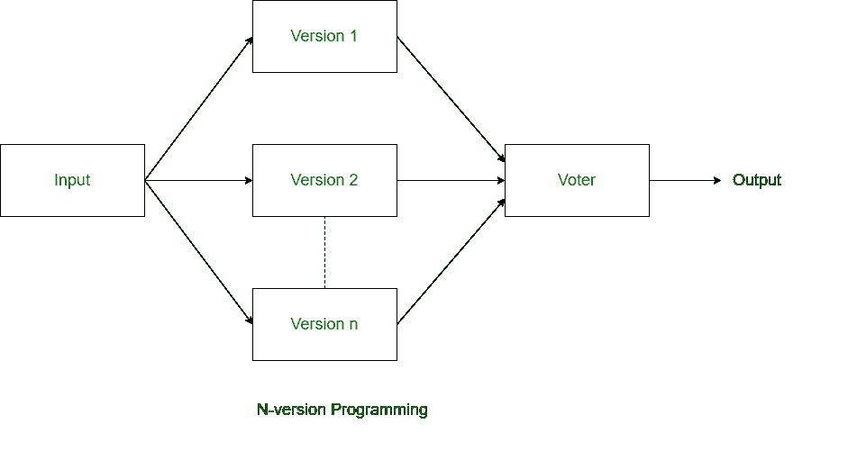
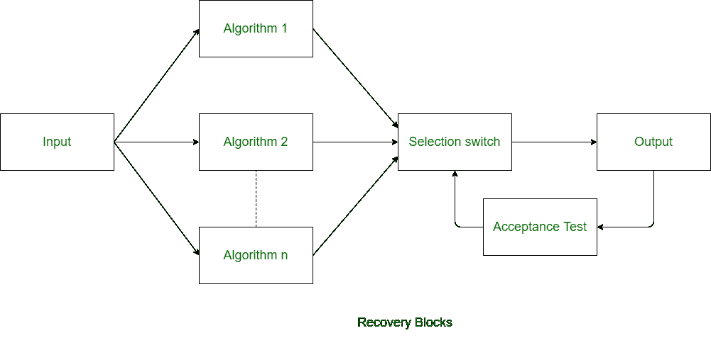

# 计算机系统中的容错技术

> 原文:[https://www . geesforgeks . org/容错-计算机系统中的技术/](https://www.geeksforgeeks.org/fault-tolerance-techniques-in-computer-system/)

**容错**是指尽管系统发生故障，系统仍以适当的方式工作的过程。即使执行了如此多的测试过程，系统仍有可能出现故障。实际上，一个系统不可能完全没有错误。因此，系统被设计成在错误可用性和故障的情况下，系统能够正常工作并给出正确的结果。

任何系统都有两个主要组件——硬件和软件。两者都可能出现故障。所以在硬件和软件上都有独立的容错技术。

**硬件容错技术:**
与软件相比，硬件容错很简单。容错技术使硬件正常工作，即使系统的硬件部分出现故障也能给出正确的结果。硬件容错基本上有两种技术:

1.  **内建自测试–**
    内建自测试代表内建自测试。系统在一定时间后反复进行自身的测试，这就是硬件容错的内建自测试技术。当系统检测到故障时，它会切换出故障组件并切换到冗余组件。发生故障时，系统基本上重新配置自己。
2.  **TMR–**
    TMR 是三模冗余。生成关键组件的三个冗余副本，并且这三个副本同时运行。对所有冗余副本的结果进行投票，并选择多数结果。它可以容忍一次出现一个故障。

**软件容错技术:**
软件容错技术用于使软件在发生故障和失效的情况下保持可靠性。软件容错有三种技术。前两种技术很常见，基本上是硬件容错技术的改编。

1.  **N-version Programming –**
    In N-version programming, N versions of software are developed by N individuals or groups of developers. N-version programming is just like TMR in hardware fault-tolerance technique. In N-version programming, all the redundant copies are run concurrently and result obtained is different from each processing. The idea of n-version programming is basically to get the all errors during development only.

    

2.  **Recovery Blocks –**
    Recovery blocks technique is also kike the n-version programming but in recovery blocks technique, redundant copies are generated using different algorithms only. In recovery block, all the redundant copies are not run concurrently and these copies are run one by one. Recovery block technique can only be used where the task deadlines are more than task computation time.

    

3.  **Check-pointing and Rollback Recovery –**
    This technique is different from above two techniques of software fault-tolerance. In this technique, system is tested each time when we perform some computation. This techniques is basically useful when there is processor failure or data corruption.

    