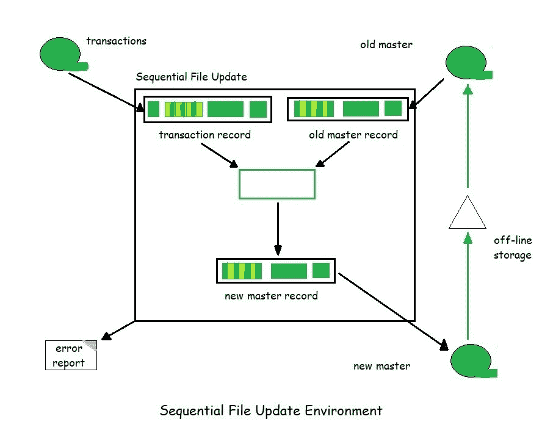
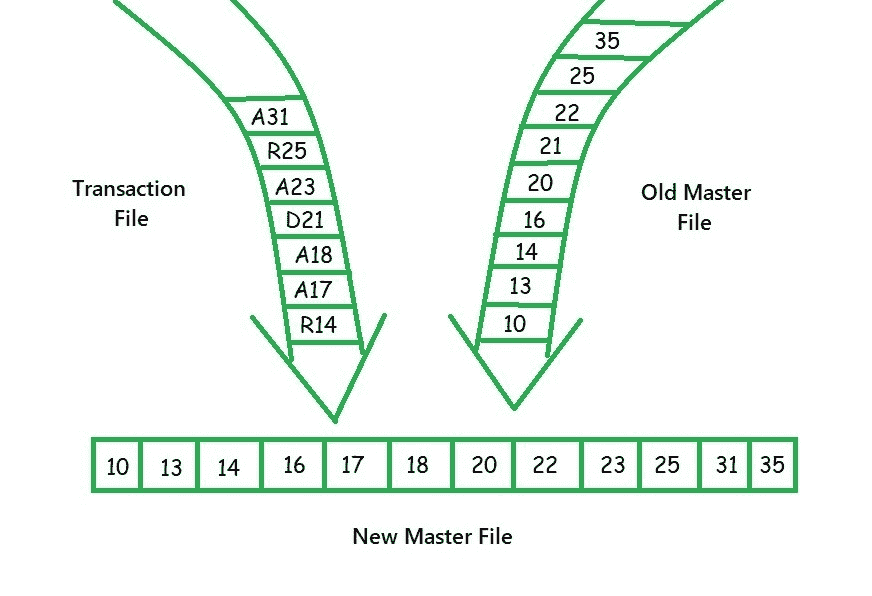
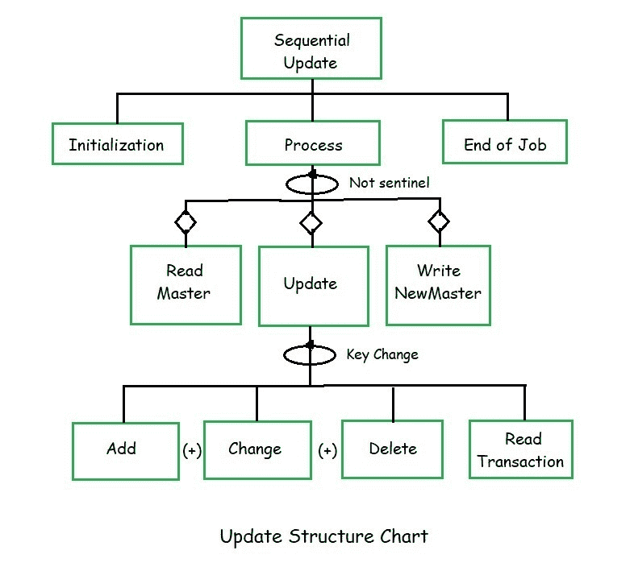

# 软件工程中的文件更新

> 原文:[https://www . geesforgeks . org/file-update-in-software-engineering/](https://www.geeksforgeeks.org/file-updation-in-software-engineering/)

先决条件–[文件组织](https://www.geeksforgeeks.org/file-organization-in-dbms-set-1/)
数据是*而不是静态的*，因为它是不断变化的，这些变化需要反映在他们的文件中。保持文件最新的功能称为**更新**。

**更新文件:**
在更新一个文件时，会关联三个特定的文件。

1.  称为**主文件**的永久数据文件包含最新的文件数据。
2.  **事务文件**包含要应用于主文件的更改。
3.  更新程序中需要的第三个文件是**错误报告文件**。错误报告包含更新过程中发现的所有错误的列表，并呈现给用户以采取纠正措施。

三种基本类型的更改发生在所有文件更新中:添加新数据、删除旧数据、修改包含修订的数据。
要处理这些交易，我们需要一个**键**。密钥是唯一标识文件中数据的一个或多个字段。例如，在学生文件中，密钥将是学生证。在员工档案中，关键是社会安全号码。

文件更新有两种类型:

*   在**批量更新**中，随着时间的推移收集更改，然后所有更改立即应用于文件。
*   在**在线更新**中，用户直接连接到计算机，一次处理一个变更——通常是在变更发生时。

**顺序文件更新:**
假设一个批处理、顺序文件环境。它是一个文件，必须从一开始就连续处理，没有任何随机处理能力。顺序文件更新实际上有两个主文件副本，**旧主文件**和**新主文件**。



在上图中，我们看到了上面讨论的四个文件。*磁带符号*用于文件，因为它是连续文件的经典符号。更新程序完成后，新的主文件被发送到离线存储器，在那里保存，直到再次需要它。当要更新文件时，从离线存储器中检索主文件并用作旧的主文件。

通常，脱机存储中至少保留三份主文件的副本，以防有必要重新生成不可读的文件。这个*保留周期*被称为祖父母系统，因为文件的三代始终可用:*祖父母、父母和孩子*。

**更新程序设计:**
更新过程要求我们匹配事务和主文件上的密钥，并且假设没有错误，遵循以下三个操作/规则之一:

1.  如果事务文件密钥小于主文件密钥，事务将被添加到新的主文件中。
2.  如果事务文件密钥等于主文件密钥，则
    *   **(一)。**如果交易是修订交易，主文件的内容会改变，或者
    *   **(b)。**如果事务是删除，数据将从主文件中删除。
3.  如果事务文件密钥大于主文件密钥，旧的主文件记录将被写入新的主文件。



这个更新过程如上图所示。在交易文件中，交易代码为 **A** 为新增， **D** 为删除， **R** 为修改。该过程从匹配每个文件中第一条记录的关键字开始，在本例中，

```
14 > 10
```

因此，使用规则 3，并且主记录被写入新的主记录。然后 14 和 13 匹配，这导致 13 被写入新的主设备。在下一场比赛中，我们有

```
14 == 14
```

因此，根据规则 2a，在事务文件中使用数据来改变主文件中的数据。但是，此时不会写入新的主文件。更多的事务可能与主文件匹配，它们也需要被处理。给新主人写完 16 页后，情况是

```
17 < 20
```

根据规则 1，17 必须添加到新的主文件中。要做的事务被复制到新的主文件，但还没有写。
处理继续，直到读取删除事务，此时出现以下情况

```
21 == 21
```

并且由于事务是删除，根据规则 2b，从新的主文件中删除 21。为此，读取下一个主记录和事务记录，而不写入新的主记录。处理以类似的方式继续，直到两个文件上的所有记录都被处理。

**更新错误:**
一个更新程序中可能会出现两类常见的错误。第一个是**坏数据**暗示属性不是数据的一部分。第二类错误是**文件错误**。当事务文件上的数据与主文件上的数据不同步时，就会出现文件错误。

可能会出现 3 种不同的情况:

1.  添加事务匹配主文件中具有相同密钥的记录。主文件不允许出现重复数据。因此，当添加事务上的密钥与主文件上的密钥匹配时，事务将被视为无效而拒绝，并在错误报告中报告。
2.  修订交易的密钥与主文件中的记录不匹配。在这种情况下，用户试图更改不存在的数据。这也是一个文件错误，必须在错误报告中报告。
3.  删除事务的密钥与主文件中的记录不匹配。在这种情况下，用户试图删除不存在的数据，这也必须作为错误报告。



**更新逻辑:**
**初始化**是一个打开文件并以其他方式准备处理环境的功能。主线处理在**流程**中完成。**作业结束**是关闭文件并显示任何作业结束消息的功能。

**文件更新伪代码:**

```
1 read first record from transaction file
2 read first record from old master file
3 select next entity to be processed
4 loop current entity not sentinel
      1 if current entity equals old master entity
           1 copy old master to new master work area
           2 read old master file
      2 end if
      3 if current entity equals transaction entity
           1 update new master work area
      4 end if
      5 if current entity equals new master entity
           1 write new master file
      6 end if
      7 select next entity to be processed
5 end loop 
```

前三个语句包含流程的*初始化*逻辑。更新逻辑背后的驱动力是，在每个 *while 循环*中，所有数据都是为一个实体处理的。为了确定哪个实体，处理下一个(语句和 4.7)，通过将当前事务密钥与当前主密钥进行比较来确定当前条目。当前键是较小的。

然而，在*比较键*之前，必须在每个文件中读取第一条记录。这就是所谓的**启动文件**，可以在语句 1 和 2 中看到。算法中的循环语句包含整个程序的驱动逻辑。它建立在一个非常简单的原则上:*只要数据存在于事务文件或主文件中，循环就继续*。当文件被完全读取后，其键被设置为**标记值**。因此，当两个文件都在它们的末尾时，它们的两个键都将是哨兵。然后，被选择作为下一个要处理的实体的将是一个哨兵，这是终止 while 循环的事件。

三个主要的处理功能发生在*同时循环*中。

*   首先，确定旧主文件上的实体是否需要处理。如果是，它将被移动到新的主输出区域，并从旧的主文件中读取下一个实体。旧主服务器上的密钥可以在两种情况下匹配当前密钥:当前实体存在更改或删除事务。这一逻辑可见于语句 4.1。
*   第二个主要流程处理与当前实体匹配的事务。它调用一个函数来确定正在处理的事务的类型(*添加、更改或删除*)并相应地处理它。如果是添加，它会将新实体数据移动到新的主区域。如果是更改，它会更新新主区域中的数据。如果是删除，它会清除新主区域中的密钥，这样就不会写入记录。为了在 update 函数中处理多个事务，它会读取下一个事务，如果它的键与当前实体匹配，它就会继续。
*   最后一个主要进程在适当的时候编写新的主进程。如果当前实体与新主文件区域中的密钥匹配，则需要将记录写入文件。除非处理了删除事务，否则将会出现这种情况。