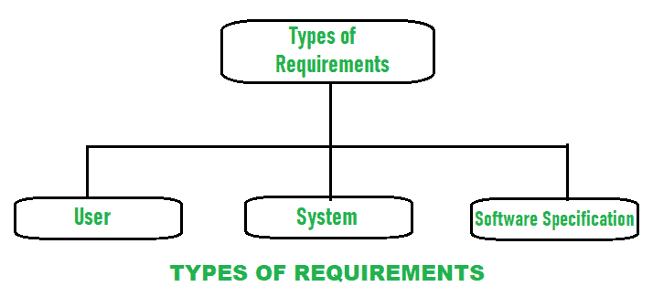

# 系统的功能性和非功能性需求

> 原文:[https://www . geesforgeks . org/系统的功能和非功能需求/](https://www.geeksforgeeks.org/functional-and-non-functional-requirement-of-a-system/)

**需求**简单来说就是需要或者想要的东西。需求工程是以适当的方式定义需求、建立需求、记录需求的过程，目的是保持系统中客户需求的质量，以及系统运行和开发的限制。这是软件工程的第一项活动。需求是需要通过软件系统的设计、产品或过程来满足的东西。要求可分为:

1.  **用户需求:**
    用户需求简单来说就是软件系统应该满足的用户需求。它记录在用户需求文档中(URD)。总的来说，语句通常是用自然语言编写的，加上对系统提供的服务及其操作限制的描述。如果用户需求清晰而简短，能够提高整体质量，提高生产率，具有可追溯性等，那么用户需求就是好的。
2.  **系统需求:**
    系统需求简单来说就是系统需要平稳高效的运行。它是一个结构化文档，详细描述了系统功能、服务和操作限制。它需要许多硬件和软件资源。如果这些硬件和软件资源不可用或不太可用，则可能会导致系统故障或导致性能问题。在客户和承包商之间，它被写成一份合同来定义所有需要实施以提高生产率的要求。

*   **Software specification :**
    It is a detailed description of software system requirements with the help of which designing and implementation can be done to develop software. For software developers, software specification is usually written that makes it easier for the developer to understand overall requirement of software.

    系统的两种主要需求:

    1.  **[Functional requirements](https://www.geeksforgeeks.org/functional-vs-non-functional-requirements/) :**
        Functional requirements are mandatory which means it is compulsory and needed to be fulfilled. They generally describe and define features of end product of software system and simply focuses on what the end product does.

        这些是系统应该完成的要求，比如计算、数据操作等。找出功能需求并在用例中捕获是非常容易的。

        系统应提供服务声明，描述系统如何对提供的输入做出反应，并应明确系统在特定情况下如何做出反应。功能需求是依赖于软件类型的需求类型，因为不同的软件有不同的功能需求，使用软件的系统严重影响软件的功能和用户满足他们的需求。用户的功能需求是高级抽象语句。一般来说，它描述了在任何需要的时候系统应该是什么样的，但是系统功能应该通过功能系统需求来详细描述。

    2.  **[Non-Functional Requirements](https://www.geeksforgeeks.org/non-functional-requirements-in-software-engineering/) :**
        Non-functional requirements are not mandatory which means that they are not compulsory to be fulfilled. The non-functional requirements define system properties and system performance. Different properties of a system are there which can be Reliability, response time, maintainability, availability, storage requirements.

        它只关注最终产品是如何工作的，找出非功能性需求并将其作为质量属性捕获并不容易也不困难。测试包括性能、压力、安全测试等。非功能性需求更不被认可，如果非功能性需求没有得到满足，那么完整的系统是没有用的。

        **示例–**
        产品需求、组织需求、外部需求、容量或存储需求、资源需求、整体性能需求时间等。