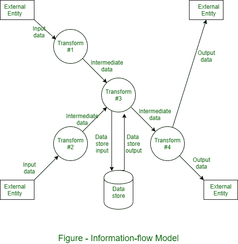

# 功能建模和信息流建模

> 原文:[https://www . geesforgeks . org/functional-modeling-and-information-flow-modeling/](https://www.geeksforgeeks.org/functional-modeling-and-information-flow-modeling/)

在**功能模型**中，软件转换信息。为了实现这一点，它必须执行至少三个共同的任务——输入、处理和输出。当应用程序的功能模型被创建时，软件工程师强调特定于问题的任务。功能模型从单个参考水平模型开始(即制造)。在一系列的迭代中，越来越多的功能细节被给出，直到所有的系统功能被完全展现。

信息被转换是因为它来自一个基于计算机的系统。系统接受各种形式的输入；硬件、软件和人为因素被用来取代它；并以各种形式生产。变换或函数可以由单个逻辑比较、复杂的数值方法或规则组成——专家系统的发明方法。输出可以点亮一个发光二极管或提供 200 页的报告。相反，我们可以为任何基于计算机的系统创建一个模型或流程模型，无论其大小和复杂性如何。

结构分析最初是一种**信息流建模**技术。基于计算机的系统可以被建模为信息转换函数，如图所示。

矩形代表外部单位。也就是说，系统元件，例如硬件、人或提供信息供软件转换或接收软件提供的信息的另一个系统。圆圈用于表示应用于数据并以某种方式改变数据的过程、转换或函数。箭头用于表示一个或多个数据项。

所有的箭头都应该标上一个 [DFD](https://www.geeksforgeeks.org/levels-in-data-flow-diagrams-dfd/) 。双线用于表示数据存储。图中可能有隐含的过程或顺序，但显式的逻辑细节通常会延迟到软件设计时。