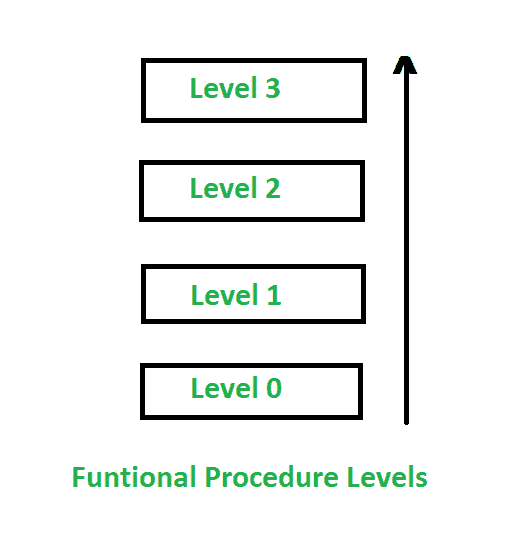

# 软件工程中的功能程序层

> 原文:[https://www . geesforgeks . org/functional-procedure-layers-in-software-engineering/](https://www.geeksforgeeks.org/functional-procedure-layers-in-software-engineering/)

**面向功能的设计**是一种处理软件设计的方法，其中计划已经恶化为一堆连接单元，每个单元都有明确定义的功能。因此，系统是从功能角度规划的。

您可以在这里查看更多关于[功能导向设计](https://www.geeksforgeeks.org/software-engineering-function-oriented-design/)的信息。

**功能程序层:**

功能程序层是在软件设计过程中使用的功能程序的层或层次。该功能内置于层中，附加符号用于指定细节。在功能程序层中，程序中存在 4 层:

1.  0 级
2.  一级
3.  二级
4.  三级

让我们一个接一个地讨论它们:

1.  **等级 0–**
    该等级定义了以下内容:
    *   函数或过程的名称。
    *   与其他系统组件的关系(例如，哪个系统的一部分，由哪个例程调用，等等。).
    *   它还简要描述了该功能的用途。
    *   此外，它还定义了作者和日期。

2.  **等级 1–**
    该等级定义了以下内容:
    *   函数参数，如问题变量、类型、目的等。
    *   全局变量像问题变量、类型、目的、共享信息。
    *   它也有函数调用的例程。
    *   输入/输出断言

3.  **等级 2–**
    该等级定义了以下内容:
    *   变量等本地数据结构。
    *   时间限制。
    *   异常的处理，如条件、响应、事件。

4.  **级别 3–**
    该级别仅定义 Body，即结构化图表、英文伪代码、决策表、流程图等。