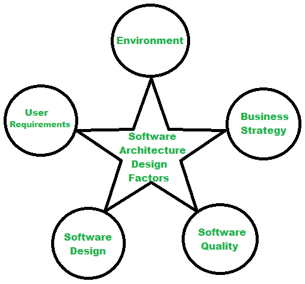

# 软件架构设计基础

> 原文:[https://www . geesforgeks . org/软件架构设计基础/](https://www.geeksforgeeks.org/fundamentals-of-software-architecture-design/)

先决条件:[软件架构基础](https://www.geeksforgeeks.org/fundamentals-of-software-architecture/)

**软件架构设计:**
软件架构设计、软件架构建模或软件架构模式用于表示系统将如何基于软件元素、关系和属性进行操作。它大多被用作将要建造的项目的蓝图。软件架构设计通过定义和构建解决方案来帮助连接技术和操作方面。架构和设计部分可以分为两部分

*   **软件架构–**
    架构定义了系统的蓝图。它是这些要素的沟通和协调机制。它设计了一个结构化的解决方案，同时保持了性能、安全性等。签到。它影响系统的质量、可维护性和整体性能。

*   **软件设计–**
    软件设计是提出一个计划的方法，该计划考虑了用户需求、可用资源来找到最佳设计。这为开发人员和经理开发项目以满足客户需求奠定了基础。

**软件设计架构的重要性:**

*   将焦点放在结构上，同时隐藏实现
*   满足顾客的需求
*   最佳利用资源，同时提供有效的产品
*   提高对组织的信任
*   实现用例和场景
*   提前预测产品发布

**软件架构设计因素:**
当一个结构化的框架被设计用于产品概念化其行为、软件元素和关系等。在这种情况下，与软件产品相关的不同方面被考虑用于设计软件架构。下图代表了所有这些因素。

**软件设计原则的主要目标:**

*   在业务和技术需求之间建立桥梁
*   确定与项目结构相关的需求
*   使项目的架构可扩展、稳定和可测试
*   考虑决策的整体后果
*   让项目变得灵活

**设计原则:**
当在软件架构设计中遵循不同的设计原则时，不仅使设计过程更简单，而且以低成本、低工作量、最大限度地减少需求维护和跟踪，使产品开发更容易、更快。

1.  **关注点分离–**
    该原则规定，应根据软件的工作情况来区分软件。例如，这可以通过将业务模型与实现部分分离来实现，这样每个模块的不同相关人员就不必担心另一个模块。
2.  **封装–**
    它有助于将应用程序的一部分隐藏起来。这有助于改进项目，因为它确保一个部分的更改不会影响到应用程序的另一部分。
3.  **不要重复自己(DRY)–**
    避免单个应用程序中的功能重复。方法避免重复，并为单个组件实现一段代码。这一原则将降低应用程序的复杂性。
4.  **最少知识原则–**
    它也被称为 LoD(德米特里定律)，有助于避免组件之间的相互依赖。因为组件对于包含其他组件或对象的产品的内部架构是未知的。