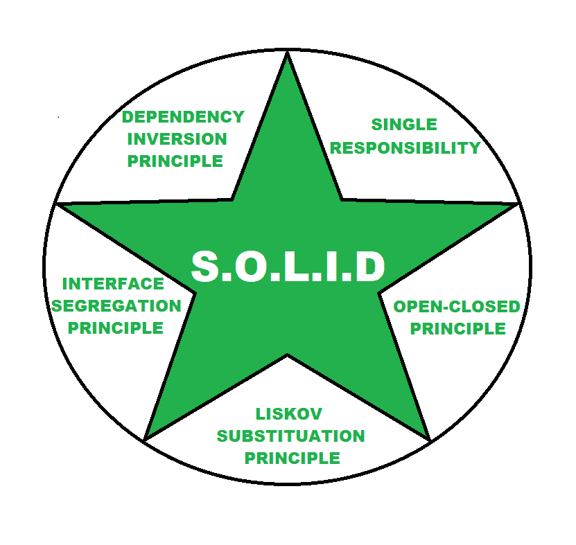

# 软件架构基础

> 原文:[https://www . geesforgeks . org/软件架构基础/](https://www.geeksforgeeks.org/fundamentals-of-software-architecture/)

在科技的世界里，从小孩到年轻人，从年轻人到老年人，每个人都在使用他们的智能手机、笔记本电脑、电脑、掌上电脑等，通过使用一些软件程序在线解决任何简单或复杂的任务，在用户看来一切都很简单。这也是一个好软件的目的，在一个用户友好的环境中提供高质量的服务。在那里，任何软件产品的整体抽象使它看起来简单，用户使用起来非常容易。但是在后面，我们将看到构建一个复杂的软件应用程序包括复杂的过程，这些过程由许多元素组成，而编码只是其中的一小部分。

在业务分析师收集业务需求后，开发团队开始制定[软件需求规范(SRS)](https://www.geeksforgeeks.org/software-requirement-specification-srs-format/) ，依次经历测试、验收、部署、维护等各种步骤。每一个软件开发过程都是通过遵循属于这个[软件开发生命周期(SDLC)的一些顺序步骤来执行的。](https://www.geeksforgeeks.org/software-development-life-cycle-sdlc/)

在软件开发生命周期的设计阶段，软件架构被定义和记录。因此，在本文中，我们将清楚地讨论软件开发生命周期的一个重要元素，即软件体系结构。

**软件架构:**
软件架构定义了系统的基本组织，更简单地定义了结构化的解决方案。它定义了软件系统的组件是如何组装的，它们之间的关系和通信。它作为软件应用的蓝图和开发团队的开发基础。

软件架构定义了一系列的事情，这些事情使得软件开发过程中的许多事情变得更加容易。

*   软件架构定义了系统的结构。
*   软件架构定义了系统的行为。
*   软件架构定义了组件关系。
*   软件架构定义了通信结构。
*   软件架构平衡了涉众的需求。
*   软件架构影响团队结构。
*   软件架构关注重要的元素。
*   软件架构捕捉早期设计决策。

**软件架构的特征:**
架构师根据操作将架构特征分成大类，很少出现需求、结构等。下面解释一些通常被认为是重要的特征。

*   **运营架构特征:**
    1.  有效性
    2.  表演
    3.  可靠性
    4.  低容错性
    5.  可量测性
*   **结构建筑特点:**
    1.  可配置性
    2.  展开性
    3.  可支持
    4.  轻便
    5.  可维护性
*   **交叉架构特征:**
    1.  易接近
    2.  安全
    3.  可用性
    4.  隐私
    5.  可行性

**软件架构的固体原则:**
单词*固体*的每个字符定义了软件架构的一个原则。遵循这一原则是为了避免产品策略错误。软件架构必须遵循固体原则，以避免任何架构或开发失败。

南 O.L.I.D 原则

1.  **单一责任–**
    每个服务都应该有一个单一的目标。
2.  **开闭原则–**
    软件模块应该是独立的、可扩展的。
3.  **利斯科夫替代原则–**
    独立服务应该能够相互沟通和替代。
4.  **接口隔离原则–**
    软件应该分成这样的微服务，不应该有任何冗余。
5.  **依赖倒置原则–**
    上级模块不应该依赖下级模块，上级的变化不会影响下级。

**软件架构的重要性:**
软件架构进入软件开发生命周期的设计阶段。它是整个软件开发过程的初始步骤之一。没有软件架构进行软件开发就像建造一座房子而没有设计房子的架构。

因此，软件体系结构是软件应用开发的重要组成部分之一。从技术和发展的角度来看，以下是软件架构重要的原因。

*   为系统选择要优化的质量属性。
*   促进早期原型制作。
*   允许以组件方式构建系统。
*   帮助管理系统中的更改。

除了所有这些**软件架构**对于软件质量、软件可靠性、软件可维护性、软件可支持性和软件性能等许多其他因素也很重要。

**软件架构优势:**

*   为软件项目提供坚实的基础。
*   有助于提高性能。
*   降低开发成本。

**软件架构的缺点:**

*   有时候获得好的工具和标准化成为软件架构的一个问题。
*   基于架构的项目成功的初始预测并不总是可能的。

从上面可以清楚地看到**软件架构**对于软件应用程序的开发有多重要。所以一个好的软件架构也是交付一个好的软件产品的责任。