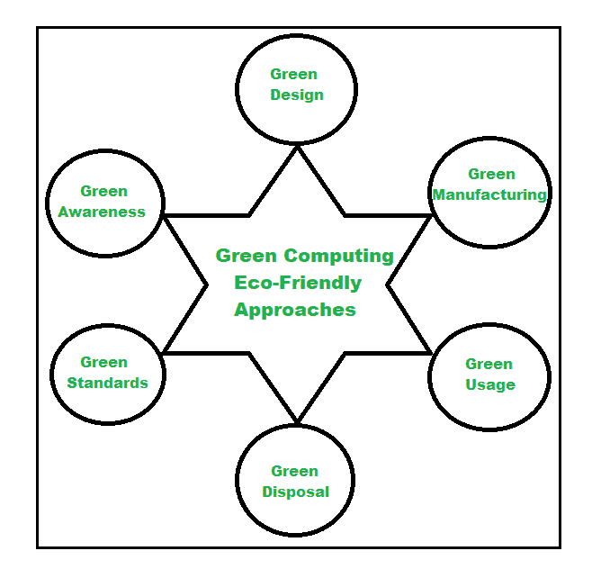

# 绿色计算的未来

> 原文:[https://www.geeksforgeeks.org/future-of-green-computing/](https://www.geeksforgeeks.org/future-of-green-computing/)

**绿色计算**又称绿色 IT(信息技术)或绿色科技，是指对环境的持久计算，也就是对计算机及其相关资源的生态友好使用。广义而言，它指的是以减少不良环境影响的方式设计、制造、使用和处置计算组件的研究。这些做法包括设计节能计算设备、实施节能处理单元和服务器、减少危险材料的使用和鼓励数字设备的可回收性、适当处置电子废物(电子废物)。绿色计算始终旨在使计算过程更加绿色友好。1992 年，它起源并最初被称为能源之星，后来被称为绿色计算。

**绿色计算的目标:**

*   尽量减少使用危险的信息技术/计算产品。
*   让计算过程更加环保。
*   让计算过程更节能。
*   减少差旅需求。
*   计算废品的回收。
*   购买和使用绿色能源。
*   由于公用事业成本降低，节省了资金。
*   减少纸张的使用。
*   设计好的算法以提高计算机的效率。

**绿色计算方法:**
为了推广绿色计算，采用了以下四种方法

1.  **绿色使用–**
    减少电脑及其周边子系统的用电量，以环保方式使用。此外，采用虚拟化降低了能源需求。
2.  **绿色处置–**
    回收再利用现有设备，妥善处置废弃 IT/计算材料、电子设备等。
3.  **绿色设计–**
    设计节能以及对绿色环境影响最小的有效系统。
4.  **绿色制造–**
    制造可生物降解材料，同时制造长期可用、可回收的产品，减少制造过程中的浪费。

下图展示了绿色计算的方法:

**绿色计算的应用:**

1.  绿色无线网络。
2.  数据中心的能源管理。
3.  绿色云计算。
4.  绿色并行计算。

绿色计算的优缺点:

**优势:**

*   降低能耗。
*   维护绿色环境。
*   经济高效的计算。
*   资源保护。

**缺点:**

*   技术日新月异。
*   初始实施可能成本高昂。
*   需要用户小心。
*   需要深刻理解绿色计算概念。

**电脑用户和商家让计算过程更加绿色的一些小技巧**:

*   在完成使用过程中，关闭计算机系统及其外围设备的电源。
*   睡眠模式使系统长时间不活动。
*   使用笔记本电脑和笔记本电脑，而不是使用台式电脑。
*   寻求绿色包装解决方案。
*   尽量减少纸张的使用，使用电子纸，并回收废纸。
*   妥善处理电子废物。
*   尝试翻新现有的设备，而不是去一个新的。