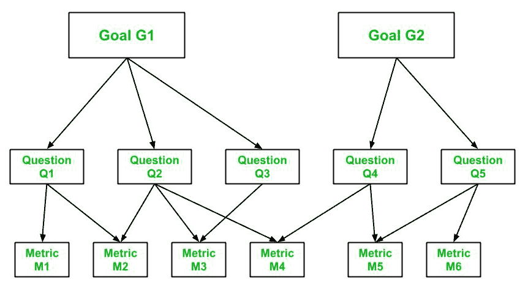

# 软件质量中的目标问题度量方法

> 原文:[https://www . geesforgeks . org/goal-question-metric-进场-软件-质量/](https://www.geeksforgeeks.org/goal-question-metric-approach-in-software-quality/)

**GQM 或目标问题度量方法**是一种通过以下方式识别重要且有意义的度量的方法:

*   列出流程的目标或目的
*   用数据或指标追踪目标
*   使用一个框架来解释与列出的过程目标相关的数据

GQM 的方法有三个层次——概念层次、操作层次和数量层次。每个级别对于理解度量标准都很重要。

**1。概念层面–目标:**
这个层面代表一个目标或目的。目标是一个对象或实体。
测量对象包括:

*   **产品–**
    软件需求规范(SRS)、设计、程序或代码
*   **流程–**
    测试(验证和确认)，设计
*   **资源–**
    硬件和软件

**2。操作级别–问题:**
此级别代表问题。一组问题用于评估目标。
问题示例可以是:

*   从团队的角度来看，当前的流程绩效是否令人满意？
*   性能在提高吗？
*   改进是否令人满意？

**3。定量级别–指标:**
该级别代表指标。随着场景中每个问题的增加，一组数据被用来以定量的方式回答问题。这组数据被称为指标。
数据可以有两种类型:

*   **目标–**
    LOC(代码行)、模块大小、程序大小等。
*   **主观–**
    1 到 10 级的用户满意度

GQM 是一个层级模型，遵循自上而下的方法，首先指定目标，然后编写和收集问题，最后将指标与每个问题相关联。参考下图:

**GQM 方法示例:**
一个目标应该在其中指定以下内容:

*   它的目的
*   过程(或对象)
*   观点
*   质量问题

在下面显示的示例中，我们有以下目标:

*   目的–评估
*   对象编程工具
*   观点–从项目经理的角度来看
*   问题–的有效性

| 目标 | 目的–评估
对象–编程工具 ABC
问题–T2 观点的有效性–项目经理的观点 |
| **提问 Q1** | 程序员或工具用户目前的工作效率如何？ |
| 公制 M1 | 代码行 |
| 公制 M2 | 努力 |
| 公制 M3 | ELOC(无注释或有效代码行) |
| 公制 M4 | YOE 编程 |
| 公制 M5 | 功能点 |
| **提问 Q2** | 代码质量是否令人满意？ |
| 公制 M6 | 缺陷数 |
| 公制 M7 | 损坏 |
| 公制 M8 | 缺陷年龄 |
| 公制 M1 | 代码行 |
| 公制 M3 | ELOC(无注释或有效代码行) |
| 公制 M5 | 功能点 |
| **问题 Q3** | 谁在使用这个编程工具？ |
| 公制 M9 | 程序员比例 |
| 公制 M4 | YOE 编程 |
| 公制 M10 | 使用软件 ABC 的月份 |

这就是为一个目标指定问题和度量的方式，对于场景中的每个目标，都要执行类似的过程。

目标问题度量方法与其他方法相结合来分析目标是否能够实现。像美国国家航空航天局和摩托罗拉这样的组织已经使用 GQM 方法来改进他们的过程，并确保按照要求实现目标。