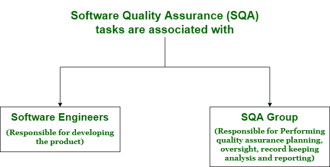

# 软件质量保证的目标和措施

> 原文:[https://www . geesforgeks . org/软件质量保证目标和措施/](https://www.geeksforgeeks.org/goals-and-measures-of-software-quality-assurance/)

软件质量仅仅意味着衡量软件设计的好坏，即设计的质量，以及软件与设计的一致性，即一致性的质量。软件质量描述了软件组件满足特定要求和用户或客户需求和期望的程度。

[软件质量保证(SQA)](https://www.geeksforgeeks.org/software-engineering-software-quality-assurance/) 是一种有计划、有系统的活动模式，为产品质量提供高度信任是必要的。它实际上提供或给出质量控制活动的质量评估，并有助于确定数据的有效性或确定质量的程序。它通常监控项目中使用的软件过程和方法，以确保或保证和维护软件质量。

**软件质量保证的目标:**

*   质量保证包括一套报告和审计功能。
*   这些功能有助于评估和控制质量控制活动的有效性和完整性。
*   它确保了对产品质量至关重要的数据管理。
*   它还确保所开发的软件符合标准质量保证，并以标准质量保证进行编译。
*   它确保最终结果或产品满足用户和业务需求。
*   它只是发现或识别缺陷或 bug，并减少这些缺陷的影响。

**软件质量保证的衡量标准:**
软件质量有多种衡量标准。这些内容如下:

1.  **可靠性–**
    它包括系统的可用性、准确性和可恢复性等方面，以便在给定的时间段内，在特定使用情况下继续运行。例如，系统从关闭故障中的可恢复性是一种可靠性度量。
2.  **性能–**
    表示使用系统响应时间、恢复时间和启动时间来衡量系统的吞吐量。这是一种测试类型，用来衡量系统在高负载下的响应性和稳定性。
3.  **功能性–**
    代表系统满足主要功能需求。它只是指系统所需的和指定的能力。
4.  **保障性–**
    软件系统还必须满足许多其他需求或属性。这些包括-可测试性、适应性、可维护性、可扩展性等等。这些需求通常会增强支持软件的能力。
5.  **可用性–**
    是软件系统容易被其指定的用户或客户理解和使用，以有效、高效和满意的方式实现指定目标的能力或程度。它包括美观、一致性、文档和响应。