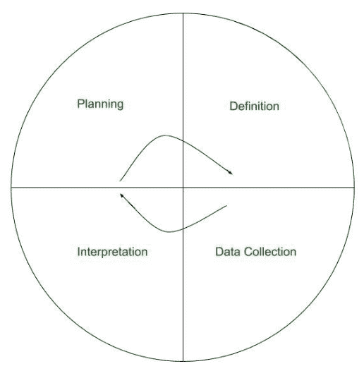

# 软件工程中的 GQM 方法

> 原文:[https://www . geesforgeks . org/gqm-软件工程中的方法/](https://www.geeksforgeeks.org/gqm-method-in-software-engineering/)

**目标/问题/度量(GQM)** 方法是一种用于目标导向测量的成熟技术。它由以下 3 个基本要素组成:

1.  目标
2.  问题
3.  公制的

在 GQM 方法中，测量是面向目标的。首先，需要清晰地描述目标，以便在软件开发过程中对其进行度量。

在这种方法中，目标被定义并转化为问题和度量。然后回答问题，并检查这些答案是否满足目标。因此，该方法遵循自上而下的方法，通过划分目标，然后将目标映射为问题，然后将这些问题转换为度量，该方法还遵循自下而上的方法，通过分析度量和检查目标是否得到满足。

**GQM 步法**

1.  目标被清晰地定义和描述。
2.  将目标转化为适当的问题。
3.  问题被转换成默特克斯。

**GQM 方法的阶段:**

1.  **规划:**
    第一阶段，通过确定基本需求，编制项目计划。
2.  **定义:**
    在第二阶段描述目标，问题和度量发生。这三者定义明确。
3.  **数据收集:**
    在此阶段，收集实际数据。
4.  **解读:**
    是最后一个阶段，提供前几个阶段提问的答案，验证目标达成情况。