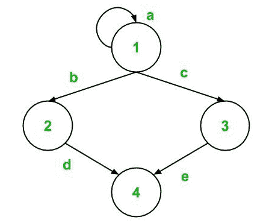
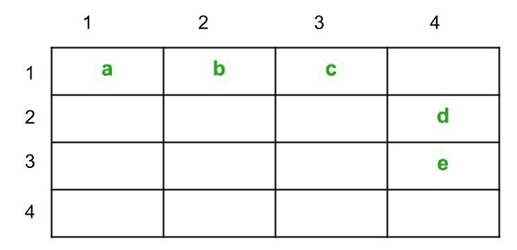
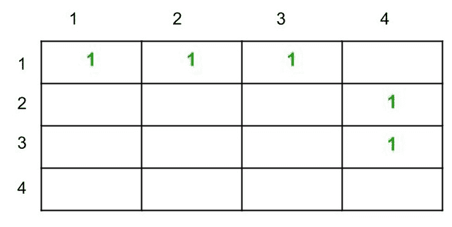
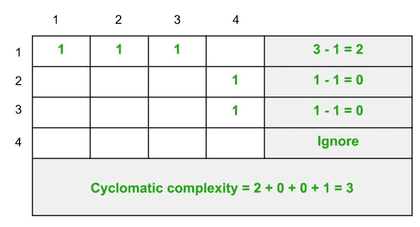

# 软件测试中的图形矩阵

> 原文:[https://www . geesforgeks . org/graph-matrix-in-software-testing/](https://www.geeksforgeeks.org/graph-matrices-in-software-testing/)

一个**图形矩阵**是一个数据结构，可以帮助开发一个用于[路径测试](https://www.geeksforgeeks.org/path-testing-in-software-engineering/)自动化的工具。图矩阵的属性是开发测试工具的基础，因此图矩阵对于理解[软件测试](https://www.geeksforgeeks.org/software-testing-basics/)概念和理论非常有用。

**什么是图形矩阵？**
图矩阵是一个正方形矩阵，其大小代表控制流图中的节点数。如果你不知道什么是控制流图，那么阅读[这篇](https://www.geeksforgeeks.org/basis-path-testing-in-software-testing/?ref=rp)文章。矩阵中的每一行和每一列都标识一个节点，矩阵中的条目表示这些节点之间的边或链接。传统上，节点用数字表示，边用字母表示。

举个例子吧。



让我们把这个控制流图转换成一个图形矩阵。因为图有 4 个节点，所以图矩阵的维数为 4 X 4。矩阵条目将按如下方式填写:

*   (1，1)将用“a”填充，因为从节点 1 到节点 1 存在一条边
*   (1，2)将用“b”填充，因为从节点 1 到节点 2 存在一条边。需要注意的是，(2，1)不会被填充，因为边缘是单向的，而不是双向的
*   (1，3)将用“c”填充，因为从节点 1 到节点 3 存在边 c
*   (2，4)将用“d”填充，因为从节点 2 到节点 4 存在边
*   (3，4)将用“e”填充，因为从节点 3 到节点 4 存在一条边

形成的图形矩阵如下所示:



**连接矩阵:**
连接矩阵是用边权重定义的矩阵。简单来说，当控制流图的两个节点之间存在连接时，则边权重为 1，否则为 0。然而，通常不在矩阵单元中输入 0，以降低复杂性。

例如，如果我们将上面的控制流图表示为连接矩阵，那么结果将是:



如我们所见，边的权重被简单地替换为 1，并且之前为空的单元格保持原样，即表示 0。

连接矩阵用于计算控制图的**圈复杂度。
虽然还有其他三种方法可以找到圈复杂度，但是这种方法也很有效。**

计算圈复杂度的步骤如下:

1.  计算每行中 1 的数量，并将其写入行尾
2.  每行从该计数中减去 1(如果计数为 0，则忽略该行)
3.  将之前计算的每行计数相加
4.  将总数加 1
5.  步骤 4 中的最终总和是控制流图的圈复杂度

让我们将这些步骤应用到上面的图中来计算圈复杂度。



我们可以使用其他方法验证圈复杂度的这个值:

**方法-1 :**

```
Cyclomatic complexity
= e - n + 2 * P 
```

从这里开始，

```
e = 5
n = 4
and, P = 1 
```

因此，圈复杂度，

```
= 5 - 4 + 2 * 1 
= 3 
```

**方法-2 :**

```
Cyclomatic complexity 
= d + P 
```

在这里，

```
d = 2 
and, P = 1 
```

因此，圈复杂度，

```
= 2 + 1 
= 3 
```

**方法-3:**

```
Cyclomatic complexity
= number of regions in the graph 
```

里

*   区域 1:由边 b、c、d 和 e 界定
*   区域 2:以边 a 为界(在循环中)
*   区域 3:图外

因此，圈复杂度，

```
= 1 + 1 + 1 
= 3 
```

可以看出，所有其他方法都给出相同的结果。方法 1、2 和 3 已经在这里详细讨论过[](https://www.geeksforgeeks.org/basis-path-testing-in-software-testing/?ref=rp)<u>。</u>