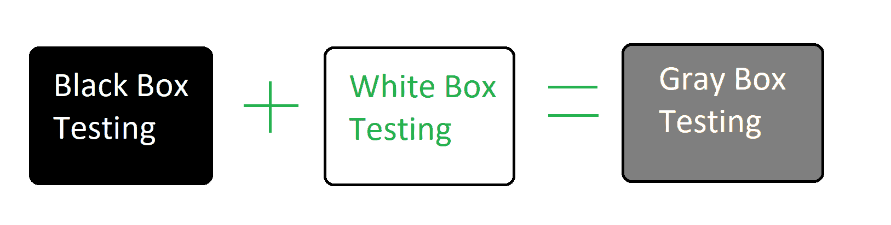

# 灰盒测试|软件测试

> 原文:[https://www . geesforgeks . org/gray-box-testing-software-testing/](https://www.geeksforgeeks.org/gray-box-testing-software-testing/)

先决条件–[软件测试|基础](https://www.geeksforgeeks.org/software-testing-basics/)
**灰盒测试**是一种软件测试技术，它是[黑盒测试](https://www.geeksforgeeks.org/software-engineering-black-box-testing/)技术和[白盒测试](https://www.geeksforgeeks.org/software-engineering-white-box-testing/)技术的结合。在黑盒测试技术中，测试人员不知道被测试项目的内部结构，而在白盒测试中，测试人员知道内部结构。内部结构在灰盒测试中是部分已知的。这包括为了设计测试用例而访问内部数据结构和算法。

灰色盒子测试之所以这样命名，是因为软件程序就像一个半透明或灰色的盒子，测试人员可以部分看到里面。它通常关注与 web 系统相关的特定于上下文的错误。

**灰箱检测的目的:**
灰箱检测的目的是:

1.  提供黑盒测试和白盒测试的综合优势。
2.  结合开发人员和测试人员的输入。
3.  提高整体产品质量。
4.  减少长时间的功能和非功能测试的开销。
5.  为开发人员提供足够的空闲时间来修复缺陷。
6.  从用户的角度而不是从设计者的角度进行测试。

**灰盒测试技术:**

*   **矩阵测试:**
    在矩阵测试技术中，检查由软件程序中的开发人员定义的业务和技术风险。开发人员定义程序中存在的所有变量。每个变量都有固有的技术和业务风险，并且在其生命周期中可以以不同的频率使用。
*   **模式测试:**
    要执行测试，需要分析之前的缺陷。它通过查看代码来确定失败的原因。分析模板包括缺陷的原因。这有助于测试用例的设计，因为它们能够在投入生产之前主动发现其他故障。
*   **正交阵列测试:**
    主要是黑盒测试技术。在正交阵列测试中，测试数据有 n 个排列和组合。当测试用例非常少且测试数据很大时，需要最大覆盖时，最好使用正交阵列测试。这对于测试复杂的应用程序非常有帮助。
*   **回归测试:**
    回归测试是在软件的每一次更改后对软件进行测试，以确保更改或新功能不会影响系统的现有功能。还进行回归测试，以确保修复任何缺陷都不会影响软件的其他功能。

**灰盒测试的优势:**

*   用户和开发人员在做测试时有明确的目标。
*   灰盒测试大部分是从用户角度来做的。
*   测试人员不需要有很高的编程技能。
*   灰盒测试是非侵入性的。
*   产品的整体质量得到提高。
*   在灰盒测试中，开发人员有更多的时间来修复缺陷。
*   通过进行灰盒测试，获得了黑盒测试和白盒测试的双重好处。
*   灰盒检验是无偏的。它避免了测试人员和开发人员之间的冲突。
*   灰盒测试在集成测试中更有效。

**灰盒测试的缺点:**

*   当对分布式系统进行灰色测试时，缺陷关联是困难的。
*   对内部结构的有限访问导致对代码路径遍历的有限访问。
*   因为无法访问源代码，所以不可能进行完整的白盒测试。
*   灰盒测试不适合算法测试。
*   大多数测试用例很难设计。