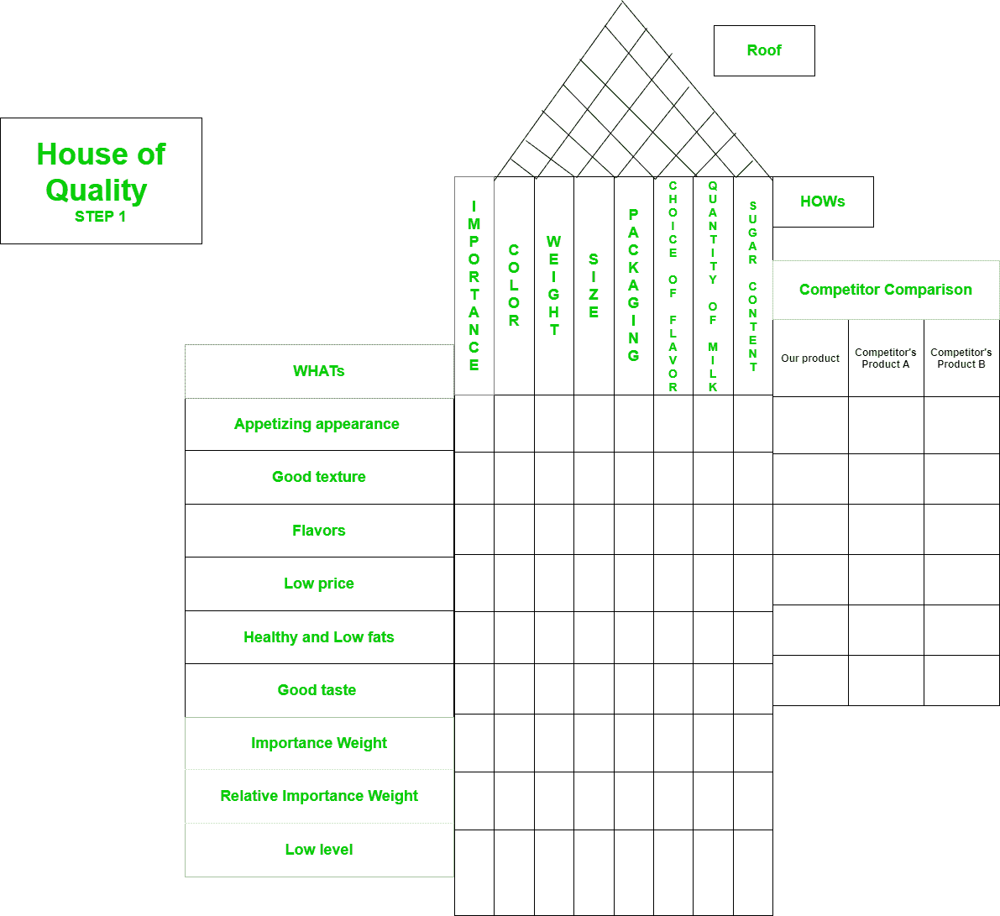
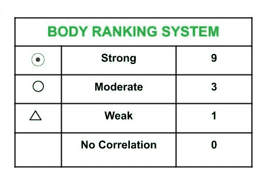
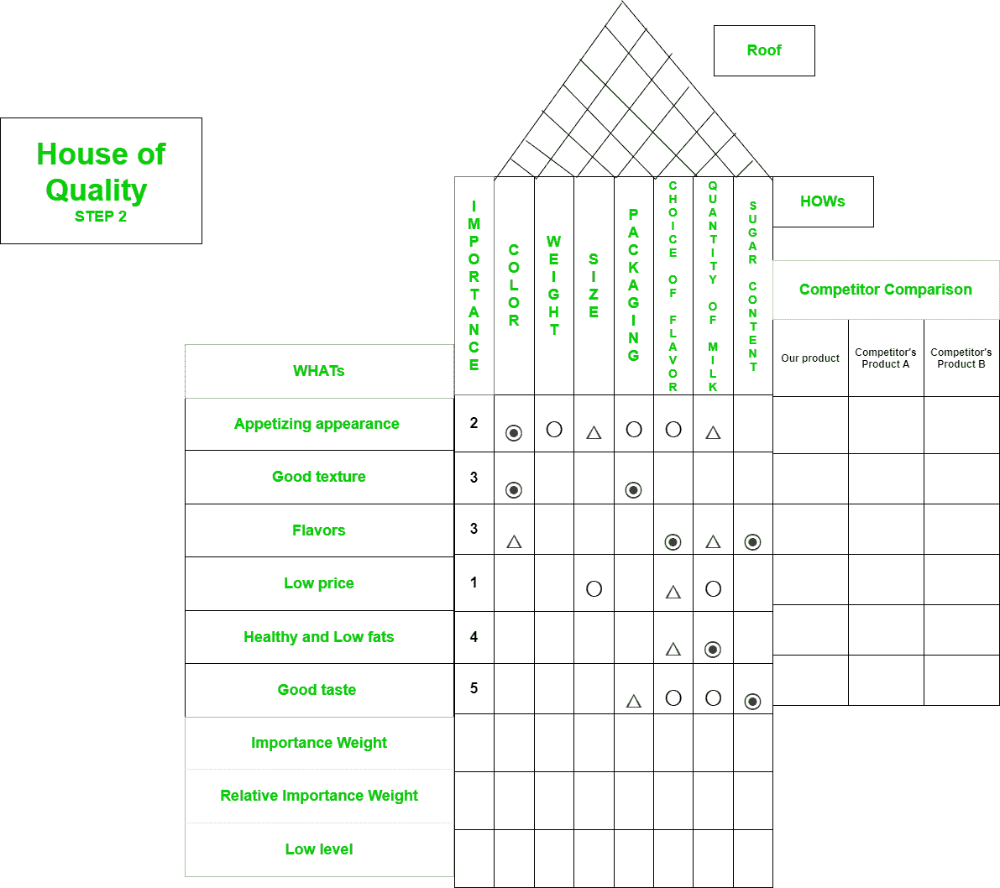
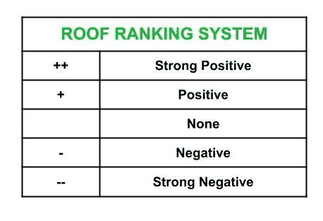
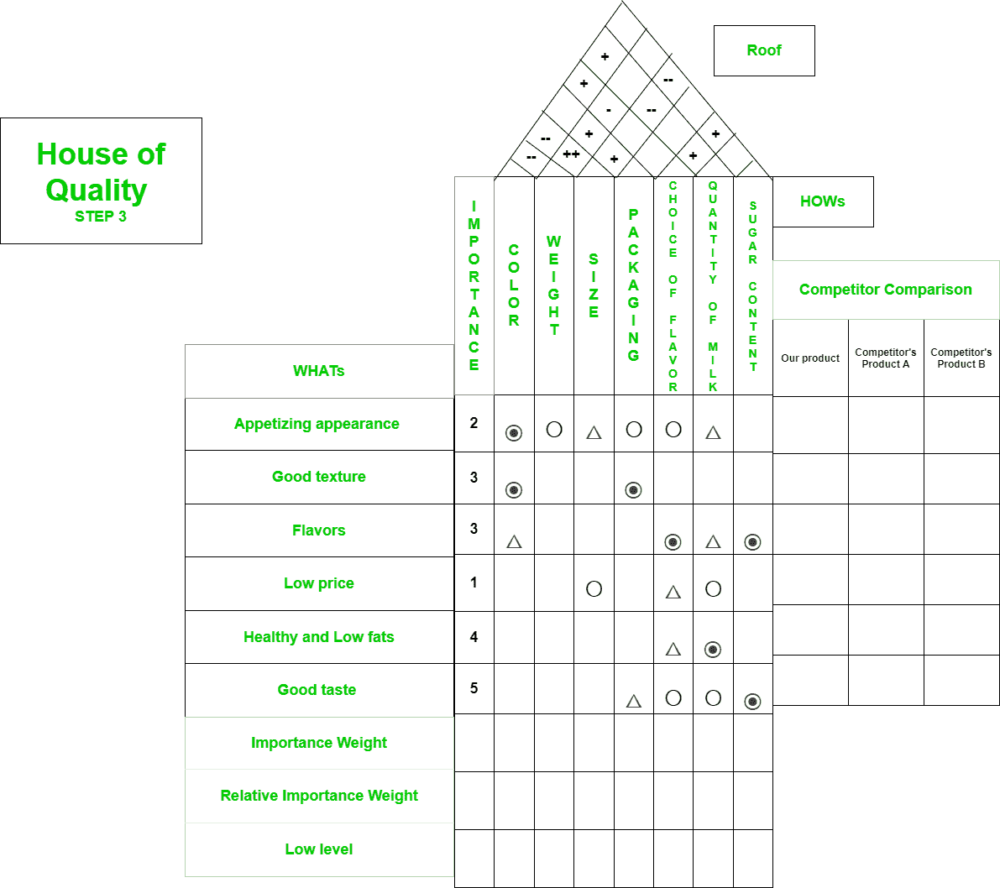
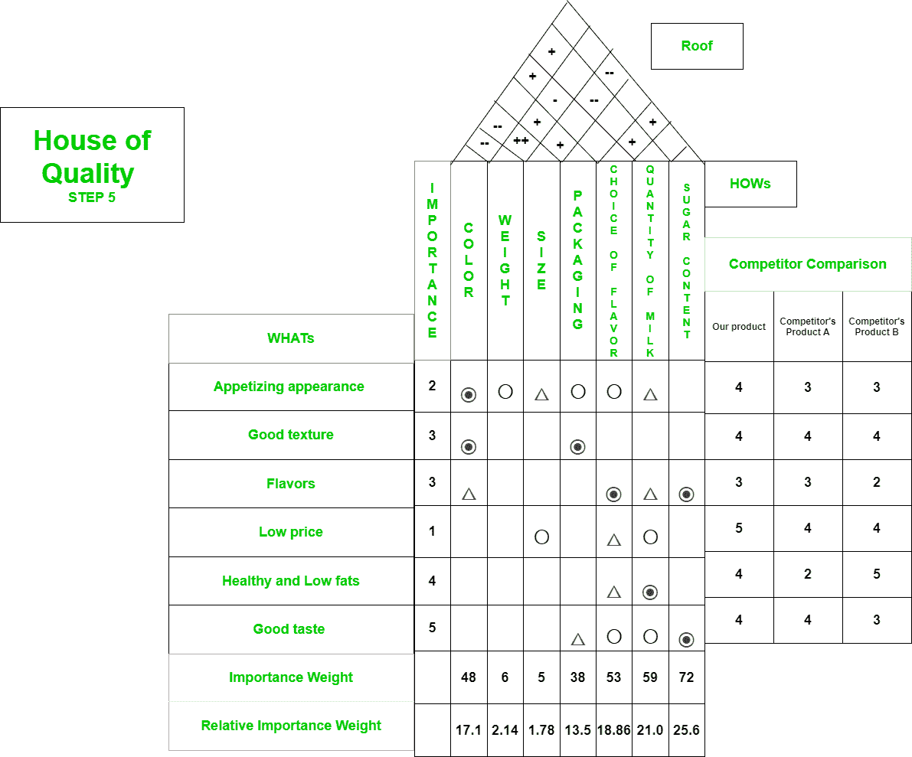

# 软件质量中的质量范例之家

> 原文:[https://www . geesforgeks . org/质量屋-软件质量范例/](https://www.geeksforgeeks.org/house-of-quality-example-in-software-quality/)

先决条件–[质量功能部署(QFD)](https://www.geeksforgeeks.org/quality-function-deployment-qfd-in-software-quality/)

**质量屋**及其零件已在先决条件文章中讨论。在这里，我们将了解如何从零开始建造高质量的房子。

**问题:**
为产品——巧克力构建质量屋图。

让我们首先确定客户需求(什么)和设计或技术规格(如何) :

*   什么是产品–巧克力可能是:
    1.  诱人的外表
    2.  质地好
    3.  风味
    4.  低价
    5.  健康和低脂肪
    6.  口味好
*   巧克力产品的销售方式是:
    1.  颜色
    2.  重量
    3.  尺寸/尺寸
    4.  包装
    5.  口味的选择
    6.  牛奶的数量
    7.  含糖量

现在，让我们把它们都填入质量屋图表:



现在，让我们利用下面显示的身体等级系统，通过识别 WHATs 和 how 之间的相关性，在质量屋的身体中分配等级符号。



*   以下两者之间存在很强的相关性:
    1.  诱人的外观–颜色
    2.  良好的质地–颜色
    3.  质地良好–包装
    4.  口味–口味的选择
    5.  口味–含糖量
    6.  健康和低脂肪——牛奶量
    7.  好味道——含糖量
*   以下两者之间存在适度的相关性:
    1.  诱人的外观–重量
    2.  开胃外观–包装
    3.  开胃的外观–口味的选择
    4.  低价-尺寸/尺寸
    5.  低价-牛奶数量
    6.  好味道——口味的选择
    7.  好味道——牛奶的数量
*   以下两者之间存在弱相关性:
    1.  诱人的外观–尺寸/尺寸
    2.  开胃外观-牛奶量
    3.  口味–牛奶数量
    4.  低价–口味选择
    5.  健康和低脂肪——口味的选择
    6.  好味道——包装
*   The rest of cells in body of matrix have no correlation, so they are left empty. Importance factor is assigned by team on basis of prioritized customer requirements. In our example, let’s assign importance factor as follows :
    1.  开胃外观–2
    2.  质地良好–3
    3.  口味–3
    4.  低价-1
    5.  健康和低脂肪–4
    6.  好品味–5

    填体后，房屋质量图如下:

    

    现在，让我们按照下面给出的屋顶排名系统，以类似的方式来填充质量屋的屋顶。

    

    *   强烈的积极互动:
        1.  重量-尺寸
    *   积极互动:
        1.  颜色–风味的选择
        2.  颜色–牛奶的数量
        3.  重量-包装
        4.  尺寸–包装
        5.  风味选择–含糖量
        6.  风味的选择–牛奶的数量
    *   负面互动:
        1.  重量–口味的选择
    *   强烈的负面互动:
        1.  颜色-重量
        2.  颜色-尺寸
        3.  大小-牛奶的数量
        4.  大小-含糖量
    *   The rest of interactions are None Updated house of quality diagram is shown below :

        

        下一步是填写竞争对手比较部分。因此，这一部分可以由产品开发团队完成，也可以通过开展调查或从客户那里获得反馈来完成。

        

        现在，让我们计算重要性权重和相对重要性权重。

        ```
        Importance Weight (Color) 
        = 9 * 2 + 3 * 9 + 3 * 1 = 48

        Importance Weight (Weight) 
        = 3 * 2 = 6

        Importance Weight (Size) 
        = 2 * 1 + 1 * 3 = 5

        Importance Weight (Packaging) 
        = 2 * 3 + 3 * 9 + 5 * 1 = 38

        Importance Weight (Choice of flavor) 
        = 2 * 3 + 3 * 9 + 1 * 1 + 4 * 1 + 5 * 3 = 53

        Importance Weight (Quantity of milk) 
        = 2 * 1 + 3 * 1 + 1 * 3 + 4 * 9 + 5 * 3 = 59

        Importance Weight (Sugar content) 
        = 3 * 9 + 5 * 9 = 72

        Total Importance Weight 
        = 48 + 6 + 5 + 38 + 53 + 59 + 72 
        = 281
        ```

        现在，相对重要性权重:

        ```
        Relative Importance Weight (Color) 
        = ( 48 / 281 ) * 100 = 17.1

        Relative Importance Weight (Weight) 
        = ( 6 / 281 ) * 100 = 2.14

        Relative Importance Weight (Size) 
        = ( 5 / 281 ) * 100 = 1.78

        Relative Importance Weight (Packaging) 
        = ( 38 / 281 ) * 100 = 13.5 

        Relative Importance Weight (Choice of flavor) 
        = ( 53 / 281 ) * 100 = 18.86

        Relative Importance Weight (Quantity of milk) 
        = ( 59 / 281 ) * 100 = 21.0

        Relative Importance Weight (Sugar content) 
        = ( 72 / 281 ) * 100 = 25.6

        ```

        现在，我们需要在质量屋中填充这些值。最终质量屋图如下所示:

        

        **注–**
        低水平的质量屋是使用产品和其他竞争对手产品的更具体的目标值来填充的。