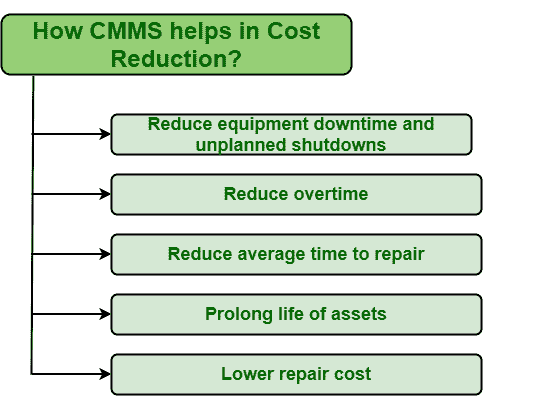

# CMMS 如何帮助降低成本？

> 原文:[https://www . geesforgeks . org/how-CMMs-帮助降低成本/](https://www.geeksforgeeks.org/how-cmms-helps-in-cost-reduction/)

[CMMS(计算机化维护管理系统)](https://www.geeksforgeeks.org/computerized-maintenance-management-systemcmms/)是帮助降低维护资产或设备所需的总体成本的最佳方法之一。 [CMMS](https://www.geeksforgeeks.org/implementation-of-cmms/) 是一种管理和处理维护操作的计算机化方式，因为它使管理和组织数据以及生成报告变得更加容易。使用 CMMS 的主要优势之一是它有助于降低维护成本。以下是 CMMS 帮助降低维护成本的一些方法

**1。减少设备停机和计划外停机:**
反应性维护或紧急维护，即在故障发生后维护设备不是一个坏策略，但它有许多其他缺点。故障设备的维护远远超过防止资产故障的维护成本。防止资产故障只会节省维修或更换故障资产所需的成本，进而降低整体维护成本。资产故障或崩溃，即资产停机或关闭，对任何组织来说都是更大的损失。应该实施预防性或前瞻性维护策略，而不是反应性维护策略。CMMS 帮助人们轻松实施预防性或前瞻性维护策略，以减少资产故障和停机时间。

**2。减少加班:**
如果任何组织的紧急情况比较多，那么工作量也会比较大，工人可能要 24 小时工作才能立即处理这种紧急情况。反过来，劳动力成本也会增加。但是，如果紧急情况被阻止发生，即任何资产的任何意外故障或故障机会减少(资产的停机时间减少)，那么它将自动减少工作量。如果实施定期维护并保持资产状况最新，员工就不必加班。CMMS 帮助团队成员更有效地沟通，这样成员们就可以一起工作，在给定的期限内快速完成任务。

**3。减少平均维修时间:**
如果发生紧急情况，人们必须迅速有效地处理情况，不得有任何延误。修复失败资产所需的时间不应太长，因为这可能会使紧急情况恶化。如果不及时修复，资产故障会导致更多的损失。这将反过来增加处理情况和使资产恢复正常工作状态所需的成本。CMMS 系统可以帮助用户更快地处理此类情况，因为 CMMS 系统提供了所需资产的所有信息，因此用户可以快速决定需要应用的最佳维护策略以及修复该资产所需的工具。

**4。延长资产寿命:**
每次处理失败的情况，资产出现紧急情况，简单来说就是资产状况不好。需要更换或修理。但这将增加维护资产所需的总体成本。一个人应该总是试图增加资产的寿命。对于越来越长的使用寿命，重要的是防止资产故障并保持其最新状态。CMMS 是确保资产得到良好维护和正常运行而不受任何干扰的最佳方式。这将自动延长它们的使用寿命，从而降低维修成本。

**5。较低的维修成本:**
资产状况是影响成本的主要因素。如果一个人实施预防性维护，那么就不会有任何维修工作的要求。这将自动节省维修成本。一个人不必做任何不必要的投资，如果修复资产状况。CMMS 帮助维持资产健康，没有任何类型的损害或失败。