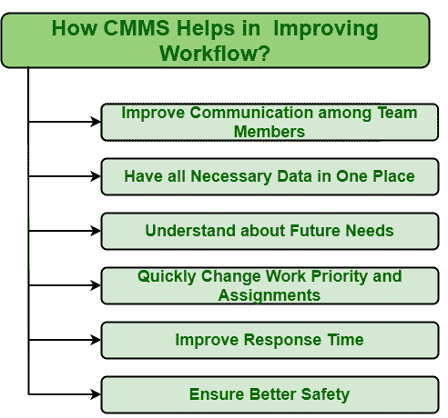

# CMMS 如何帮助改进工作流程？

> 原文:[https://www . geesforgeks . org/how-CMMs-help-in-improving-workflow/](https://www.geeksforgeeks.org/how-cmms-helps-in-improving-workflow/)

**先决条件–**[计算机化维护管理系统(CMMS)](https://www.geeksforgeeks.org/computerized-maintenance-management-systemcmms/)

**工作流**基本上是对任何一个组织的处理，通过它一个任务从发起到完成都被完成。简单地说，这是一系列完成这个过程的步骤。工作流对于任何组织都非常重要。它只是帮助组织简化和自动化任务，减少失败的机会，从而提高整体效率。工作流非常重要，因为它是帮助团队成员在更短的时间内完成更多任务的重要步骤。CMMS 是一个软件系统，它将自动简化流程，自动化重复任务，优先工作，进而提高工作流程效率。CMMS 通常通过以下方式改进工作流程:

 

1.  **改善团队成员之间的沟通:**
    团队成员和技术人员之间的沟通仍然是很多组织关注的点。不良的沟通会导致新的错误，以负面的方式影响工作流程，这反过来会给任何组织带来更大的损失。因此，团队成员之间需要更好的沟通，以便他们能够以更有效的方式一起工作。CMMS 被认为是解决这个问题的最佳方案。它通常使所有成员保持在同一页面上，并改善团队成员之间以及与其他成员的沟通。这对任何组织来说都非常重要，因为它只是删除了不必要的任务。
2.  **在一个地方拥有所有必要的数据:**
    如果数据记录在不同的地方，那么人们很难在需要的时候收集重要的数据。为了更容易，CMMS 是最好的选择，因为它将所有类型的数据保存在一个地方。团队成员可以从一个地方访问任何类型的数据。简而言之，它就像一个商场，人们可以在这里识别任何类型的东西，如工作订单、预防性维护、库存控制、维护计划、库存水平、设备等。

*   **了解未来需求:**
    了解未来需求对任何组织的成功和盈利能力都是最好的。CMMS 是一个软件系统，它帮助一个人理解所有未来的需求，这样一个人就可以根据它来满足未来的目标。人们可以在所需的方向上正常工作，也可以根据未来的需求进行简单的维护操作。*   **快速更改工作优先级和分配:**
    CMMS 是一款定期提供工作订单更新的软件，如优先级状态、工作分配等。如果有人想改变工作优先级，只需要打个电话或者简单地在维护软件中重新分配任务。*   **提高响应时间:**
    响应时间简单来说就是系统对给定事件、动作或请求的反应速度。如果响应时间很短，那么它将直接影响生产。为了提高响应时间，需要使用 CMMS。它只是加快了响应时间，因为它消除了不必要的预防性维护，确定了工作的优先级，允许通过手机访问工作订单，并就潜在的故障发出警报。*   **确保更好的安全:**
    确保更好的工作环境最重要。CMMS 是一个有助于确保更好安全的软件。它对潜在的故障发出警报，这样就可以通过立即采取措施来防止资产发生故障。这将反过来防止系统和工人受到其负面影响。这也将延长资产的使用寿命，并使其保持最新状态。