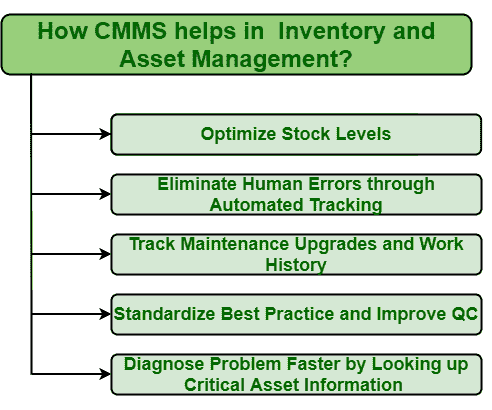

# CMMS 如何在库存和资产管理方面提供帮助？

> 原文:[https://www . geesforgeks . org/how-CMMs-in-help-in-inventory-asset-management/](https://www.geeksforgeeks.org/how-cmms-helps-in-inventory-and-asset-management/)

**先决条件–**[计算机化维护管理系统(CMMS)](https://www.geeksforgeeks.org/computerized-maintenance-management-systemcmms/)

**资产和库存管理**是任何试图降低成本和提高产量的组织中最重要和最关键的部分。管理资产和库存有助于组织使用计划和系统的方法简单地监控和管理资产。这反过来提高了生产率，节省了资金。但是管理资产和库存并不是一件容易的事情。有多少库存可用，实际需要多少，需要多少库存但没有，所有这些问题都是非常必要的。拥有太多甚至不需要的股票纯粹是浪费金钱。

另一方面，没有库存来修复库存中的失败资产可能是危险的，并可能使情况恶化。因此，一个人应该能够有效地管理资产和库存。但是没有维护软件的帮助，这是不可能的。 [CMMS](https://www.geeksforgeeks.org/implementation-of-cmms/) 是通过以下方式更有效管理资产和库存的最佳软件之一–

*   **优化库存水平:**
    库存优化非常重要，因为它可以在提高生产水平的同时减少库存。通过优化库存水平，可以轻松确定需要多少库存以及何时需要。还可以确定不需要多少库存。CMMS 是帮助优化库存水平的最佳软件。它只是旨在降低维护成本，同时不影响客户满意度。如果所需资产不可用，则 CMMS 将自动通知所需资产，以便能够及时订购。

*   **通过自动跟踪消除人为错误:**
    人为错误不是有意为之，而是会导致失败或计划外的行动。这不是一件坏事，但有时它会导致危险或危急的情况，从而对组织产生负面影响。人为错误对组织来说代价很高。但是在自动化的帮助下，人们可以减少人为错误并节省成本。CMMS 帮助执行自动跟踪到监控的任务，而不需要任何人。这将反过来减少故障发生的机会，并且不需要定期检查库存。*   **轨道维护升级和工作历史:**
    保持设备的工作历史非常必要和重要。CMMS 通常更有效地跟踪维护升级和工作历史。记录资产的所有维护和维修，只会有助于提高其转售价值。跟踪工作订单和维护升级对于任何组织来说都是非常重要的功能。CMMS 是一种数字方法，因此由于其准确性和实时更新，它更容易实施。*   **规范最佳实践，提高 QC :**
    提高 QC(质量控制)是组织的主要目标。为了提高质量控制，为维护功能选择最佳策略，执行维护操作是非常必要的。为此，非常需要跟踪维护操作的性能，以便可以确定哪种实践更有效，并将提高生产率和质量。如果维护是必不可少的，保持维护记录更为重要，CMMS 是跟踪维护操作的最佳方式。*   **通过查找关键资产信息更快地诊断问题:**
    CMMS 通常存储所有类型的信息，无论是否关键。它允许对关键信息和数据的访问，这将有助于人们更快地识别问题，也更准确地识别问题。