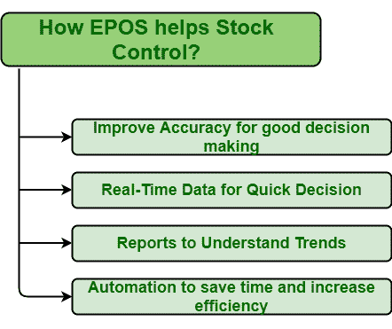

# 【EPOS 如何帮助库存控制

> 原文:[https://www.geeksforgeeks.org/how-epos-help-stock-control/](https://www.geeksforgeeks.org/how-epos-help-stock-control/)

[EPOS(电子销售点):](https://www.geeksforgeeks.org/applications-of-electronic-point-of-sale-epos/#:~:text=Electronic%20Point%20of%20Sale%20(EPOS)%2C%20as%20name%20suggests%2C,and%20handle%20their%20business%20effectively.&text=EPOS%20system%20is%20one%20of,that%20is%20user%2Dfriendly%20also.)
它是一个记录销售、处理交易、监控和管理库存以及创建报告的电子系统。它加快了支付过程，进而提高了客户满意度。EPOS 系统一般帮助中小型企业管理员工、库存等。这反过来增加了他们的利润、效率和客户体验。它只是让一个人了解最新的市场需求和利润，进而帮助一个人超越竞争对手。它减少了通过收银台的时间，使支付过程更快。

**控制库存的不同方式:**
EPOS 是一个计算机化系统，如今被认为是业务的核心部分，不仅管理交易，还管理其他业务操作，如 CRM、员工管理、库存管理、会计、记录和报告、库存控制等。EPOS 帮助库存控制的方式有多种。其中一些如下。

1.  **提高准确性以做出更好的采购决策–**
    EPOS 是一个有助于监控、报告、控制和准确性的系统。这是一个自动化系统，减少了维护手动解决方案所需的时间，并降低了人为错误的风险。它在整个操作过程中准确记录实时数据。自动化数据收集、简化销售流程和监控员工绩效可以节省资金和时间。
2.  **用于快速决策的实时数据–**
    EPOS 系统提供各种功能，如记录销售、不时更新信息、更新库存水平、加快交易速度等。在 EPOS 的帮助下，人们可以保持高度准确的库存记录，该记录会自动更新，并实时包含与库存相关的每一个细节，以及尺寸、颜色、形状、重量等描述。所有这些信息有助于一个人就业务做出快速决策，并确定必要和有益的资源。利用这些实时数据，人们可以预测未来的收入，然后进行计划、进度、订单等。因此。这将防止任何类型的损失，并有助于做出人员配置决策。
3.  **了解趋势的报告–**
    企业和组织需要准确的数据和信息来规划未来。如今，有不同类型的 EPOS 系统可用。新的 EPOS 系统附带了一些更多的附加功能，以更简单有效的方式提供销售报告，使其易于做出决策和有效开展业务。这些报告可以在白天的任何时候由欧洲专利局系统提供。在报告的帮助下，人们可以确定增加增长和业务的良好机会，也可以确定未来可能出现的意外问题。这种对销售趋势的理解会让你知道销售额比去年增长了多少百分比，是否达到了预定目标。
4.  **自动化节省时间提高效率–**
    EPOS 是一个自动化系统。有了 EPOS 系统的帮助，人们可以节省时间和金钱，因为它提高了会计程序，交易过程，以及安排员工和管理库存。这仅仅意味着人们可以花更多的时间来服务客户，从而提高客户满意度，并且这些时间也可以用来寻找更好的方法来将业务增长提升到一个新的水平。