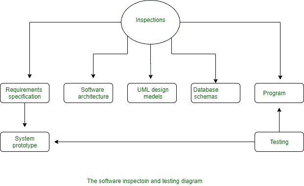

# 软件检测如何提高软件质量？

> 原文:[https://www . geesforgeks . org/how-software-inspection-improved-software-quality/](https://www.geeksforgeeks.org/how-software-inspection-improves-software-quality/)

术语软件检查是由 IBM 在 20 世纪 70 年代早期开发的，当时人们注意到测试不足以获得大型应用程序的高质量软件。

检查用于确定代码中的缺陷并有效地消除它。这可以防止缺陷并提高测试质量以消除缺陷。这种软件检查方法达到了高效消除缺陷和提高软件质量的最高水平。

有一些因素可以产生高质量的软件:

*   **短语质量设计检查和规范检查:**该因素是指遵循培训等协议的正式监督。参与者，分发材料以供检查。主持人和记录员都在场分析缺陷统计。
*   **短语质量保证:**这个因素指的是一个活跃的软件质量保证小组，它加入了一组软件开发，以支持他们开发高质量的软件。
*   **正式测试:**在一定条件下抛出测试过程
    *   对于一个应用程序，创建了一个测试计划。
    *   是完整的规范，因此可以在没有明显差距的情况下制作测试用例。
    *   使用了大量的库控制工具。
    *   使用测试覆盖率分析工具。

**软件检查流程:**检查流程开发于 20 世纪 70 年代中期，后来进行了扩展和修订。该过程必须有一个进入标准，确定检查过程是否准备好开始。这可以防止不完整的产品进入检验过程。参赛标准可以用诸如“拼写-文档检查”之类的项目来填充。

软件检查过程中有一些阶段，例如-

*   **策划:**版主策划检查。
*   **概述会:**作品背景由作者描述。
*   **准备:**由检验员对工作产品进行检查，以识别可能的缺陷。
*   **检查会议:**本次会议期间，读者逐件阅读工作产品，检查人员检查各部分的故障。
*   **返工:**检查会后，编写人根据工作计划更改工作产品。
*   **跟进:**检查作者所做的修改，确保一切正确。

**软件检测的优势:**

*   有助于早期消除主要缺陷。
*   这种检查能够对任何技术文件进行数字质量评估。
*   软件检查有助于过程改进。
*   这有助于员工的在职培训。
*   软件检查有助于逐步提高生产率。

**软件检查的缺点:**

*   这是一个耗时的过程。
*   软件检查需要纪律。