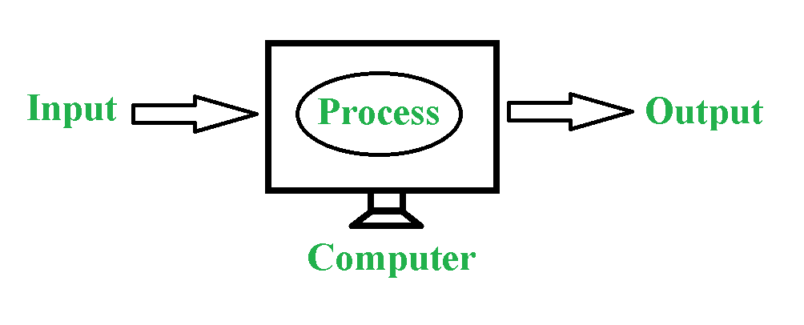
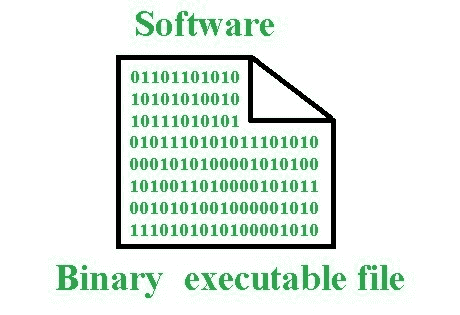
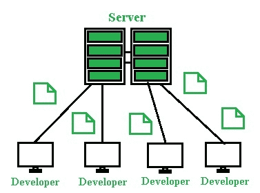

# 软件是如何制造的？

> 原文:[https://www.geeksforgeeks.org/how-software-is-made/](https://www.geeksforgeeks.org/how-software-is-made/)

每当你听到软件这个名字，脑海中就会浮现一个问题，那就是“软件是如何制作的，软件开发过程是如何发生的？所以你会在这篇文章中找到所有问题的答案。

现在在去软件之前，首先你要了解什么是电脑？因为所有的软件都是在电脑上运行的，所以让我们来看看电脑。

**电脑:**
电脑是一个接受输入处理并给出输出的电子设备。

为了理解这台计算机，让我们举一个例子:假设您正在使用 Ms-word 创建一个文档，这里 MS-word 是软件，我们从键盘输入，在输入之后，计算机处理它并向屏幕显示输出。现在你有了一个想法，即计算机如何接收输入，然后处理它并给出输出，但是，对于这个创建文档的特定任务，我们需要像 MS-word 这样的软件。
所以结论是我们需要软件在电脑上执行任务。

**软件:**
软件是指示计算机完成特定任务的一组指令。

这组指令也被称为程序。这些运行在计算机上的软件是 1 和 0 的二进制代码形式，是一个可执行文件，如下图所示。

由于计算机中的每一项任务都是在这些程序的帮助下完成的，开发人员可以通过执行一个程序来改变它，这就是为什么计算机也被称为**可编程机器的原因。**
以二进制形式编写软件是不可能的，也是繁琐的。因此，工程师们制作了各种编程语言，如 **C、C++、JAVA、Python 等**。有时两种或多种语言被用来制作一个特定的软件。

**软件是怎么做出来的？**
任何使用人类可以理解的语言编写的程序都被称为源代码，在编译过程的帮助下，这些源代码被转换成可执行文件。下面是一个基本的 C 程序源代码转换成软件的例子，如下图所示。

这个简单的程序可以由开发人员在合理的时间内编写，然而，专业软件可能涉及数百名开发人员。一个大型软件会被分割成数百甚至数千个文件。允许他们这样做的一个概念叫做**修订控制**。那么它是如何工作的呢？

如上图所示，软件的所有源代码都存储在服务器上，每个开发人员都在自己的机器上存储这些文件的副本。当他们准备好时，他们可以对服务器进行更改。服务器存储了哪些文件被更改的详细列表？这些变化是什么，是谁提交的。如果任何时候程序进入一个坏的状态，开发者可以撤销改变，直到软件程序再次正常工作。

软件开发人员在他们的软件上努力工作，但是代码总是有一些问题，我们称这些问题为**bug**。即使在一个软件向公众发布后，软件开发人员也必须继续修复**bug**，并进一步改进软件。这就是为什么软件会有定期发布的更新或新版本。

软件可以用两种不同的方式创建:专有的和开源的。这些解释如下。

1.  **专有:**
    个人或软件公司拥有并出售以赚钱的软件。源代码不对外发布，只发布软件。
2.  **开源:**
    软件是免费的，任何人都可以访问源代码。开源软件所有者通过捐赠获得资金。

**软件类型:**

1.  **系统软件:**
    为系统或计算机工作的软件。例如:操作系统、驱动器、固件等。固件是一种永久附加在硬件上的软件，如键盘或电视遥控器等。
2.  **应用软件:**
    为用户工作的软件。例子:MS-Word、火狐等。