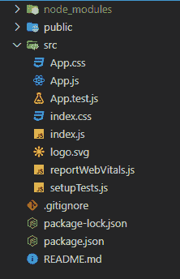
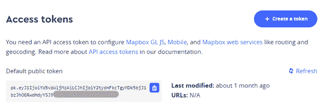
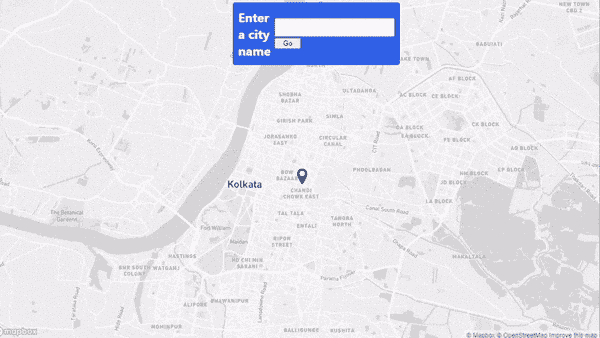

# 如何使用 ReactJS 创建定位程序？

> 原文:[https://www . geesforgeks . org/how-to-create-location-finder-app-using-reactjs/](https://www.geeksforgeeks.org/how-to-create-a-location-finder-app-using-reactjs/)

在本文中，我们将构建一个位置查找应用程序，让您在地图上搜索不同的地方。我们的应用程序包含两个部分，一个用于在地图上显示标记，另一个用于搜索不同的地方。为了渲染地图和获取搜索位置的坐标，我们将使用 Mapbox。通过本文，我们还将学习如何在 React 中使用 Mapbox。

**先决条件:**本项目的先决条件是:

*   [反应](https://www.geeksforgeeks.org/react-js-introduction-working/)
*   [功能组件](https://www.geeksforgeeks.org/reactjs-functional-components/)
*   [反作用钩](https://www.geeksforgeeks.org/introduction-to-react-hooks/)
*   [反应公理& API](https://www.geeksforgeeks.org/how-to-make-get-call-to-an-api-using-axios-in-javascript/)
*   [Javascript 为 6](https://www.geeksforgeeks.org/introduction-to-es6/)

**创建一个 React 应用程序并安装一些 npm 包:**

**步骤 1:** 在终端中键入以下命令，创建一个 react 应用程序:

```
npx create-react-app location-finder
```

**第 2 步:**现在，运行以下命令进入项目文件夹，即位置查找器:

```
cd location-finder
```

**第三步:**我们来安装这个项目需要的一些 npm 包:

```
npm install react-map-gl
npm install axios
npm install react-icons
```

**项目结构:**会是这样的:



**示例:**让我们抓取这个项目所需的 Mapbox API 键。遵循以下简单步骤:

*   去网站:https://www.mapbox.com/，创建一个免费账户。
*   转到您的帐户仪表板，在页面底部，您会发现一个名为“访问令牌”的部分。



*   复制默认的公共访问令牌，并将其保存在某个地方以供以后使用。

现在在 **App.js** 组件中，我们将使用 *react-map-gl* 包导入地图。在地图内部，我们将使用一个标记来通过坐标精确定位准确的位置，还有一个搜索框，用户可以在其中键入任何城市/位置名称。有关 *react-map-gl* 的更多信息，请访问他们的官方网站 https://visgl.github.io/react-map-gl/.现在在 App.js 组件中写下以下代码。

**记住**用自己的 Mapbox 公共访问令牌替换< YOUR_API_KEY >。

## App.js

```
import { useEffect, useState } from "react";
import ReactMapGL, { Marker, FlyToInterpolator }
      from "react-map-gl";
import Fly from "./Components/Fly";
import { ImLocation } from "react-icons/im";
import "./App.css";

function App() {

  // Setting up the state for the latitude
  // and longitude
  const [lat, setLat] = useState(22.5726);
  const [lon, setLon] = useState(88.3639);

  // Setting up the state for the map
  const [viewport, setViewport] = useState({
    latitude: lat,
    longitude: lon,
    zoom: 12,
    bearing: 0,
    pitch: 0,
    width: "100%",
    height: "100vh",
  });

  // Map viewport updates whenever the
  // latitude and longitude changes
  useEffect(() => {
    setViewport({
      latitude: lat,
      longitude: lon,
      zoom: 12,
      transitionInterpolator: 
        new FlyToInterpolator({ speed: 1.0 }),
      transitionDuration: "auto",
      width: "100%",
      height: "100vh",
    });
  }, [lat, lon]);

  return (
    <ReactMapGL
      mapboxApiAccessToken={"<YOUR_API_KEY>"}
      {...viewport}
      onViewportChange={(viewport) => setViewport(viewport)}
    >
      <Marker latitude={lat} longitude={lon}>
        <ImLocation size="30px" />
      </Marker>
      <Fly setLat={setLat} setLon={setLon} />
    </ReactMapGL>
  );
}

export default App;
```

在 App.js 组件中，我们还导入了自己的名为“Fly”的自定义组件，它只不过是一个简单的盒子，接受用户输入，调用 Mapbox 本身提供的正向地理编码 API(https://docs.mapbox.com/api/search/geocoding/)，并相应地设置坐标。让我们创建这个组件。

在名为“**组件**的 **src** 文件夹下创建一个文件夹，并在该文件夹下创建一个名为“ **Fly.jsx** 的文件。”

**文件名:Fly.jsx** 现在在 Fly.jsx 文件中写下下面的代码。

## 飞，jsx

```
import React, { useState } from "react";
import Axios from "axios";

const API_KEY = "<YOUR_API_KEY>";

const Fly = ({ setLat, setLon }) => {

  // Setting up the state variable to store user input
  const [city, setCity] = useState("Kolkata");

  // Function to call the API and set the
  // coordinates accordingly
  function getCoordinates() {
    Axios.get(
      `https://api.mapbox.com/geocoding/v5/
        mapbox.places/${city}.json?access_token=${API_KEY}`
    ).then((res) => {

      // Longitude
      setLon(res.data.features[0].geometry.coordinates[0]);

      // Latitude
      setLat(res.data.features[0].geometry.coordinates[1]);
    });
  }

  return (
    <div className="fly">
      <h2>Enter a city name</h2>
      <div className="inp-box">
        <input
          type="text"
          onChange={(e) => {
            setCity(e.target.value);
          }}
        />
        <button onClick={() => getCoordinates()}>Go</button>
      </div>
    </div>
  );
};

export default Fly;
```

**记住**用自己的 Mapbox 公共访问令牌替换< YOUR_API_KEY >。

**文件名:App.css** 现在让我们编辑名为 **App.css** 的文件来设计我们的应用。

## App.css 文件

```
.fly {
  display: flex;
  align-items: center;
  justify-content: center;
  width: 300px;
  height: 100px;
  color: white;
  background-color: #3061e7;
  margin-top: 1%;
  margin-left: 40%;
  padding: 10px;
  border-radius: 5px;
}
.fly input {
  padding-left: 5px;
  font-size: 18px;
  height: 30px;
}
.fly button {
  cursor: pointer;
  width: 50px;
}
```

**运行应用程序的步骤:**从项目的根目录使用以下命令运行应用程序。

```
npm start
```

**输出:**现在打开浏览器，转到 **http://localhost:3000/** ，会看到如下输出:

