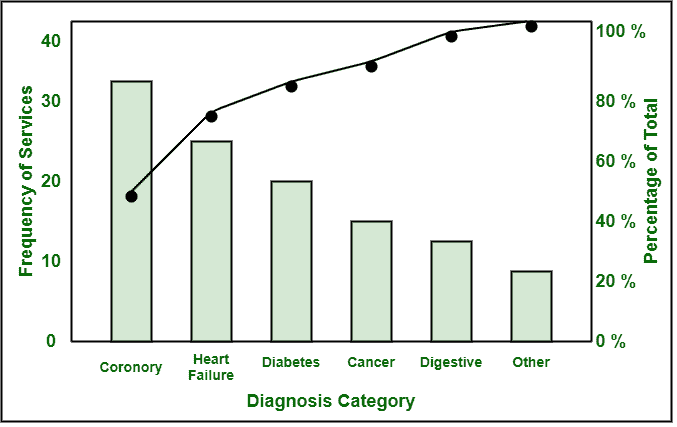

# 如何创建帕累托图

> 原文:[https://www.geeksforgeeks.org/how-to-create-pareto-chart/](https://www.geeksforgeeks.org/how-to-create-pareto-chart/)

**[缺陷帕累托图](https://www.geeksforgeeks.org/when-to-use-a-defect-pareto-chart/)** 一般代表不同类型缺陷或问题类别的出现频率。使用这种方法，可以确定出现频率最高的缺陷，然后根据它们的频率分配优先级。简单地说，20%的原因主要导致 80%的问题。它只是帮助确定迄今为止在系统中发现的缺陷类型。它还提供了一种有效且有意义的方式，即以图形方式显示过程中出现的问题及其原因。

**步骤包括:**

1.  **收集有关缺陷或问题的信息或数据:**
    非常清楚地解释和理解问题。收集数据是主要任务之一，应该以非常适当的方式集中精力完成。一个人需要专注于与缺陷相关的每一点，然后从所有这些点收集信息。只有在那之后，才能对缺陷做出决定。你不应该只从一个点收集数据，然后就缺陷做出决定。人们可以为每个点制作一个单独的图表来比较重要的缺陷。
2.  **理货收集数据:**
    收集足够数量的信息和数据，或者使用可用的历史数据。一个人应该统计每个项目收集的数据，它是如何发生的，花费的总时间，或者成本。

*   **标记 X 轴和 Y 轴:**
    应在图表的 Y 轴上按从高到低的降序列出项目，并在 X 轴上列出频率、时间或成本等数字。通过按发生频率或原因及其特征的降序排序来管理正在收集的数据。*   **画条:**
    保持每个条的宽度相同，应该为对应于其特定计数的各种类别画条。根据正在排序的数据绘制条形图。x 轴代表缺陷的主要原因或特征，而 Y 轴代表缺陷出现的频率或次数。也计算累计百分比。*   **Identification :**
    With help of Pareto chart, identify main critical causes of defect, and these defect types must be given greater priority and should be firstly addressed.

    **例:**
    我们举一个入院诊断类别的例子，如下所示:

    

    **帕累托图**由一个 x 轴和两个 y 轴组成。左侧的 x 轴表示某一原因类别发生的次数，即频率。右侧的 y 轴代表原因的累积百分比。第一条代表更频繁的原因。在上图中，条形图基本上以降序表示主要原因，而折线图基本上以升序表示累计百分比。