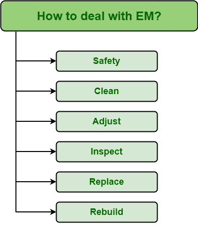

# 如何应对紧急维修情况？

> 原文:[https://www . geesforgeks . org/如何应对紧急维护情况/](https://www.geeksforgeeks.org/how-to-deal-with-emergency-maintenance-situations/)

**[【紧急维修(EM)](https://www.geeksforgeeks.org/types-of-reactive-maintenance/)**是人们不想处理的事情，因为它有很多后果。紧急是指需要立即采取行动的意外事件，而维护是指保存情况或条件的过程。

因此，软件工程中的**紧急维护(EM)** 简单来说就是指紧急情况发生后立即需要进行的维护，即意外故障发生只是为了将故障资产恢复到正常工作状态。这种故障可能对健康和安全以及环境造成危险，因此需要立即进行维护，以将危险影响降至最低。

**如何处理 EM :**
由于一个人不想处理情况，但如果出现这种紧急情况，那么他必须更谨慎地有计划地处理情况。以下是解决电磁环境应遵循的任务列表:

1.  **安全:**
    首先，最重要的任务是确保工人、员工或团队成员免受故障、故障或资产故障的影响。这是一个关键因素，但也是最重要的因素。缺乏维护也可能导致危险情况，并可能影响健康和安全。为了健康和安全，即使有时间压力，也应该遵循安全的产品，因为捷径可能非常昂贵，并可能导致伤害或系统损坏。
2.  **清洁:**
    清洁工作，即清洁和维护也是需要完成的重要任务。清洁是维护的一部分，非常重要，因为它可以消除安全问题，为将要执行设备维护任务的员工创造更好、更安全的工作环境。
3.  **调整:**
    维护通常包括改变任务和工作环境。维护团队必须解决和调整，并共同努力，以达到令人满意的状态。因此，人们必须适应这种情况。仅仅通过适应症状来适应和学会面对问题主要取决于问题的严重程度。人们需要确定是调整好还是维护好。
4.  **巡查:**
    巡查是必不可少的任务之一。它有助于识别故障发生的根本原因。人们需要找出失败的直接原因；人们需要确定到底是什么出了问题，以及如何修复故障。
5.  **Replace :**

    更换或更新故障资产以恢复正常工作状态是另一项重要任务。恢复或替换使组织以更低的成本更快地恢复生产。它还减少了采用新技术或工艺的启动挑战和不必要的培训。

6.  **重建:**
    重建只是给装备第二次机会或者第二次生命。将设备恢复到正常工作状态几乎是维修团队的主要和最终目标。在执行维护任务后，必须确保故障设备现在是否正常工作。