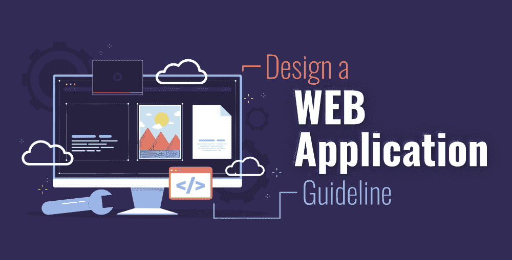
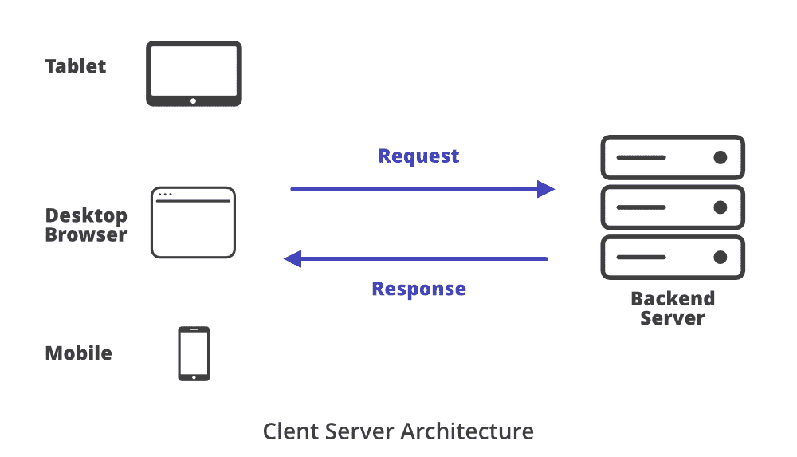
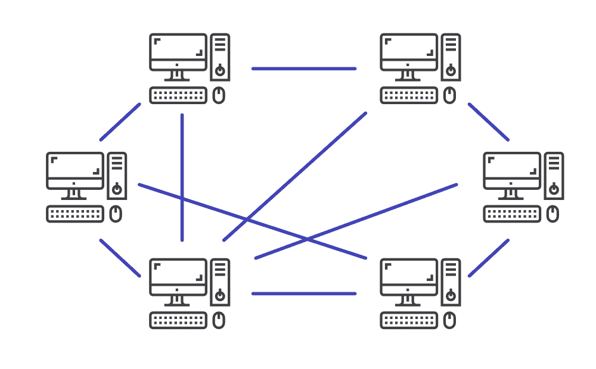
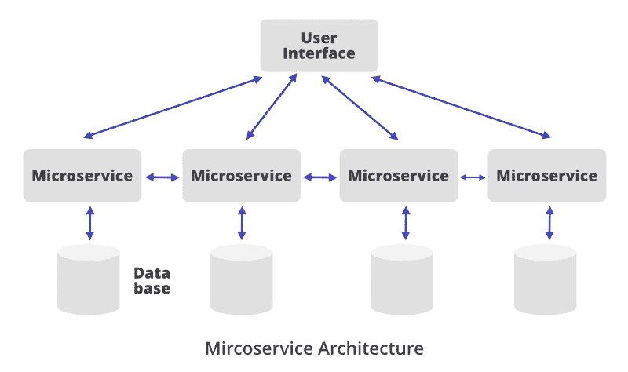
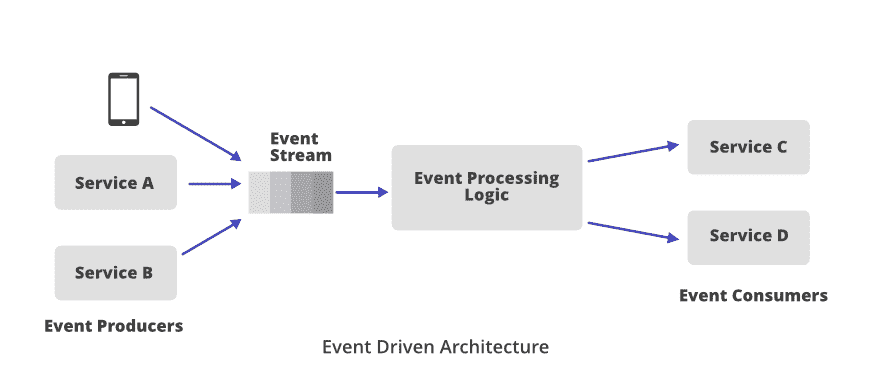
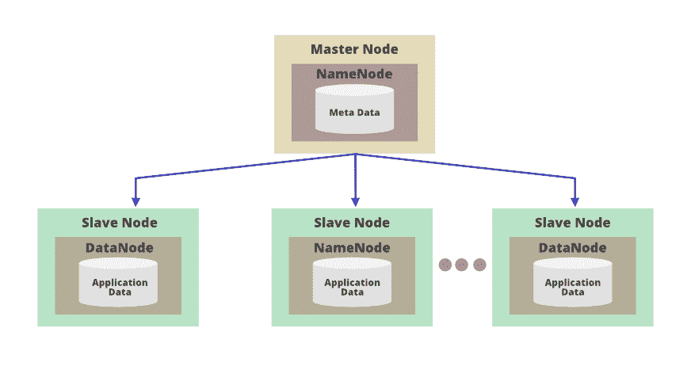

# 如何设计网络应用软件架构指南

> 原文:[https://www . geeksforgeeks . org/如何设计网络应用软件架构指南/](https://www.geeksforgeeks.org/how-to-design-a-web-application-a-guideline-on-software-architecture/)

***你有没有试过在家准备披萨？(是的！！！我们在谈论你最喜欢的食物……)***

***如果你不为你的披萨底料做好面团，会发生什么？当然，整个比萨基地都会被破坏，你不能继续准备你最喜欢的菜*** ***。***

无论你是做披萨还是做软件，如果你没有找到合适的基础，你将不得不从头开始。在 web 应用程序中，应用程序的架构是基础，要成功构建应用程序，应该仔细选择它。一个好的开发人员会为应用程序选择正确的架构，以避免软件设计或应用程序代码中的任何重大变化。当开发人员在初始设计阶段选择正确的架构时，开发过程变得更加容易，并且还可以节省大量的工程和财务资源。在本文中，让我们详细讨论这个主题，并关注一些关键方面，以便为 web 应用程序选择正确的体系结构。

### **软件架构和软件设计的区别**

***两者不一样。太好了。！！你没听错(不要困惑，让我们理解两者有什么不同。)***

**软件架构**

系统的**高级组件**，这些组件之间的关系，以及它们如何协同工作是软件架构的一部分。它是任何应用的**骨架**。例如:

*   选择无服务器架构，将应用程序分为两个组件:BaaS(后端即服务)和 FaaS(功能即服务)
*   选择一个微服务架构，其中不同的特性/任务被分割成各自独立的模块/代码库。

当您选择一个架构时，您需要考虑一些指标，例如处理**性能、容错、可伸缩性和可靠性**。

**软件设计**

您在应用程序中为不同的模块、类、函数和其他特性编写的代码被认为是软件设计。代码级设计定义了哪个模块在做什么、类的范围、函数及其用途等。为了在更大的团队中实现和管理这些代码，使用了一种通用语言/模式(**)来概念化重复的问题和解决方案。如果开发人员使用其他人已经定义的这些方法或模式，他/她在实现代码时会变得更加高效。阅读文章[设计模式:用现实生活中的例子](https://www.geeksforgeeks.org/design-patterns-understand-the-importance-with-real-life-examples/)来理解软件设计模式的重要性。**

### ****软件架构模式****

#### ****1。客户端-服务器****

**客户端-服务器架构是一种网络架构，它遵循**请求-响应模型**。这里的客户端可以是任何设备，例如用户运行应用程序的电脑或工作站。这些客户端向服务器发送请求以获取一些信息。服务器是专用于管理磁盘驱动器(文件服务器)、打印机(打印服务器)或网络流量(网络服务器)的功能强大的计算机。当服务器收到请求时，它会处理该请求并将响应发送回客户端。脸书、推特、Skype、银行应用以及几乎所有社交媒体公司都遵循这一架构。**

****

**这种架构是一个**计算机网络**，其中每台计算机作为一个节点工作，这些节点可以相互通信**，而无需使用任何中央服务器**。网络中的每台计算机都有同等的能力/责任。这种架构的好处是**不用担心单点故障**。如果一个节点发生故障，另一个节点将可以处理该请求。P2P 是区块链技术的基础。**

****

#### **3.模型-视图-控制器**

**在软件工程中，这种模式非常流行，并且已经存在了很长时间。这种架构可用于桌面、网络或移动应用。在 MVC 中，我们将整个应用程序逻辑分成三个组件。**

*   ****模型(数据和逻辑):**表示并维护数据库中应用程序的数据。信息如何存储以及如何检索。**
*   ****视图(用户界面):**它使用模型向用户显示数据，如输出或图形用户界面。**
*   ****控制器(请求处理器):**处理用户请求，充当模型和视图之间的接口。**

#### ****4 .微服务〔t1〕****

**该架构将任务/特性划分为****各自的模块/代码库**。这些模块相互协调，形成一个整体的大服务。这种架构为开发人员提供了更大的灵活性，因为它允许他们为不同的模块选择编程语言。与单体架构相比，基于微服务的架构应用程序更容易维护、测试和部署。****

********

#### ****4.事件驱动****

****现代网络应用程序很流行使用这种架构。也称为**无阻塞架构**。它允许应用程序以最小的资源消耗处理大量并发请求。它最适合需要完全异步模型来扩展的应用程序。****

********

#### ******5** 。**主从架构******

****在计算机科学的早期，这种体系结构是在数据库复制的背景下定义的。例如，在数据库中，我们跨三个服务器复制数据/信息。存在不一致的可能性，因为其中一个可能与其他不同步。主从架构解决了这个问题，我们将一个副本视为主副本，其余副本被识别为从副本。在纵向扩展中，我们通常使用一种复制方法，其中一个存储主代码，另一个存储主代码的副本。****

********

#### ****6.分层的****

****程序的整个结构被分成几组子任务或层次，每个子任务或层次都处于特定的抽象层次。每一层都负责向下一个更高层提供服务。这些层是…****

*   ****表示层****
*   ****应用层****
*   ****业务逻辑层****
*   ****数据访问层****

### ******你的应用应该有多少层？******

#### ******1。单层应用******

******优势:******

*   ****无网络延迟****
*   ****数据很容易获得，没有任何延迟。****
*   ****确保数据安全。****

******缺点:******

*   ****对应用程序的控制较少。实现新功能或修改代码是困难的。****
*   ****需要深入的测试，错误最少。****

#### ******2。**双层**应用******

******优势:******

*   ****更少的网络调用，因为代码和用户界面存在于同一台机器上。****
*   ****数据库服务器和业务逻辑在物理上是接近的，因此它提供了快速的性能。****

******缺点:******

*   ****大多数应用程序逻辑由客户端处理，因此很难重用逻辑和控制软件版本，也很难重新分发较新的版本。****
*   ****可扩展性问题。当请求数量增加时，应用程序性能下降。****

#### ******3。**三层**应用******

******优势:******

*   ****对于数据库更新，在中间层传递的数据确保其有效性，并通过客户端应用程序消除数据损坏。****
*   ****业务逻辑放在一个集中的服务器上，确保数据安全。****
*   ****由于应用服务器的分布式特性，应用程序的可伸缩性可以扩展。不需要每个客户端都有单独的连接，很少的应用服务器连接就足够了。****

******缺点:******

*   ****由于通信点(客户端到中间层到服务器，而不是直接从客户端到服务器)的增加，创建三层应用需要更多的努力。此外，由诸如 Visual Basic、PowerBuilder、Delphi 等工具扩展的性能将会降低。****

#### ******4。多层应用******

******优势:******

*   ****三层架构的所有优点。****
*   ****从数据库层和客户端层卸载可以提高性能。****

******缺点:******

*   ****层被划分成组件，这就是实现和维护复杂结构变得困难的原因。****

#### ******结论******

*   ****如果您不想要任何网络延迟，那么就选择单层架构。****
*   ****如果您的首要任务是最大限度地减少网络延迟，并且希望在应用程序中获得更多的数据控制，那么请选择两层应用程序。****
*   ****如果您想要控制数据，控制应用程序中的代码/业务逻辑，并且您更喜欢安全性，那么选择三层应用程序。****
*   ****如果您主要关心的是可扩展性，那么选择 N 层架构。****

### ******水平或垂直缩放-哪一种适合应用？******

*   ****如果你的应用程序接收到最小数量的稳定流量，并且你知道流量负载不会显著增加，那么选择**垂直缩放**是很好的。您可以升级服务器，也可以更换容量更大的服务器。没有必要使用分布式网络。****
*   ****如果你的应用程序类似于任何社交媒体应用程序，并且日复一日**的流量增加**的频率比机会更高，那么它很快就会呈指数级激增。在这种情况下，**可用性** 成为任何应用程序的首要关注点。所以选择**水平缩放**就好了。****

### ******单片还是微服务？******

#### ******何时使用单洛丽塔建筑？******

*   ****当**要求相当简单，应用上的流量有限**时，就选择单片架构(例如:税务计算应用)。如果你看不到未来流量的指数级增长，那么选择这种架构是很好的。****

#### ******何时使用微服务架构？******

*   ****它最适合复杂的用例。如果你的应用获得了**高流量**，并且流量在未来有望呈指数级增长，那么微服务架构是不错的。****
*   ****如果您正在构建一个社交媒体网络应用程序，那么对于不同的功能，如消息传递、实时聊天、实时视频流、图像上传、喜欢和共享，请分别实现这些组件。牢记**单一责任**和**分离**和**的关注**原则。****

******注意:**当你开始用单个代码库构建一个应用程序时，大多数时候它会变成一个巨大的应用程序。这就是为什么许多开发人员从单片架构开始，但后来他们将应用扩展到微服务架构。所以选择一个架构取决于你的用例和需求。****

### ******NoSQL 还是 SQL？******

#### ****何时选择 SQL/关系数据库？****

*   ****如果你正在构建一个基于股票交易、银行或金融的应用程序，那么选择一个关系数据库。****
*   ****关系数据库最适合您的应用程序处理**事务**或符合 **ACID** 属性的应用程序。对于这些应用来说，**数据一致性**极其重要。****
*   ****例如，脸书类型的社交网络应用程序通过大量的关系来存储数据。如果应用程序中的数据有很多关系，那么在这种情况下，关系数据库是最好的选择。你可以举一个生活在特定城市的人或者去特定酒店度假的人的例子。如果你正在构建 facebook 类型的社交网络应用程序，并且你需要存储大量的关系，那么就使用 SQL/Relational 数据库。****

*****MySQL、微软 SQL Server、PostgreSQL、MariaDB* 这些都是流行的关系数据库的例子。****

#### ******何时选择 NoSQL/非关系数据库？******

*   ****如果您主要关心的是应用程序的扩展，请选择非关系数据库。当你的网站上有大量的读/写操作时，NoSQL 数据库是最合适的，你需要处理大量的用户请求。有了 NoSQL，以最小的延迟处理并发流量和大量请求变得很容易。****
*   ****NoSQL 数据库也是**数据分析**用例的最佳选择。****

*****MongoDB、Redis、Cassandra、**HBase**这些都是流行的非关系数据库的例子。*****

### *****哪种技术最适合该应用？*****

#### *******1。实时数据交互*******

*****选择 **NodeJS、Tornado (Python 的框架)、Spring Reactor、Play 和 Akka.io** (针对 [Java](https://www.geeksforgeeks.org/java/) 生态系统)如果你正在构建一个你需要的应用程序…*****

*   *******与后端服务器的实时通信**。例如，像 Spotify、网飞这样的音频视频流应用程序，或者任何类型的消息应用程序。*****
*   *****客户端和服务器之间的持久连接，以及后端的非阻塞技术。*****

#### *******2。对等网络应用*******

*   *****对于对等网络应用**、**，例如 P2P 分布式搜索引擎或 P2P 直播电视广播服务(例如微软的直播站)，您可以选择 **JavaScript 协议，如 DAT 和 IPFS** 。*****
*   *****一个 JavaScript 框架**[**freedom . js**](http://www.freedomjs.org/)适合构建在现代网络浏览器中工作的 P2P 网络应用。*******

#### *****3.**基于 CRUD 的常规应用*******

*   *****对于简单的基于 CRUD 的应用程序，使用 **PHP Laravel、**[**Python Django**](https://www.geeksforgeeks.org/django-tutorial/)******Spring MVC、Ruby on Rails 和 ASP。NET MVC。***********

#### *******4。小规模应用*******

*   *****如果你正在构建一个简单的应用程序，比如博客、在线表单、一个与社交媒体集成的简单应用程序，那么就使用**。还有一些其他选项，如**弹簧靴或轨上红宝石**。这些技术需要更少的开发或配置时间，但是与其他技术相比，PHP 的托管更加经济实惠，并且最适合简单的用例。*******

#### *******5。中央处理器和内存密集型应用*******

*   *****常规的网络框架或脚本语言很适合构建网络应用程序，但这些语言不适合运行 CPU 密集型、内存密集型或在后端执行繁重的计算任务。对于所有上述任务和大数据处理、并行处理或对大量数据运行监控和分析，C++是技术社区中最常用的语言。它方便了低级别的内存操作，开发人员可以编写对内存有更多控制的分布式系统。大部分的密码货币都是用[**C++**](https://www.geeksforgeeks.org/cpp-tutorial/) 写的。*****
*   *******Rust** 类似于 C++提供高性能和安全并发。行业也在使用 Java、Scala 和 Erlang。Java 非常适合大规模企业系统。*****
*   *****[**Go** 编程语言](https://www.geeksforgeeks.org/golang/)适合多核机器和处理大量数据。*****
*   *****[**Julia**](https://www.geeksforgeeks.org/julia-language-introduction/) 是一种具有高性能特性的动态编程语言。适用于运行计算&数值分析的应用。*****

### *****结论*****

*****无论我们在本文中讨论了什么，当您开始使用软件架构时，记住所有这些都是很重要的。在您弄脏代码之前，请确保您选择了正确的软件架构、正确的数据库、正确的技术和正确的可伸缩性选项。记住以上几点，从长远来看会对你有所帮助。*****