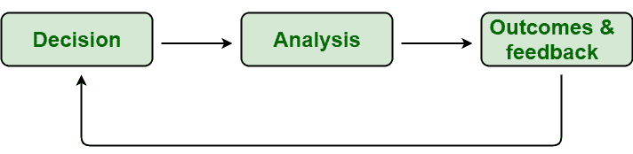

# 如何实施 RCM？

> 原文:[https://www.geeksforgeeks.org/how-to-implement-rcm/](https://www.geeksforgeeks.org/how-to-implement-rcm/)

[以可靠性为中心的维护](https://www.geeksforgeeks.org/basic-principles-of-rcm/)是一个帮助人们识别故障或问题的过程，当故障或问题被消除或解决时，会增加特定设备的总体产量并降低维护成本。这基本上是一种方法，有助于确定哪种维护方法最适合正在选择进行 RCM 分析的特定设备。 [RCM](https://www.geeksforgeeks.org/steps-to-perform-rcm/) 通常以非常巨大的方式影响公司的底线。

**实施 RCM :**
[RCM](https://www.geeksforgeeks.org/types-of-rcm-approaches/) 是一个有些复杂的过程。为了实施区域协调机制，区域协调机制的过程分为三个不同的阶段，只是为了确保区域协调机制得到充分实施。下面给出了三个不同的阶段–

1.  **Decision Phase :**
    This is one of the important phases as in this phase, a decision is taken regarding which equipment will be put first under RCM analysis. A system consists of more than one piece of equipment. Each piece of equipment has some failure modes which might occur at any time. Some types of equipment have a less or limited number of failure modes and such system is considered simple systems whereas some types of equipment have many failure modes and therefore are considered complex systems.

    在此阶段，将根据故障概率及其严重程度，决定首先分析哪些设备。有些故障对系统安全、生产、功能、运行成本等造成较大影响。因此，首先选择更关键的设备，这些设备有很大的故障后果。

2.  **Analysis Phase :**
    The next important phase is the analysis phase. In this phase, the main reason for the occurrence of failures is identified. In simple words, the main causes usually known as root causes of failure have identified that lead to the occurrence of such failures. One particular failure can have more than one root cause. So, it’s a very crucial step as one needs to identify all possible root causes of failure. Even if one root cause is not being identified by some mistake then it can lead to greater damage to the system.

    RCM 团队和专家需要全力以赴，共同找出失败的根本原因。根本原因可能是人为错误、设计错误、设备故障等。如果故障以某种方式发生，还需要分析和评估故障对系统的影响或作用。

3.  **Outcome and Feedback Phase :**
    The last phase is the outcome and feedback phase. After decision and analysis are done, one needs to take some measures actions to mitigate issues and improve equipment design. The decision regarding maintenance strategy is based on the above decision and analysis done by the RCM team and expert. RCM is a process that should be performed continuously, not only when it is needed to be performed.

    RCM 通过为不同的组织增加价值，为改进系统生产和提高质量提供了机会。它只是使系统更加可靠，并保持设备的完整性。RCM 减少了所有可能发生的故障，延长了特定设备的寿命，并降低了维护成本。