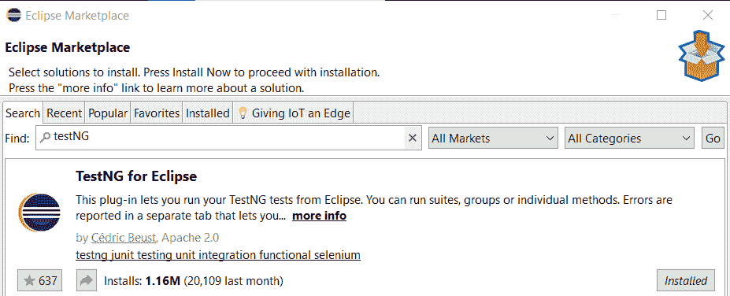
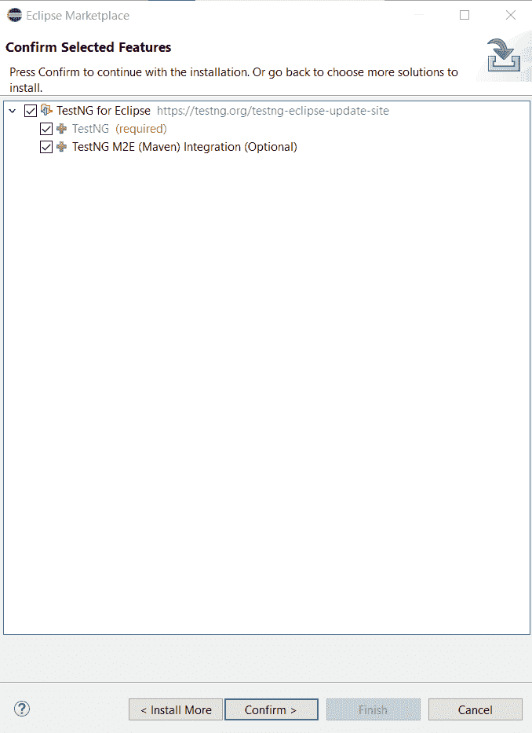
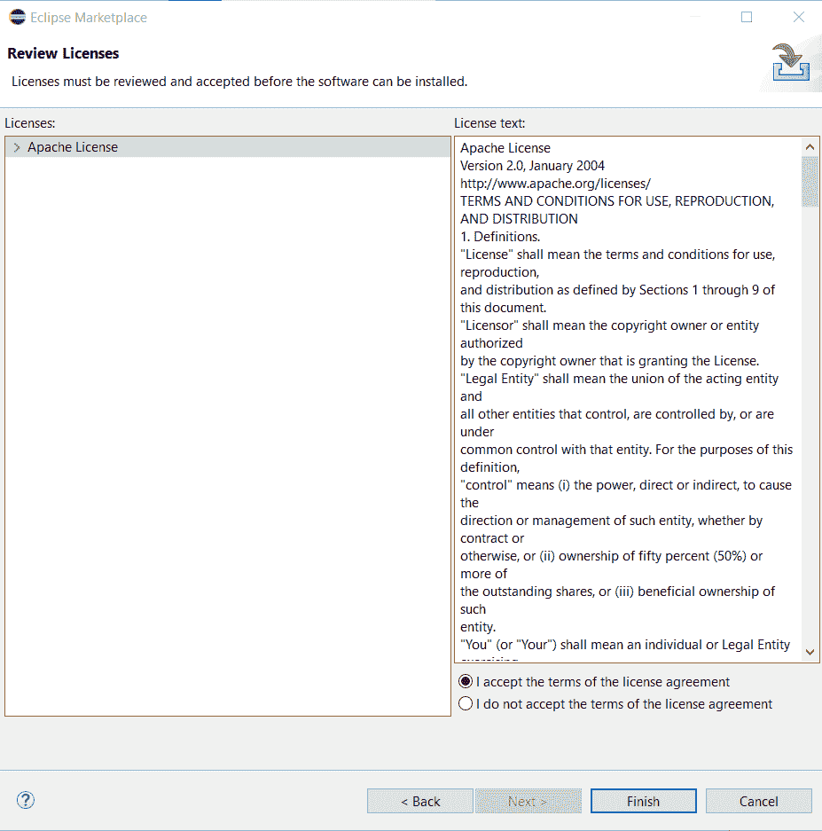
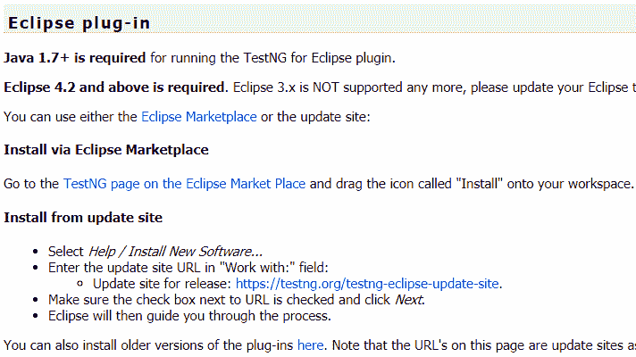
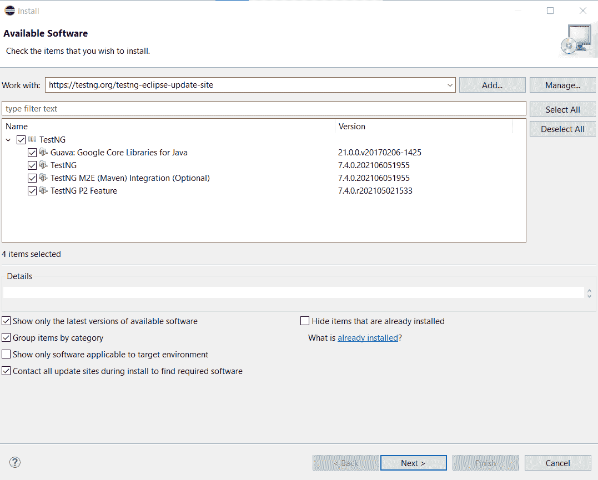

# 如何在 Eclispse IDE 上安装 TestNG？

> 原文:[https://www . geesforgeks . org/how-install-TestNG-on-eclispse-ide/](https://www.geeksforgeeks.org/how-to-install-testng-on-eclispse-ide/)

TestNG 是一个受 JUnit 和 NUnit 强烈启发的测试框架，但引入了新的功能，使其更加强大和易于使用，例如:

*   注释
*   更简单的测试配置
*   无测试套件的执行模型
*   允许用各种策略在任意大的线程池中运行线程
*   运行时和日志记录的默认 JDK 函数，没有任何依赖关系等。

在本文中，我们将安装 TestNG 作为 Eclipse 的插件，这样您就可以将 Eclipse 安装在您的设备上。你可以从他们的官方网站下载安装，点击这里的。安装 Eclipse 后，您可以继续下一步。

TestNG 可以通过两个过程安装:

1.  使用 Eclipse 市场
2.  使用手动软件安装

### **1。去 Eclipse 市场**

按照以下步骤从 Eclipse 市场安装 TestNG:

*   进入 Eclipse IDE 中的**帮助**菜单，点击 **Eclipse 市场**。
*   搜索 **TestNG。**

Eclipse 市场

*   点击**安装**按钮。
*   等待一段时间，然后会出现一个对话框。点击**确认**按钮。

*   点击**我接受条款**，然后点击**完成**。

*   安装可能需要一点时间，Eclipse 的安全系统可能会提示您确认安装。

### **2。使用手动软件:**

按照以下步骤使用软件手动安装 TestNG:

*   转到[页面](https://testng.org/doc/)，点击下载导航栏。
*   复制更新站点安装下的网址。

复制网址

*   进入 Eclipse IDE 中的**帮助**菜单，点击“我**安装新软件**”。
*   粘贴网址，勾选测试的依赖项。

*   点击**下一步**按钮。
*   **接受许可**并点击**完成**按钮。

恭喜你！至此，您已经在您的 Eclipse IDE 上成功安装了 TestNG。