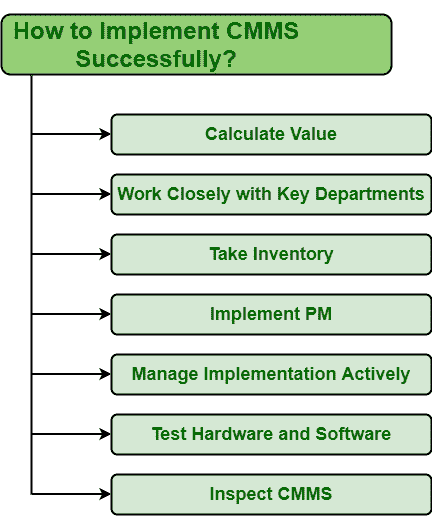

# CMMS 实施

> 原文:[https://www.geeksforgeeks.org/implementation-of-cmms/](https://www.geeksforgeeks.org/implementation-of-cmms/)

[CMMS(计算机化维护管理系统)](https://www.geeksforgeeks.org/computerized-maintenance-management-systemcmms/)顾名思义，就是对系统的维护过程进行数字化管理的一种方式。它维护一个计算机数据库，其中有关于维护功能或组织运作的信息。这些信息有助于团队成员正确有效地开展工作，并就成本投资、预防性维护等做出更有力的决策。

**成功实施 CMMS 的步骤:**
以下是一些帮助你成功实施 CMMS 的方法，如下所示。

1.  **计算价值:**
    在进行任何事情之前，应该确定的一件事是，他们将要执行的事情将如何惠及组织和客户。显然，如果我们正在实施某件事，我们希望从中获得一些好处。人们应该知道“CMMS 如何让员工、组织和客户受益”这样的问题的答案，CMMS 将如何帮助团队成员更有效地使用维护信息？这些问题是任何组织的基本需求。

*   **与关键部门紧密合作:**
    部门之间的相互理解可以使协作更加顺畅有效。与其他部门的成员一起工作可以提供新的技能和视角。组织中的大事从来不是单独完成的，而是由一群人完成的。包括生产、信息技术、计划、采购等其他部门的成员。在 CMMS，规划团队将帮助快速有效地实现组织目标。*   **取库存:**
    每个组织都想知道自己有多少库存，需要多少库存。关于库存的信息使人们能够有效地计划。库存管理不是一件容易的事情。这需要时间，人们需要非常小心。库存控制非常重要，因为它可以降低成本并改善服务。如果数据库管理不当，那么 CMMS 实现可能会失败。一个人需要通过检查和查看他想在 CMMS 追踪的资产来控制库存。*   **实施 PM :**
    PM(预防性维护)是省钱和防止资产故障的最佳方法之一。实施预防性维护可避免不必要的投资，并保持设备或资产不受任何干扰地运行。它只是增加了资产的寿命。实施和管理预防性维护是从 CMMS 节省资金的最佳方式之一，因为它减少了潜在故障的发生，并避免了紧急维护。*   **积极管理执行:**
    一旦你执行了某件事，并不意味着你的任务完成了。一个人需要管理已实施的流程并应对变化，以保持事情继续进行，即保持势头。*   **测试硬件和软件:**
    测试硬件和软件将有助于发现任何存在的问题，并解决它们以提高系统性能。当你想购买或升级 CMMS 时，测试是你需要完成的重要任务之一，以确保成功实施。*   **检查 CMMS :**
    CMMS 也是一种系统或资产，它也可能会损坏或发生故障，或者如果没有维护策略可能会发生故障。需要对 CMMS 实施预防性维护，以定期检查 CMMS，避免任何失败的可能性。这将只是 CMMS 的生命周期。