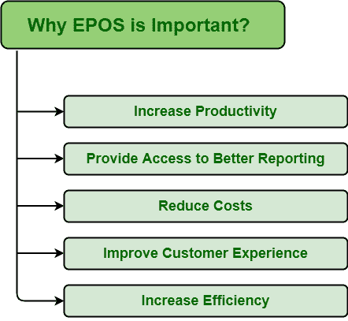

# EPOS 系统的重要性

> 原文:[https://www.geeksforgeeks.org/importance-of-epos-system/](https://www.geeksforgeeks.org/importance-of-epos-system/)

[EPOS(电子销售点)](https://www.geeksforgeeks.org/applications-of-electronic-point-of-sale-epos/) :
顾名思义，就是一个自称的用来整合业务流程的计算机系统。它主要提供更好的功能、报告，并且易于使用。它被认为是最强大的工具，因为它允许一个人开发完全详细的报告，并让一个人很容易了解业务在一个高效和有效的方式。

**EPOS 系统的重要性:**
EPOS 系统最大的优点之一就是通过增加更多具有先进功能的硬件，实现和满足业务目标，帮助业务增长。简而言之，EPOS 系统有助于通过更高效的报告、跟踪销售、处理信息和其他程序来改善业务。原因有很多，因为哪个 EPOS 系统被认为是重要的。其中一些如下。

1.  **提高生产率–**
    如今，每个企业的主要目标都是提高和加快生产率和销售额，同时节省资金。每个人都想要最好、最有效的方式来日常经营业务，因此，EPOS 系统主要用于更有效、高效地管理员工，进而提高生产率和绩效。EPOS 系统是一个自动化系统，有助于减少任何类型的欺诈，进而防止销售损失。

*   **提供更好的报告途径–**
    每个人都想记录可能对未来有帮助的数据。EPOS 系统只是跟踪和记录每一条信息。这些报告提供了关于业务绩效、业务损失和利润的全面而详细的知识。它只需在需要时提供一份实时销售报告。它只记录有助于做出更好的商业决策的准确数据。借助报告，还可以确定订购所需的资源以及对业务增长的重要性。根据收集的数据进行重要调整也有助于提高销售额。*   **降低成本–**
    中小企业根本不容易经营。建立一个成功的企业需要大量的时间、金钱和努力。EPOS 是一个自动化系统，是省钱的最佳方式之一。它帮助一个人管理员工，安排员工，计算员工成本，确定必要的和需求的资源，等等。这反过来又避免了人们在这类事情上花费不必要的成本。它还确定不能出售的库存，并避免购买此类库存。EPOS 系统还可以减少和消除错误，防止更大的损害，从而节省了修复损害的开支。*   **改善客户体验–**
    客户满意度是业务的主要目标之一。客户是企业成功的关键，因为在客户忠诚度方面，客户体验就是一切。如果没有更好的客户体验和满意度，就不可能有成功的企业。EPOS 是一个提升客户忠诚度和体验的系统。EPOS 系统跟踪对满足客户需求非常重要的库存。它还加快了交易速度，提高了性能，并使客户完成销售和付款过程变得容易。如今，可用的触摸屏显示器和扫描仪是 EPOS 系统最重要的组成部分，因为它加快了交易过程，增加了企业利润，进而提高了客户满意度。*   **提高效率–**
    EPOS 系统有助于有效管理业务。它加快了交易过程和支付过程。这减少了管理客户订单的时间，进而提高了效率和客户满意度。