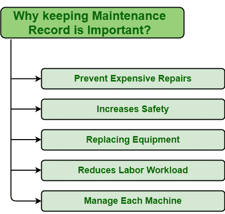

# 维护记录的重要性

> 原文:[https://www . geesforgeks . org/重要性-维护-记录/](https://www.geeksforgeeks.org/importance-of-maintenance-record/)

**维护记录**顾名思义，是一份包含资产或设备上进行的每项维修和维护工作相关信息的文件。简单地说，它跟踪资产故障和维修。这是保持健康和安全管理的最佳方式之一。它还改进了资产管理，因为此类记录包括以下信息:

*   要求进行维护的时间和日期。
*   需要进行的维护类型。
*   资产详情，如数量、所需零件、工作条件等。
*   与之相关的风险。
*   环境条件及其影响。

**保存保养记录的好处:**
保存保养记录有几个好处。其中一些如下:

1.  **防止昂贵的维修:**
    资产维护会导致组织整体成本的增加。有些资产维护成本较低，有些非常高。维修成本只是将资产恢复到正常工作状态所需的金额。维护记录保存有关设备维修和修理的信息。在维护记录的帮助下，人们可以很容易地确定何时以及需要对特定资产执行哪种维护策略。这些有助于防止资产故障，并降低维修所需的成本。

*   **增加安全性:**
    维护记录还包括关于每个资产故障对系统、员工、环境的影响的信息。它还包括有关工人或操作员如何执行任务的信息。借助于维护记录，人们可以很容易地确定资产有多严重，何时会发生故障，如何防止故障，以便采取措施防止故障的发生。这又降低了安全和环境健康方面的风险。这也有助于确保使用哪些设备是安全的。即使是操作员或工人也能很好地完成任务。*   **更换设备:**
    维护记录包括关于资产故障的信息，关于特定资产发生故障的次数、资产状况。人们可以很容易地确定资产的工作状况、何时需要修理资产、与特定资产的每次修理相关的成本。主要优点之一是，可以很容易地确定何时需要更换资产。如果资产的维修成本高于更换新资产所需的成本，那么用新资产更换资产会更好，因为它可以降低成本，减少故障发生，包括保修，最大限度地减少维修工作量等。*   **减少人工工作量:**
    众所周知，借助维修记录，可以防止故障的发生。它有助于减少不必要的维护工作，安排所需的维护工作，帮助管理层确保员工、工人或劳动力表现良好，完成任务所需的劳动力。这只是减少了修复资产所需的工作量。反过来，它减少了执行任务所需的人工数量，并减少了人工工作量。*   **管理每台机器:**
    维护记录保存每项资产信息。它包括工作细节、维护细节、维修细节、工作环境、其处理、与之相关的风险等。在所有这些信息的帮助下，人们可以在任何需要的时候执行维护任务，以便很好地维护资产状况，防止其发生故障，并延长其寿命。