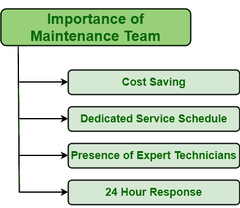

# 维护团队的重要性

> 原文:[https://www . geesforgeks . org/重要性维护团队/](https://www.geeksforgeeks.org/importance-of-maintenance-team/)

**维护**是质量保证中最重要、最本质的因素之一。它只会影响任何组织或公司的长期成功。如果资产维护不当，这些维护不善的资产将导致不稳定，影响质量，并可能暂停生产。这将导致产量减少，而且成本很高。

资产的任何故障或崩溃都会直接影响成本，即成为许多组织的高成本流程。因此，维护团队是最重要的因素之一，每个人都应该有最好和最有能力的维护团队来提高生产率、盈利能力以及整体工作流程。维护团队应该能够正确处理任何类型的情况、问题和紧急情况。

**福利:**
**应急维护**团队一般提供如下诸多福利:

1.  **Cost Saving :**
    Emergency situations are generally costly as we discussed above. Such situations should be handled with more care because one more mistake can lead to greater damage to system. Whenever any emergency occurs, emergency maintenance team is most appropriate team to be chosen for handling and resolving emergency situations.

    甚至有许多组织只在发生任何资产故障或崩溃时才呼叫紧急维护团队。团队成员通常是高技能的技术人员，能够以较少的资金和资源投入解决问题。他们是这种紧急情况下的专家和有经验的候选人。

2.  **Dedicated Service Schedule :**

    任何需要执行的事情都应该首先计划和安排。安排事情降低了复杂性，使人们执行任何任务变得简单。紧急维护团队是一种在发生紧急情况(如故障或故障)时需要的服务类型。定期维护团队的主要目标是减少被动维护、资产故障或故障以及维护积压。每当出现任何故障时，维护团队通常会管理时间和计划来检查和修复故障资产。

3.  **Presence of Expert Technicians :**
    Of course, whenever any problem arises, one always contacts person that is experienced in such situations. Present of expert technicians is also one of important factors and benefits of maintenance team. Expert technicians are experienced candidates that have specific knowledge and also have skills that are needed to resolve any emergencies or problems.

    他们接受了资产、计算机、设备、设备部件等维修和保养方面的培训。在维护团队中有专业的技术人员有一个好处，因为从长远来看，可以节省成本，避免任何不必要的投资。

4.  **24 小时响应:**
    紧急情况是需要立即采取行动来减少其影响和任何伤害的事情。我们对任何类型的维护和维修请求的响应速度也是一个重要因素。维护团队知道如何处理这种紧急情况，以便在不浪费时间的情况下快速执行任务。