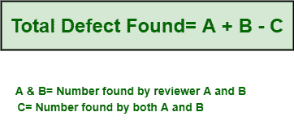
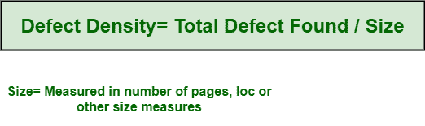

# 软件工程中的检查度量

> 原文:[https://www . geesforgeks . org/inspection-metrics-in-software-engineering/](https://www.geeksforgeeks.org/inspection-metrics-in-software-engineering/)

监控**检验过程**对于简单地获得[软件质量](https://www.geeksforgeeks.org/software-engineering-software-quality/)的早期评估、评估员工对检验程序的符合性以及识别检验过程的状态是非常必要和重要的。度量标准通常提供对检查后保留在代码中的错误或缺陷总数的主观评估。检验质量状况基本上是公司或部门积累检验经验的长期指标。

当软件质量和检验原始数据解释和定义特定检验的状态时，检验质量状态通常会长期描述检验的特征。通常在软件过程中收集的数据只需要用来计算一组指标。

这些**指标**支持过程的评估和改进以及计划和跟踪的质量。在此过程中计算的度量必须由组织的要求来解释和定义，这些要求也在质量手册中。无缘无故地收集数据和计算指标被简单地认为是浪费时间。检验质量状态通常由两种不同类型的指标组成，即

*   **平均质量度量:**
    它可以用所用时间、参与的检查员数量和检测到的缺陷数量来表征。

*   **Maturity Metrics :**
    It describes extent of inspection adoption. It is also new metric.

    在检查过程中，可以计算几个指标。其中一些如下:

    1.  **发现的大、小缺陷总数:**一般由评审人员发现。
    2.  **发现的主要缺陷总数:**如果次要缺陷与主要缺陷的比例要大得多，那么主持人可能会要求评审人员在开始记录会议之前重复评审并关注主要缺陷。
    3.  **神器的大小:**可以是页数、LOC 或其他大小度量。
    4.  **评审率:**表示评审工件的大小除以时间，即以小时表示。例如，14 页/小时。
    5.  **缺陷检出率:**代表每个评审小时发现的主要缺陷总数。

    **发现的缺陷数量和缺陷密度:**

    1.  **Number of Defects :**
        Total number of defects that are found is sum of total number of defects that are found by every reviewer, minus number of defects found that are common.

        例如，考虑实例，对于两个审阅者，度量的计算公式如下:

        

    2.  **Defect Density :**
        It is the ratio of total number of defects found to size of artifact. In simple words, it is defined as total number of confirmed defects that are detected in software during period of development, divided by size of software. It simply helps us to decide whether or not piece of software is ready to be released. It also allows us to compare relative number of defects in various software components that further helps in finding candidates for additional testing or inspection. It is expressed as :

        