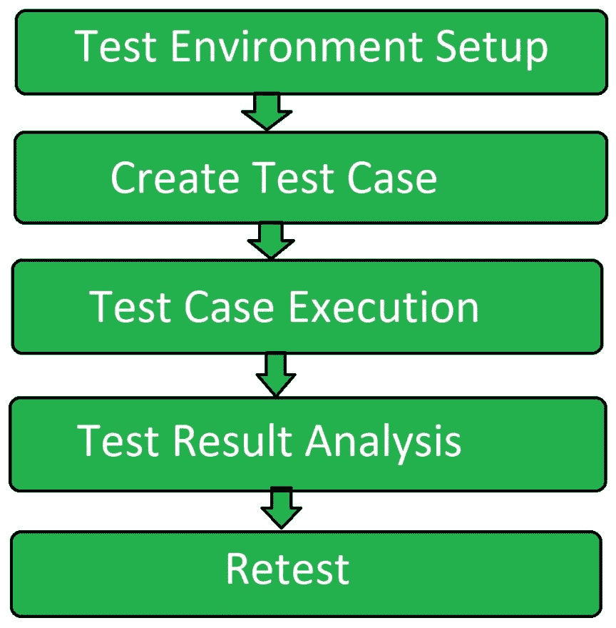

# 互操作性软件测试

> 原文:[https://www . geesforgeks . org/互操作性-软件-测试/](https://www.geeksforgeeks.org/interoperability-software-testing/)

互操作性测试是一种软件测试，用于检查软件与其组件或其他软件的交互。互操作性测试根据最终用户的要求检查两个软件系统之间的功能关系。

**互操作性测试的目标:**
互操作性测试的目标是:

*   确保两个不同软件系统之间的端到端通信。
*   减少在两个软件之间传输数据时的兼容性问题。
*   在连接的软件系统之间提供统一的数据类型和数据格式。

**互操作性测试的类型:**
互操作性测试有五种类型:

*   **Data type Interoperability Testing:**
    It focuses on the data type of the data that is being transferred. The data type of sent and received data should be same so that there is no inconsistency. If the data sent is a character (suppose ‘a’), then data received at the receiver end should also be a character (i.e. ‘a’).

*   **Semantic Interoperability Testing:**
    It focuses on the algorithm used in data transfer. It checks the data semantic that is involved in the data transfer. Algorithm used in data transfer should be reliable.
*   **Physical Interoperability Testing:**
    It checks the connecting devises used to connect the two software systems. Basically it checks the ports and data cables used in connection. Generally the USB port also affects the data transfer rate hence in order to increase the data transfer rate 3.0 USB port is used.
*   **Protocol Interoperability Testing:**
    It focuses on the protocol used in data transfer between two connected software systems. It checks whether the protocol used provides the efficient security to the data or not. The checksum used in protocol enables to transfer the data without any error.
*   **数据格式互操作性测试:**
    它检查发送数据和接收数据的格式。发送的数据和接收的数据的格式应该相同。如果发送方发送的数据是二进制形式(0 和 1)，那么接收端接收的数据也应该是二进制形式(即 0 和 1)。

**互操作性测试流程:**
互操作性测试流程涉及以下步骤:

*   **测试环境设置:**
    第一步，设置测试环境。没有环境测试是无法进行的。
*   **创建测试用例:**
    生成测试用例来检查连接行为。生成不同类型的测试用例，以便以有效的方式执行测试。
*   **测试用例执行:**
    在测试用例创建之后，为了执行测试过程，测试用例被执行。
*   **测试结果分析:**
    测试用例执行后，测试结果 ins 分析检测到的缺陷是否解决。
*   **重测:**
    在对测试结果进行分析后，如果仍然发现缺陷，则再次进行测试，并再次重复整个过程。

**不透明性测试的优势:**

*   它有助于在两个软件系统之间建立无错误的连接。
*   它确保了两个软件系统之间统一的数据类型数据传输。
*   它在转换时确保统一的数据格式。
*   它在转换中给出了语义格式。

**互操作性测试的缺点:**

*   互操作性测试中没有足够的需求。
*   它需要精确的测量。
*   它增加了网络的复杂性。
*   它增加了不充分的需求。