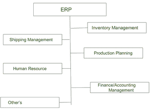
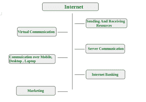

# 介绍 ERP 和互联网

> 原文:[https://www . geesforgeks . org/introduction-ERP-and-internet/](https://www.geeksforgeeks.org/introduction-erp-and-internet/)

**1。** [**ERP 系统**](https://www.geeksforgeeks.org/introduction-to-erp/) **:**
ERP 系统是一种软件工具，用于管理企业或组织的数据。企业资源规划系统是管理人力资源、产品管理、库存管理、物料管理、订单处理等的单一系统。

企业资源计划（Enterprise Resource Planning）

**2。** [**互联网**](https://www.geeksforgeeks.org/the-internet-and-the-web/) **:**
互联网是连接全球计算机系统的全球广域网。它是一个互联的计算机网络系统，使用互联网协议组(TCP/IP)在设备之间进行通信。

互联网

**ERP 与互联网的融合:**
ERP 与互联网的融合为组织提供了最好的效益。它使整个组织之间以及与其他组织之间的信息共享和沟通变得更加容易。

**ERP 整合的好处:**

*   借助互联网，纸质系统被共享资源的计算机系统所取代。
*   仅一次捕获数据。
*   数据的单一副本以所有授权用户都可以轻松访问的方式存储。
*   允许以多种方式选择和操作数据，以满足组织中不同群体的需求。

**为什么互联网成为 ERP 的必修课？**
互联网在企业资源规划中的应用为组织和公司等带来了大量的商机。这些包括克服新市场的地理边界和成本障碍、改善客户服务、获得全球通信等。

**如何利用互联网提升 ERP 的威力:**

*   企业资源规划系统的价值通过与互联网的结合得以提升。所有参与者——工程和产品设计师、供应商和供应商、制造、销售和营销、分销商和客户——都可以在需要时访问任何系统。
*   与传统方法相比，结果就像生成报告和文书工作一样，可以通过互联网轻松管理，并安全地放在互联网上。例如:如果有人想知道 10 年前加入的员工的信息。那么检索它的信息是非常困难的，但是当企业资源规划支持互联网时。它需要将近几秒或几分钟。
*   组织的工作流程将变得更加顺畅。例如:公司中有人想要找到上个月的报表，以便通过分析数据来衡量绩效。如果互联网没有企业资源规划系统，那么需要很长时间，但在互联网的帮助下，他们的工作将变得顺利。
*   在互联网的帮助下，主要的问题，即地理依赖将很容易消除。例如:一些组织希望从市场获得企业资源规划系统，假设 **X** ，如果它位于其他国家，那么如果没有互联网，就不可能订购企业资源规划系统。但是在企业资源规划的帮助下，这个问题很容易解决。
*   互联网让有限的机会和企业资源规划系统的实施变得无限。
*   在互联网的帮助下，服务得到改善。

**互联网对 ERP 的劣势:**

*   用户获得更多的选择，因此一些企业资源规划市场将受到影响。
*   各种市场竞争变得更加激烈。