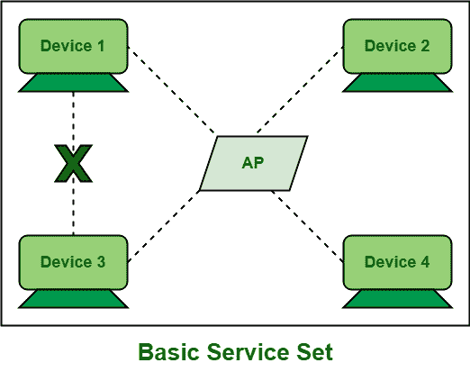

# 基础服务集(BSS)介绍

> 原文:[https://www . geesforgeks . org/基本服务集简介-bss/](https://www.geeksforgeeks.org/introduction-of-basic-service-set-bss/)

**基本服务集(BSS)** 顾名思义，基本上是一种网络拓扑，允许所有无线设备通过公共介质(即 AP(接入点))相互通信。它还管理这些无线设备或客户端。它基本上为所有无线[局域网](https://www.geeksforgeeks.org/local-area-network-lan-technologies/)提供了一个构建模块。基站基本上只包含一个接入点，该接入点连接到所有站点，即网络中的所有无线设备。这里，接入点是一个共同的接入点，充当媒介，创建[无线局域网](https://www.geeksforgeeks.org/wlan-full-form/)。

接入点允许所有无线设备连接到有线网络，并开始相互通信。因此，接入点被视为控制所有无线设备或基站或无线局域网站的主机。基站只包含一个接入点，但它可能包含一个或多个站。如果论坛包含一个接入点和一个站，通常被认为是最简单的。在连接到无线网络之前，无线设备或站需要向 AP 发送关联请求，然后 AP 检查客户端是否符合以下任何标准–

*   匹配 [SSID(服务集标识符)](https://www.geeksforgeeks.org/service-set-identifier-ssid-in-computer-network/)。

*   兼容的无线数据速率，即传输速度或站间数据传输速度。

*   认证证书，即验证客户身份。

然后，接入点要么拒绝请求，要么允许请求。在基站系统中，站或设备不直接相互通信。需要 AP 作为媒介。所有站将它们想要传送或共享给目的站的数据帧传送或传送给接入点，然后接入点将接收到的数据帧转发给目的站。基站通常提供短距离无线通信，这种区域被称为基本服务区。

每个基站都使用一个名为 BSSID(基本服务集标识符)的标识进行唯一标识。基站标识符是与基站相关联的接入点的媒体访问控制地址，该接入点的媒体访问控制地址用于识别基站。它主要用于小型办公室或家庭，因为它的网络范围很小。

**优势:**

*   基站是一个小范围的网络，因此它更安全。

*   设备或计算机可以轻松地相互通信，没有任何问题。

*   接入点还管理该网络中的所有站点，从而使网络更加便携和易于管理。

**劣势:**T2】

*   基站仅包含一个接入点，因此不支持移动性，即客户端无法从一个地方自由移动到另一个地方。

*   它只提供短距离无线通信。

*   由于基站只包括一个接入点和许多设备或客户端或站，每个站或客户端都通过相同的介质共享或通信。这可能会在传输时产生一些问题。因此，建议 BSS 应仅包括有限数量的设备。