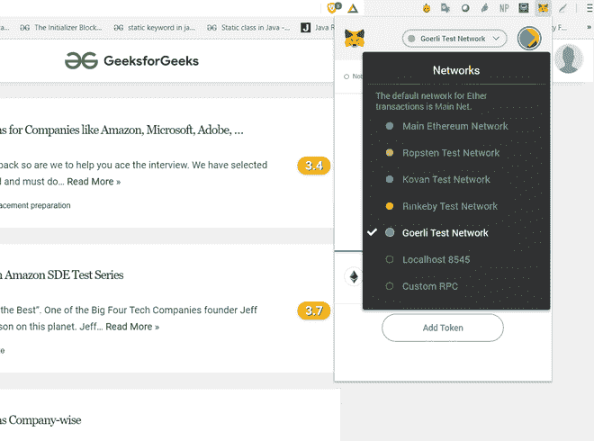

# 龟鳖的引入

> 原文:[https://www . geesforgeks . org/introduction-of-ether eum-testnests/](https://www.geeksforgeeks.org/introduction-of-ethereum-testnests/)

当我们在 Ethereum 虚拟机(EVM)上创建一个项目或编写一个代码，并将其部署在 Ethereum mainnet 上进行演示或测试时，由于以 Ether 的形式支付“Gas ”,无论是网络使用量的增加还是财务成本，成本都会很高。一旦部署到 mainnet 的代码是区块链永久的一部分，除非修复，否则 bug 永远是可以利用的。

这就需要一个真实的以太网区块链的模拟，它的令牌可能是没有价值的，代码可以在部署到最初的区块链之前进行测试。这个受到刺激的以太网区块链被称为“以太网测试网”。

因此，testnet 的核心优势是能够部署您的代码并检查漏洞、错误，并完成测试阶段，而不会给开发人员带来任何财务负担，也不会在 mainnet 上产生额外的事务。

**连接到测试网:**
可以在主网私有和公共地址上交易的以太令牌也可以发送到测试网的同一地址。格外注意不要将 mainnet 的令牌发送到 testnet。以下是两种常见的向 Ethereum testnet 进行交易的方式–

1.  **MetaMask :**
    *   在元掩码的左上角，您可以选择一个以太网网络。
    *   从主以太网网络切换到 Gorli(或其他测试网)，您应该会看到该网络的余额和交易历史更新。
    *   现在，当您使用元掩码创建事务时，它将被处理到您选择的网络。

     

    
**Figure –** Metamask

2.  **MyEtherWallet :**
    *   MyEtherWallet 和 MyCrypto 同样允许您选择备用网络。
    *   在屏幕右上角选择您的网络。
    *   此后，所有交易和合同电话都在您选择的网络上进行。

     

    
**Figure –** My Ether Wallet

**获取 testnet 的乙醚:**
Testnet 的乙醚大部分是通过该特定 Testnet 的水龙头获取的。在某些情况下，只有开发人员有权共享以太令牌。

**下面是一些最受欢迎的可用龟巢的比较–**

**1。"托斯汀"**

*   工作证明
*   无法免受垃圾邮件攻击
*   由 geth 和奇偶校验支持
*   链标识:3
*   网络标识:3
*   阻断时间:低于 30 秒
*   faut cet:https://faut cet . ROP sten . be/

**2。硬:T1**

*   权威证明
*   免受垃圾邮件攻击
*   由 geth 和奇偶校验支持
*   链条编号:42
*   网络标识:42
*   阻断时间:4 秒
*   水龙头:https://水龙头. kovan.network/

**3。林班尼:T1**

*   权威证明
*   免受垃圾邮件攻击
*   由 geth 和奇偶校验支持
*   链标识:4
*   网络标识:4
*   封锁时间:15 秒
*   水龙头： https://faucet.rinkeby.io/

**4。索科尔:**

*   权威证明
*   免受垃圾邮件攻击
*   由 geth 和奇偶校验支持
*   链条编号:77
*   网络号:77
*   阻断时间:5 秒
*   水龙头:https://水龙头. poa.network/

**5 号。他们说" T1 "**

*   权威证明
*   免受垃圾邮件攻击
*   由多个客户端支持，如 Geth、Pantheon、幽冥和奇偶校验
*   链号:5
*   网络标识:5
*   阻断时间:平均 15 秒
*   水龙头:https://水龙头. goerli.mudit.blog/(需要向开发者请求)