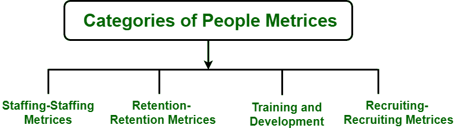

# 软件工程中人的度量介绍

> 原文:[https://www . geeksforgeeks . org/软件工程中的人员介绍/](https://www.geeksforgeeks.org/introduction-of-people-metrices-in-software-engineering/)

人的度量的概念起源于人力资源管理领域。它提供了对人的**活动**的量化测量。这些度量标准有助于根据目标和目的等提供绩效证据。对于平衡记分卡和其他绩效衡量系统来说，人的度量已经变得很重要。原因在于对人力资源资本进行有效管理的必要性；即合理利用有助于获取价值的智力资本。更紧急的是，高级管理层有时无法利用组织内人力资源的实际价值。在平衡记分卡中稍微强调人员管理是非常常见的。因此，解释或者说展示人力资本对可执行管理的**价值就变得非常重要。人们的度量可以提供对照目标和目的表现的证据。**

**以下给出了一些人的十进制的例子，可能包括:**

*   计算填补新职位的平均数。
*   新员工失败因素。
*   按性别统计的人数。

这也有助于人力资源讲首席团队的语言。通过衡量人员管理活动，业务成果的价值通常会转化为可量化的证据，并以能引起业务领导者共鸣的语言呈现出来。

**<u>人的类别十进制:</u>**

人员十进制的主要类别如下图所示:

**1。人员配置矩阵:**

这种十进制量化了你在员工身上的投资回报。这些措施包括以下数量:

*   每次成本
*   招聘效率比率
*   替换员工的成本

**2。保留度度量:**

它通常衡量营业额的重要方面。管理层通常希望量化这些变量:

*   周转率
*   平均任期
*   老工人比率
*   员工流动的财务影响

结果通常表明每个离职员工在公司成本中所占的比例，并帮助公司制定积极的计划来阻止顶尖人才的流失。

**3。培训和发展指标:**

它量化了新员工的学习过程。这些措施包括以下活动:

*   方向
*   培训过程时间和成本
*   在职学习的时间和成本

结果通常表明专业发展过程的成功，以及它们对组织实现其业务目标的帮助程度。

**4。招聘指标:**

它衡量吸引和选拔顶尖人才阶段所涉及的活动。决策者经常希望量化变量，例如:

*   新员工绩效
*   新员工的离职率
*   不良雇佣的影响
*   新员工的投资回报

**一件事是共同的通过**，我们需要收集关于我们资源的一致信息，使用能够进行决策的度量标准，并确保人才管理战略与整体业务战略保持相关性，并为业务增长做出积极贡献。我们需要选择有助于管理层根据事实而不是感觉做出快速而合理的商业决策的度量标准。