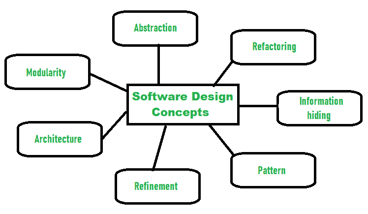

# 软件设计流程介绍|第二集

> 原文:[https://www . geesforgeks . org/软件介绍-设计-流程-设置-2/](https://www.geeksforgeeks.org/introduction-of-software-design-process-set-2/)

[软件设计](https://www.geeksforgeeks.org/software-engineering-software-design-process/)是将用户需求转化为某种合适形式的过程，帮助程序员进行软件编码和实现。在软件设计阶段，根据 SRS 文档中记录的客户要求，生成设计文档。因此，此阶段的目标是将 SRS 文档转换为设计文档。

在设计阶段设计并记录了以下项目:

*   需要不同的模块。
*   模块之间的控制关系。
*   不同模块之间的接口。
*   不同模块之间的数据结构。
*   在各个模块之间实现所需的算法。

**软件设计目标:**

1.  **正确性:**
    一个好的设计应该是正确的，即它应该正确地实现系统的所有功能。
2.  **效率:**
    一个好的软件设计应该解决资源、时间和成本的优化问题。
3.  **易懂性:**
    一个好的设计应该是容易理解的，为此应该是模块化的，所有的模块都是分层排列的。
4.  **完整性:**
    设计应该具备数据结构、模块、外部接口等所有组件。
5.  **可维护性:**
    一个好的软件设计应该很容易接受来自客户方的变更请求。

**软件设计概念:**
概念被定义为进入我们的头脑或在思想中理解某事的主要想法或发明。**软件设计概念**只是指设计背后的想法或原则。它描述了你计划如何解决设计软件的问题，背后的逻辑，或者你将如何设计软件的想法。它允许软件工程师创建将要开发或构建的系统、软件或产品的模型。软件设计概念为开发正确的软件提供了一个支持和基本的结构或模型。软件设计的概念有很多，下面给出其中一些:

设计软件时应考虑以下**点:**

1.  **抽象-隐藏无关数据**
    抽象简单的说就是隐藏细节，降低复杂度，提高效率或者质量。不同层次的抽象是必要的，并且必须在设计过程的每个阶段应用，以便可以消除存在的任何错误，从而提高软件解决方案的效率并改进软件解决方案。该解决方案应该以广泛的方式进行描述，在较高的抽象层次上覆盖各种不同的东西，而软件解决方案的更详细的描述应该在较低的抽象层次上给出。
2.  **模块化——细分系统**
    模块化简单来说就是把系统或者项目分成更小的部分，降低系统或者项目的复杂度。同样，设计中的模块化意味着将一个系统细分为更小的部分，以便这些部分可以独立创建，然后在不同的系统中使用这些部分来执行不同的功能。有必要将软件划分为称为模块的组件，因为现在有不同的软件可用，如 Monolithic 软件，这对于软件工程师来说很难掌握。因此，模块化设计现在已经成为一种趋势，也很重要。如果系统包含较少的组件，那么这将意味着系统是复杂的，需要大量的努力(成本)，但是如果我们能够将系统分成组件，那么成本将会很小。
3.  **建筑——设计某物的结构**
    建筑简单来说就是设计某物结构的一种技术。软件设计中的架构是一个关注各种元素和结构数据的概念。这些组件相互作用，并在架构中使用结构的数据。
4.  **精炼-去除杂质**
    精炼简单来说就是精炼某物，去除任何存在的杂质，提高质量。软件设计的细化概念实际上是一个以详细的方式开发或展示软件或系统的过程，这意味着要精心设计一个系统或软件。细化是非常必要的，以找出任何错误，如果存在，然后减少它。
5.  **图案——重复的形式**
    图案简单来说就是将同一形状重复几次形成图案的重复形式或设计。设计过程中的模式意味着在特定的环境中重复解决一个常见的重复出现的问题。
6.  **信息隐藏-隐藏信息**
    信息隐藏简单来说就是隐藏信息，使其不被不需要的一方访问。在软件设计中，信息隐藏是通过设计模块来实现的，即一个模块中收集或包含的信息是隐藏的，不能被任何其他模块访问。
7.  **重构——重构一些东西**
    重构简单来说就是重构一些东西，重构的方式不影响任何其他特性的行为。软件设计中的重构是指在不影响行为或功能的情况下，重构设计以降低复杂性并简化设计。福勒将重构定义为“以不影响设计行为和改进内部结构的方式改变软件系统的过程”。

**不同层次的软件设计:**
软件设计有三个不同层次。它们是:

1.  **建筑设计:**
    系统的架构可以看作系统的整体结构&结构提供系统概念完整性的方式。架构设计将软件视为一个系统，其中有许多组件相互作用。在这个层次上，设计者获得了建议的解决方案域的概念。

2.  **初步或高层设计:**
    这里把问题分解成一套模块，识别各个模块之间的控制关系，也识别各个模块之间的接口。这个阶段的结果称为程序架构。这个阶段使用的设计表示技术是结构图和 UML。

3.  **详细设计:**
    一旦高层设计完成，就进行详细设计。在详细设计中，每个模块都经过仔细检查，以设计数据结构和算法。阶段结果以模块规范文档的形式记录下来。